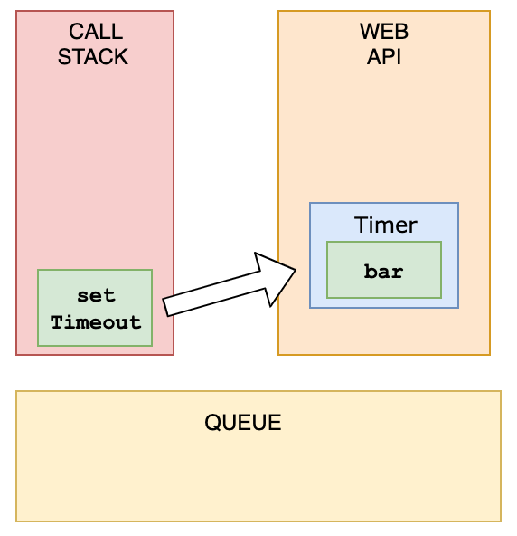
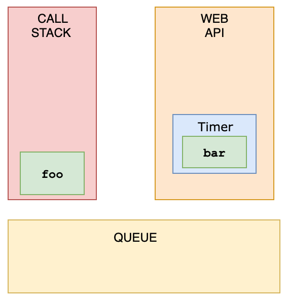
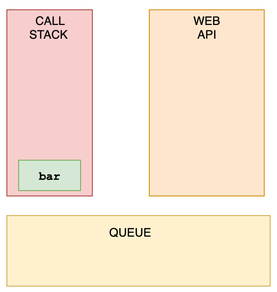
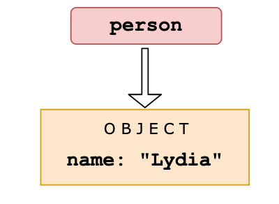
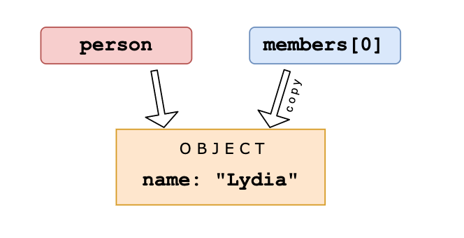
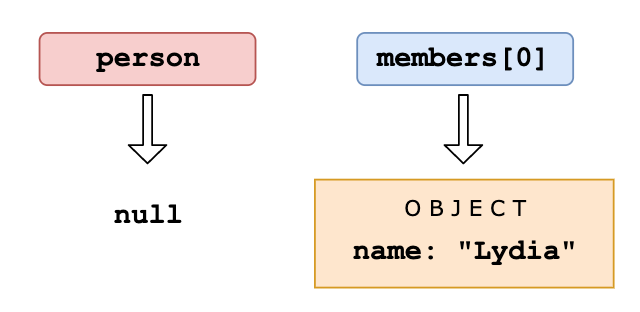
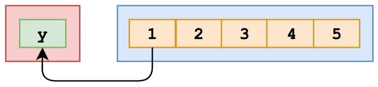
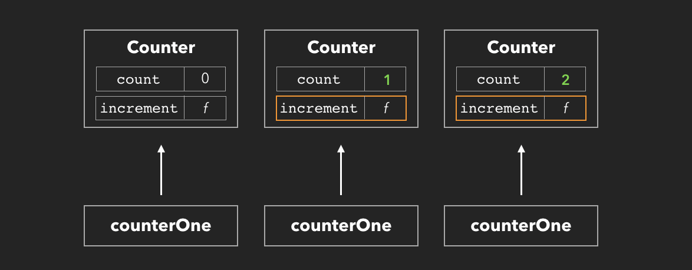
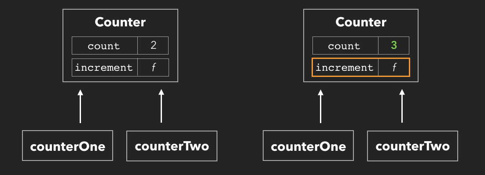

<div align="center">
  
  <h1>JavaScript Quizzes</h1>
</div>


#### Ngôn ngữ:
- [🇻🇳 Tiếng Việt](#)
- [🇬🇧 English](./English/README.md)


###### 1. Output là gì?

```javascript
function a() {
    console.log(this);
}
a.call(null);
```

- A: `null`
- B: `undefined`
- C: `window object`

<details><summary><b>Đáp án</b></summary>
<p>

#### Đáp án: C

`this context` trong JavaScript tùy theo ngữ cảnh lúc gọi hàm.

Chúng ta có thể thay đổi `this context` của hàm bằng cách dùng hàm `call`, với tham số đầu tiên trở thành `this` và các tham số tiếp theo là các params của hàm.
Vì vậy, khi gọi `a.call(window)` thì `this` trong hàm `a` chính là `window`.

Lưu ý, khi chúng ta truyền tham số đầu tiên vào hàm `call` là `null` hay `undefined` thì JavaScript sẽ tự động truyền `global object` vào hàm được gọi chứ không truyền `null` hay `undefined`.
Vì vậy, đoạn code trên sẽ in ra `object window` thay vì `null`.

</p>
</details>

---

###### 2. Output là gì?

```javascript
if (!("a" in window)) {
    var a = 1;
}

console.log(a);
```

- A: `undefined`
- B: 1
- C: Reference Error

<details><summary><b>Đáp án</b></summary>
<p>

#### Đáp án: A

Đoạn code này trông có vẻ đơn giản, nếu biến global `window` chưa có phần tử `a` thì định nghĩa biến `a`, gán cho nó bằng 1.
Bạn sẽ nghĩ kết quả là 1, nhưng không, đáp án đúng là `undefined`, điều gì đang xảy ra? Cùng đi qua 3 điểm dưới đây sẽ rõ.

Đầu tiên, tất cả các biến global được lưu trữ trong global object là `window` (ở browser). Khi chúng ta khai báo `var a = 1` điều đó đồng nghĩa với việc khai báo `window.a = 1`, và chúng ta có thể kiểm tra 1 biến có phải là global hay nằm trong object window hay không bằng cách `"variable-name in window"`.
Vậy sau khi khai báo var `a = 1` thì `"a" in window` cho kết quả `true`.

Thứ hai, JavaScript có cơ chế `hoisted`, tất cả các khai báo biến đều được đưa lên đầu của scope của nó. Ví dụ:

```javascript
console.log("a" in window);
var a;
```

Tuy biến `a` được khai báo dưới dòng `console` nhưng kết quả in ra là `true`, vì JavaScript engine sẽ lần lượt tìm tất cả các khai báo biến và chuyển chúng lên đầu của scope.
Vì thế đoạn code được thực thi có thể viết lại như sau:

```javascript
var a;
alert("a" in window);
```

Thứ ba là chỉ các khai báo biến mới được `hoisted`, còn các khởi tạo, gán giá trị cho biến thì không. Ví dụ:

```javascript
var a = 1;
```

thì chúng ta có 2 quá trình:

```javascript
var a;    //declaration
a = 1;    //initialization
```

Tóm lại, với sự hiểu biết của 3 khái niệm trên thì đoạn code ban đầu được thực thi như sau:

```javascript
var a;
if (!("a" in window)) {
    a = 1;
}
console.log(a);
```

và tất nhiên, kết quả là `undefined`.

</p>
</details>

---

###### 3. Output là gì?

```javascript
function b(x, y, a) {
    arguments[2] = 10;
    console.log(a);
}
b(1, 2, 3);
```

- A: 1
- B: 2
- C: 3
- D: 10

<details><summary><b>Đáp án</b></summary>
<p>

#### Đáp án: D

`arguments` là một object đặc biệt trong function của JavaScript, nó chứa các params của function và share chung bộ nhớ với chúng, vì thế khi thay đổi giá trị của `agruments` thì các params cũng được thay đổi theo.

</p>
</details>

---

###### 4. Output là gì?

```javascript
console.log(new String('hello') === String('hello'));
```

- A: true
- B: false
- C: TypeError

<details><summary><b>Đáp án</b></summary>
<p>

#### Đáp án: B

Khi gọi String constructor function với từ khóa `new` sẽ cho kết quả là một object, trong khi đó, không có từ khóa `new` kết quả sẽ là một primitive string, so sánh `===` giữa 2 kiểu dữ liệu khác nhau sẽ cho kết quả là `false`.

</p>
</details>

---

###### 5. Output là gì?

```javascript
console.log('1' -- '1');
```

- A: 0
- B: 2
- C: 11
- D: TypeError

<details><summary><b>Đáp án</b></summary>
<p>

#### Đáp án: D

Postfix Operator `--` chỉ thực hiện với biến, trong trường hợp này `'1'` không phải là biến nên sẽ gây ra lỗi `TypeError`.
Nếu đoạn code trên được viết thành `'1' - - '1'` (chú ý có space giữa 2 dấu `-`) thì sẽ cho kết quả là `2`.

</p>
</details>

---

###### 6. Output là gì?

```javascript
var foo = function bar() {
    console.log(foo === bar);
};
foo();
bar();
```

- A: true, true
- B: false, false
- C: true, ReferenceError
- D: false, ReferenceError

<details><summary><b>Đáp án</b></summary>
<p>

#### Đáp án: D

Chúng ta có thể khai báo `function expression` cùng với `named function` và dùng `named function` bên trong function đó để gọi tới chính nó.
Nhưng chúng ta không thể dùng `named function` bên ngoài được, điều đó có nghĩa khi gọi `bar()` sẽ gây ra lỗi `ReferenceError`.

</p>
</details>

---

###### 7. Output là gì?

```javascript
var myArr = ['foo', 'bar', 'baz'];
console.log('2' in myArr);
```

- A: ReferenceError
- B: true
- C: false

<details><summary><b>Đáp án</b></summary>
<p>

#### Đáp án: B

`in operator` sẽ kiểm tra 1 thuộc tính có phải là của object đó hay không, một array cũng là một object và có các thuộc tính index (`myArray[2] === myArray['2']`), vậy kết quả là `true`.

</p>
</details>

---

###### 8. Output là gì?

```javascript
var bar = 1,
    foo = {};

foo: {
    bar: 2;
    baz: ++bar;
};

console.log(foo.baz + foo.bar + bar);
```

- A: ReferenceError
- B: TypeError
- C: NaN
- D: 4
- E: 5

<details><summary><b>Đáp án</b></summary>
<p>

#### Đáp án: C

Trong JavaScript cũng có `labled statement` nên đoạn code trên không có lỗi gì đâu nhé.
Phần tử `baz` và `bar` không có trong object `foo` nên ta có thể viết lại như sau `undefined + undefined + 1` và cho kết quả là `NaN`.

</p>
</details>

---

###### 9. Output là gì?

```javascript
console.log([] + [] + 'foo'.split(''));
```

- A: f,o,o
- B: ["f", "o", "o"]
- C: TypeError
- D: [][]["f", "o", "o"]

<details><summary><b>Đáp án</b></summary>
<p>

#### Đáp án: A

Theo operator precedence, các lời gọi function sẽ có độ ưu tiên cao hơn operator `+`, vì vậy `'foo'.split('')` sẽ thực hiện trước.
Ta có thể viết lại như sau `[] + [] + ['f', 'o', 'o']`, JavaScript sẽ chuyển đổi array sang string trước khi `+` nên ta có kết quả là `f,o,o`.

</p>
</details>

---

###### 10. Output là gì?

```javascript
console.log(true + false > 2 + true);
```

- A: true
- B: false
- C: TypeError
- D: NaN

<details><summary><b>Đáp án</b></summary>
<p>

#### Đáp án: B

Operator `+` sẽ có độ ưu tiên cao hơn operator `>` vì thế `+` sẽ được thực hiện trước.
Khi `+` number với boolean hoặc 2 boolean với nhau, JavaScript sẽ chuyển đổi boolean về number, `true -> 1` và `false -> 0`, vì vậy ta có thể viết thành `1 + 0 > 2 + 1`, kết quả `1 > 3` là `false`.

</p>
</details>

---

###### 11. Output là gì?

```javascript
var arr = [];
arr[0]  = 'a';
arr[1]  = 'b';
arr.foo = 'c';
console.log(arr.length);
```

- A: 1
- B: 2
- C: 3
- D: undefined

<details><summary><b>Đáp án</b></summary>
<p>

#### Đáp án: B

Trong JavaScript Array, khi set một thuộc tính cho một array, nếu thuộc tính đó là một `valid array index` thì `length` của array đó sẽ được tính toán lại. Một thuộc tính `p` là `valid array index` khi và chỉ khi `ToString(ToUint32(p)) bằng p hoặc ToUint32(p)` và p không bằng  `2^32−1.`.
Khi đó, `0` và `1` sẽ thỏa mãn điều kiện còn `foo` thì không, vậy kết quả là `2`.

</p>
</details>

---

###### 12. Output là gì?

```javascript
function Dog(name) {
    this.name = name;
    this.speak = function() {
        return 'woof';
    };
}

const dog = new Dog('Pogo');

Dog.prototype.speak = function() {
    return 'arf';
};

console.log(dog.speak());
```

- A: woof
- B: arf

<details><summary><b>Đáp án</b></summary>
<p>

#### Đáp án: A

Khi gọi đến thuộc tính hay phương thức của một object, đầu tiên nó sẽ tìm trong object trước, nếu không tìm thấy, mới tiếp tục tìm trong Prototype của nó.

</p>
</details>

---

###### 13. Output là gì?

```javascript
const p1 = new Promise((resolve, reject) =>
    setTimeout(resolve, 100, 'Hello')
);

const p2 = new Promise((resolve, reject) =>
    setTimeout(resolve, 120, 'Goodbye')
);

const p3 = new Promise((resolve, reject) =>
    setTimeout(reject, 10, 'Oops!')
);

Promise.race([p1, p2, p3])
    .then(result => console.log(result))
    .catch(reason => console.log('Something went wrong...'));
```

- A: Hello
- B: Goodbye
- C: Oops!
- D: Something went wrong...

<details><summary><b>Đáp án</b></summary>
<p>

#### Đáp án: D

Promise.race() sẽ trả về kết quả của một Promise nào hoàn thành trước. Trong ví dụ trên, `p3` sẽ hoàn thành trước, nó sẽ gọi `reject` sau 10ms và sẽ rơi vào `catch`.

</p>
</details>

---

###### 14. Output là gì?

```javascript
const timer = a => {
    return new Promise(res =>
        setTimeout(() => {
            res(a);
        }, Math.random() * 100)
    );
};

const all = Promise.all([
    timer('first'),
    timer('second')
]).then(data => console.log(data));
```

- A: ["first", "second"]
- B: It is random

<details><summary><b>Đáp án</b></summary>
<p>

#### Đáp án: A

Promise.all không quan tâm đến thứ tự thời gian hoàn thành xong các Promise, nó sẽ chờ cho tất cả các Promise hoàn thành xong và kết quả của nó sẽ là một array với thứ tự giữ nguyên với thứ tự của tham số truyền vào.

</p>
</details>

---

###### 15. Output là gì?

```javascript
console.log(1 < 2 < 3);
console.log(3 > 2 > 1);
```

- A: true true
- B: true false
- C: false false
- D: undefined undefined

<details><summary><b>Đáp án</b></summary>
<p>

#### Đáp án: B

Các toán tử `<` và `>` có cùng độ ưu tiên và sẽ được thực hiện từ trái qua phải.

Dòng đầu tiên chúng ta có thể viết lại như sau `(1 < 2) < 3`, `1 < 2` được thực hiện trước và trả về `true`, sau đó thực hiện `true < 3`, khi so sánh với number, boolean sẽ được chuyển đổi sang number, `true` trở thành `1`, vậy `true < 3` cho kết quả `true`.

Ở dòng thứ hai `(3 > 2) > 1`, `(3 > 2)` cũng được thực hiện trước và trả về `true`, tuy nhiên sau đó `true > 1` sẽ được chuyển đổi thành `1 > 1` và cho kết quả `false`.

</p>
</details>

---

###### 16. Output là gì?

```javascript
const obj = {
    1: 1,
    2: 2,
    3: 3
};

console.log(Object.keys(obj), Object.values(obj));
```

- A: [1, 2, 3] ["1", "2", "3"]
- B: ["1", "2", "3"] [1, 2, 3]
- C: ["1", "2", "3"] ["1", "2", "3"]

<details><summary><b>Đáp án</b></summary>
<p>

#### Đáp án: B

`Object.keys` sẽ chuyển đổi keys của object sang string `['1', '2', '3']` và `Object.values` sẽ giữ nguyên values của object `[1, 2, 3]`.

</p>
</details>

---

###### 17. Output là gì?

```javascript
const a = {
    stringField: 'Joe',
    nestedField: { field: 'Nested' },
    functionField: () => 'aReturn'
};

const b = Object.assign({}, a);

b.stringField = 'Bob';
b.nestedField.field = 'Changed';
b.functionField = () => 'bReturn';

console.log(
    a.stringField,
    a.nestedField.field,
    a.functionField()
);
```

- A: Joe Nested aReturn
- B: Bob Changed bReturn
- C: Joe Changed aReturn
- D: Bob Nested bReturn

<details><summary><b>Đáp án</b></summary>
<p>

#### Đáp án: C

`b = Object.assign({},a);` sẽ thực hiện một `shallow copy` trên object `a`, bất kỳ thuộc tính nào của `b` là object đều tham chiếu đến cùng thuộc tính trong `a`.
Vì vậy khi chúng ta thay đổi nested field của `b`, thì nested field của `a` cũng thay đổi theo.

</p>
</details>

---

###### 18. Output là gì?

```javascript
const a = {
    stringField: 'Joe',
    numberField: 123,
    dateField: new Date('1995-12-17T03:24:00'),
    nestedField: { field: 'Nested' }
};

const b = JSON.parse(JSON.stringify(a));

console.log(
    a.stringField === b.stringField,
    a.numberField === b.numberField,
    a.dateField === b.dateField,
    a.nestedField.field === b.nestedField.field
);
```

- A: true true true true
- B: true true true false
- C: true true false true
- D: false false false false

<details><summary><b>Đáp án</b></summary>
<p>

#### Đáp án: C

`b = JSON.parse(JSON.stringify(a))` sẽ thực hiện deep copy trên object `a`.
Tất cả các thuộc tính là các kiểu dữ liệu nguyên thủy (Boolean, String, Number) sẽ được copy một cách chính xác, tuy nhiên đối với các thuộc tính có giá trị không phải là giá trị JSON (Date, undefined, Function, và không phải kiểu dữ liệu nguyên thủy) sẽ không được copy đúng.
Trong ví dụ trên, object Date sẽ được chuyển đổi sang string, chúng ta có thể xem thêm về `JSON.stringify` để hiểu rõ hơn.

</p>
</details>

---

###### 19. Output là gì?

```javascript
var x = 5;

(function() {
    console.log(x);
    var x = 10;
    console.log(x);
})();
```

- A: 5 10
- B: undefined 10
- C: 5 undefined
- D: undefined undefined

<details><summary><b>Đáp án</b></summary>
<p>

#### Đáp án: B

Biến `x` sẽ được `hoist` bên trong function, chúng ta có thể xem function được thực thi như sau:

```javascript
var x = 5;

(function() {
  var x;
  console.log(x);
  x = 10;
  console.log(x);
})();
```

</p>
</details>

---

###### 20. Output là gì?

```javascript
console.log(typeof Object, typeof Array, typeof Number);
```

- A: object array number
- B: object object number
- C: object object object
- D: function function function

<details><summary><b>Đáp án</b></summary>
<p>

#### Đáp án: D

Object, Array và Number đều là các Function Constructor, chúng dùng để tạo ra các object với từ khóa `new`.

</p>
</details>

---

###### 21. Output là gì?

```javascript
const output = `Soon we must all choose between what is ${
    [] ? 'right' : 'wrong'
} and what is ${(() => false)() ? 'difficult' : 'easy'}`;

console.log(output);
```

- A: Soon we must all choose between what is right and what is easy
- B: Soon we must all choose between what is right and what is difficult
- C: Soon we must all choose between what is wrong and what is easy
- D: Soon we must all choose between what is wrong and what is difficult

<details><summary><b>Đáp án</b></summary>
<p>

#### Đáp án: A

Trong JavaScript, mảng rỗng `[]` và function là `truthy`. Nhưng chú ý ở ví dụ trên, function này được thực thi và nó trả về `false`.

</p>
</details>

---

###### 22. Output là gì?

```javascript
(function() {
    console.log(1);
    setTimeout(function() {
        console.log(2);
    }, 1000);
    setTimeout(function() {
        console.log(3);
    }, 0);
    console.log(4);
})();
```

- A: 1, 2, 3, 4
- B: 4, 2, 1, 3
- C: 1, 4, 3, 2
- D: 4, 3, 2, 1

<details><summary><b>Đáp án</b></summary>
<p>

#### Đáp án: C

Rõ ràng `1` và `4` sẽ được in ra đầu tiên vì `console.log()` mà không có delay.
`2` sẽ được in ra sau `3` vì `2` bị delay 1 giây còn `3` bị delay sau 0 giây.
Có một điểm chú ý là vì sao `3` bị delay là 0 giây, nhưng lại được in ra sau `4`?
Vì `callback` trong `setTimeout` sẽ được đẩy vào `event queue` và nó chỉ được gọi sau khi `call stack` rỗng.
Nếu bạn chưa rõ các khái niệm này, đọc thêm về `JS concurrency model/event loop`.

</p>
</details>

---

###### 23. Output là gì?

```javascript
const foo = () => {
    return {
        foo: 'foo'
    }
}

const bar = () => {
    return
    {
        bar: 'bar'
    }
}

console.log(foo(), bar());
```

- A: { foo: "foo" } undefined
- B: undefined { bar: "bar" }
- C: undefined undefined

<details><summary><b>Đáp án</b></summary>
<p>

#### Đáp án: A

Mặc dù trông có vẻ hai function trong ví dụ trên hoàn toàn giống nhau. Nhưng JavaScript có một số quy tắc để tự động thêm vào dấu `;` (semicolon) sau một số câu lệnh, mà cụ thể ở đây là câu lệnh `return`.

Ở function `foo`, câu lệnh `return` và dấu `{` mở đầu một code block nằm trên cùng một dòng, vì vậy JavaScript chỉ thêm các dấu `;` vào sau các dấu `}` đóng code block:

```javascript
const foo = () => {
  return {
    foo: 'foo'
  };
};
```

Tuy nhiên, với function `bar` lại là một câu chuyện khác, câu lệnh `return` nằm riêng lẻ trên một dòng, vậy nên JavaScript sẽ tự động thêm dấu `;` vào sau câu lệnh `return` này:

```javascript
const bar = () => {
  return;
  {
    bar: 'bar';
  }
};
```

Nó làm cho function `bar` giờ có thể viết như thế này:

```javascript
const bar = () => {
  return;
};
```

</p>
</details>

---

###### 24. Output là gì?

```javascript
const a = { something: 1, someOtherThing: 2 };

const deleteSomething = input => {
    delete input.something;
    return input.something;
};

const result = deleteSomething(a);

console.log(result);
```

- A: 1
- B: An error is thrown
- C: undefined
- D: Something different is logged

<details><summary><b>Đáp án</b></summary>
<p>

#### Đáp án: C

Khi chúng ta truyền tham số vào một function là một kiểu dữ liệu tham chiếu (`reference types`) thì những thay đổi đối với tham số bên trong hàm sẽ thay đổi đến chính object chúng ta truyền vào.
Vì vậy khi xóa một thuộc tính của tham số `input` cũng chính là xóa luôn thuộc tính của object `a`.

</p>
</details>

---

###### 25. Output là gì?

```javascript
let b = '4';

console.log(b++ + 3, b);
```

- A: 44 4
- B: 8 5
- C: 7 5
- D: 43 5

<details><summary><b>Đáp án</b></summary>
<p>

#### Đáp án: D

Toán tử `++` (Postfix Increment) được ưu tiên hơn toán tử `+`, đầu tiên toán tử Postfix Increment sẽ chuyển đổi `b` từ string `'4'` sang number `4`, sau đó nó sẽ chờ phép toán `4 + 3` thực hiện xong mới thực hiện tăng `b` lên một đơn vị.

</p>
</details>

---

###### 26. Output là gì?

```javascript
const scrambled = {
    2: 'e',
    5: 'o',
    1: 'h',
    4: 'l',
    3: 'l'
};

const result = Object.values(scrambled).reduce(
    (agg, el) => agg + el,
    ''
);

console.log(result);
```

- A: hello
- B: eohll

<details><summary><b>Đáp án</b></summary>
<p>

#### Đáp án: A

Nếu key trong object là number thì `Object.values` sẽ sắp xếp lại các value theo thứ tự, với key không phải number thì thứ tự vẫn được giữ nguyên.

</p>
</details>

---

###### 27. Output là gì?

```javascript
const user = {
    name: 'lao Hac',
    age: 69,
    pet: {
        type: 'cho',
        name: 'vang'
    }
};

Object.freeze(user);

user.pet.name = 'shiba';

console.log(user.pet.name);
```

- A: shiba
- B: vang
- C: An error is thrown

<details><summary><b>Đáp án</b></summary>
<p>

#### Đáp án: A

Để tránh bất kỳ sự thay đổi nào trên các thuộc tính của một object, ta có thể dùng hàm `Object.freeze`, tuy nhiên hàm này chỉ có thể thực hiện `shallow freeze` trên object đó mà thôi, điều đó có nghĩa bất kỳ sự thay đổi nào trên các thuộc tính của object con đều được cho phép.
Trong ví dụ này, chúng ta không thể thay đổi `user.age`, nhưng không có vấn đề gì khi thay đổi `user.pet.name`.
Nếu chúng ta không muốn thay đổi bất kỳ thuộc tính nào của object, có thể dùng đệ quy `Object.freeze` cho các thuộc tính con hoặc dùng các chức năng `deep freeze` của các thư viện có sẵn.

</p>
</details>

---

###### 28. Output là gì?

```javascript
const n = 5;

console.log(1..n); // ?
```

- A: [1, 2, 3, 4, 5]
- B: undefined
- C: Syntax error

<details><summary><b>Đáp án</b></summary>
<p>

#### Đáp án: B

Khi muốn truy cập đến một thuộc tính hay method của một object ta có thể dùng dot notation (một dấu `.`), còn đối với number, ta có thể dùng hai dấu `.`, vì khi dùng một dấu `.` thì JavaScript sẽ bị nhầm lẫn với decimal number.
Trong trường hợp này, `1..n` sẽ truy cập đến thuộc tính `n` của number `1`, nó trả về `undefined`. Một ví dụ cụ thể là khi gọi `1..toString()` sẽ cho kết quả là `"1"`.

</p>
</details>

---

###### 29. Output là gì?

```javascript
const compare = a => a === a;

console.log(compare(null));
console.log(compare(undefined));
console.log(compare(NaN));
console.log(compare([NaN]));
```

- A: true true true true
- B: true false true true
- C: true true false true
- D: true true false false
- E: false false false false

<details><summary><b>Đáp án</b></summary>
<p>

#### Đáp án: C

Trong JavaScript, khi sử dụng Triple Equals (`===`) thì `null` và `undefined` chỉ cho kết quả `true` khi so sánh với chính nó, `NaN` thì luôn cho kết quả `false` khi so sánh với bất kỳ object nào, kể cả chính nó, còn `[NaN]` là một array bình thường chỉ chứa một phần tử là `NaN`.

</p>
</details>

---

###### 30. Output là gì?

```javascript
const notifications = 1;

console.log(
    `You have ${notifications} notification${notifications !==
    1 && 's'}`
);
```

- A: You have 1 notification
- B: You have 1 notifications
- C: You have 1 notificationfalse

<details><summary><b>Đáp án</b></summary>
<p>

#### Đáp án: C

Toán tử `&&` sẽ dừng và trả về kết quả `false` nếu gặp bất kỳ điều kiện nào sai, vì thế `notifications !== 1 && 's'` sẽ trả về `false`.
Nếu bạn muốn ví dụ trên chạy đúng như ý muốn, ta có thể dùng ternary operator: `notifications !== 1 ? 's' : ''`.

</p>
</details>

---

###### 31. Output là gì?

```javascript
const a = 0.1;
const b = 0.2;
const c = 0.3;

console.log(a + b === c);
```

- A: true
- B: false

<details><summary><b>Đáp án</b></summary>
<p>

#### Đáp án: B

Như chúng ta đã biết trong hệ thập phân, chúng ta không thể biểu diễn chính xác `1/3` dưới dạng dấu phẩy động (`floating-point`). Kết quả của `0.333 + 0.333 + 0.333` không thể nào bằng `1` được.

Tương tự, trong máy tính các số được biểu diễn dưới dạng nhị phân.
Đôi khi chúng chỉ biểu diễn được gần đúng số thực tế chứ không thể biểu diễn một các chính xác được, ví dụ như `0.1`, `0.2` hay `0.3`. Điều này dẫn đến các kết quả không mong muốn, trong trường hợp `0.1 + 0.2`, kết quả ta nhận được là `0.30000000000000004`.

</p>
</details>

---

###### 32. Output là gì?

```javascript
bar();

var bar;

function bar() {
    console.log('first');
}

bar = function() {
    console.log('second');
};

bar();

foo();

function foo() {
    console.log(1);
}

var foo = function() {
    console.log(2);
};

function foo() {
    console.log(3);
}

foo();
```

- A: second first 1 3
- B: first second 3 2
- C: second first 3 3
- D: first second 3 3

<details><summary><b>Đáp án</b></summary>
<p>

#### Đáp án: B

Cơ chế `hoisting` trong JavaScript được áp đụng khi khai báo biến (`variable declaration`) và khai báo function (`function declaration`), trừ khi gán một function cho biến (`function expression`).

Function declaration sẽ có độ ưu tiên hơn variable declaration khi `hoisting`, vì thế function `bar` sau khi `hoisted` sẽ giống thế này:

```javascript
function bar() {
  console.log('first');
}

bar(); // 'first'

bar = function() {
  console.log('second');
};

bar(); // 'second'
```

Trong trường hợp chúng ta có các khai báo trùng lặp (`duplication declaration`) hoặc gặp một phép gán (`assignment`) thì giá trị sẽ của biến hay function sẽ được thay thế, Vì vậy function `foo` sẽ giống thế này:

```javascript
function foo() {
  console.log(1);
}

function foo() {
  console.log(3);
}

foo(); // 3

foo = function() {
  console.log(2);
};

foo(); // 2
```

</p>
</details>

---

###### 33. Output là gì?

```javascript
console.log(fetch);
```

- A: The fetch function
- B: A reference error
- C: It depends

<details><summary><b>Đáp án</b></summary>
<p>

#### Đáp án: C

Tùy vào environment bạn chạy đoạn code trên mà kết quả sẽ khác nhau. Nếu chạy trên trình duyệt đã hổ trợ fetch thì kết quả là `the fetch function`, còn nếu chạy trên các trình duyệt cũ như `IE` hoặc trên môi trường `node`, chúng ta sẽ thấy lỗi `ReferenceError`.

</p>
</details>

---

###### 34. Output là gì?

```javascript
let a = new Date('2019,1,1').toLocaleDateString();
let b = new Date(2019, 1, 1).toLocaleDateString();
console.log(a, b);
```

- A: 1/1/2019 2/1/2019
- B: 1/1/2019 1/1/2019

<details><summary><b>Đáp án</b></summary>
<p>

#### Đáp án: A

Date Constructor `new Date()` trong JavaScript được dùng để tạo một date object, dựa vào tham số đầu vào mà sẽ cho các kết quả khác nhau.
Nếu tham số là một string, JavaScript sẽ tự động parse chuỗi string thành ngày tương ứng, trong trường hợp này `"2019,1,1"` được parse thành ngày `1/1/2019`, nếu tham số là ba numbers thì ố thứ nhất là năm, số thứ hai là tháng, số thứ ba là ngày, tuy nhiên cần chú ý, tháng ở đây được bắt đầu từ `0`, vậy truyền vào `1` có nghĩa là tháng `2`.

</p>
</details>

---

###### 35. Output là gì?

```javascript
function withVar() {
    const b = () => a;
    var a = 24;
    return b;
}

function withLet() {
    const b = () => a;
    let a = 24;
    return b;
}

function changingValue() {
    let a = 24;
    const b = () => a;
    a = 42;
    return b;
}

console.log(withVar()()); // ??
console.log(withLet()()); // ??
console.log(changingValue()()); // ??
```

- A: undefined Error 42
- B: 24 Error 24
- C: 24 24 42
- D: undefined Error 24
- E: 24 Error 42

<details><summary><b>Đáp án</b></summary>
<p>

#### Đáp án: C

`Closure` là khi một inner function có thể ghi nhớ và truy cập đến các thành phần ở scope của outer function, thậm chí outer function đã thực thi xong.
Ở trong ba ví dụ trên, thì function `b` vẫn ghi nhớ và truy cập đến biến `a` ở bên ngoài scope của nó, mặc dù các outer function đã được thực thi xong.

</p>
</details>

---

###### 36. Output là gì?

```javascript
let dog = {
    breed: 'Border Collie',
    sound: 'Wooh',
    getBreed: () => {
        return this.breed;
    },
    getSound: function() {
        return this.sound;
    }
};
console.log(dog.getBreed(), dog.getSound());
```

- A: Border Collie, Wooh
- B: Border Collie, undefined
- C: undefined, Wooh
- D: undefined, undefined

<details><summary><b>Đáp án</b></summary>
<p>

#### Đáp án: C

`this` trong một `Arrow functions` không được `bind` như trong một function bình thường mà `this` được thừa hưởng từ scope bên ngoài của nó (`lexical scoping`).
Đó là lý do tại sao `this` trong function `getBreed` không phải là object `dog` mà là global object, ở trình duyệt là window object, nên `this.breed` trả về `undefined`.

</p>
</details>

---

###### 37. Output là gì?

```javascript
const arr = [
    x => x * 1,
    x => x * 2,
    x => x * 3,
    x => x * 4
];

console.log(arr.reduce((agg, el) => agg + el(agg), 1));
```

- A: 1
- B: 60
- C: 100
- D: 120

<details><summary><b>Đáp án</b></summary>
<p>

#### Đáp án: D

Hàm `reduce` của array cho phép chúng ta truyền vào một giá trị ban đầu ở tham số thứ hai, trong trường hợp này là `1` và ta có các bước tính toán sau:

1 + 1 * 1 = 2
2 + 2 * 2 = 6
6 + 6 * 3 = 24
24 + 24 * 4 = 120

</p>
</details>

---

###### 38. Output là gì?

```javascript
function sayHi() {
    console.log(name);
    console.log(age);
    var name = 'name';
    let age = 1;
}

sayHi();
```

- A: name undefined
- B: name ReferenceError
- C: ReferenceError 1
- D: undefined ReferenceError

<details><summary><b>Đáp án</b></summary>
<p>

#### Đáp án: D

Trong JavaScript, khi một function được thực thi, sẽ trải qua hai giai đoạn.
Giai đoạn đầu tiên là `creation phase`, ở giai đoạn này, các biến khai báo trong function được cấp phát bộ nhớ và gán các giá trị mặc định, giai đoạn thứ hai là `execute phase`, giai đoạn này sẽ chạy từng dòng code trong function đó.

Sự khác biệt khi chúng ta khai báo biến giữa `var` và `let` là với biến được khai báo với `var` chúng sẽ được cấp phát bộ nhớ và gán giá trị mặc định là `undefined` ngay ở giai đoạn `creation phase`, vì thế, khi JavaScript chạy dòng `console.log(name)` sẽ in ra giá trị `undefined`.

Cơ chế này gọi là `hoisting` trong JavaScript.
Còn đối với biến được khai báo với `let`, chúng cũng được `hoisting` nhưng có hơi khác một chút với `var`.
Đó chính là trong giai đoạn `creation phase`, biến `let` cũng được cấp phát bộ nhớ nhưng không được gán giá trị mặc định, chúng ta không thể truy cập đến biến này trước khi chúng được gán một giá trị nào đó (`temporal dead zone`).
Vì vậy, khi `console.log(age)` trước khi `age` được gán giá trị, sẽ văng ra lỗi `ReferenceError`.

</p>
</details>

---

###### 39. Output là gì?

```javascript
const shape = {
    radius: 10,
    diameter() {
        return this.radius * 2;
    },
    perimeter: () => 2 * Math.PI * this.radius
};

console.log(shape.diameter());
console.log(shape.perimeter());
```

- A: 20 62.83185307179586
- B: 20 NaN
- C: 20 63
- D: NaN 63

<details><summary><b>Đáp án</b></summary>
<p>

#### Đáp án: B

Trong ví dụ trên, `diameter` là một function shorthand bình thường, còn `perimeter` là arrow function.

Khi tìm hiểu về this context trong JavaScript, với arrow function thì `this` được `auto binding` và `this` chính là scope bên ngoài chính function đó.
Điều đó có nghĩa là khi chúng ta gọi function `perimeter`, `this` bây giờ không phải là object `shape` mà là object global `window` (trong trình duyệt), window không có biến `radius` nên `this.radius` trả về `undefined`.

</p>
</details>

---

###### 40. Output là gì?

```javascript
function Person(firstName, lastName) {
    this.firstName = firstName;
    this.lastName = lastName;
}

const member = new Person('firstname', 'lastname');
Person.getFullName = function() {
    return `${this.firstName} ${this.lastName}`;
};

console.log(member.getFullName());
```

- A: TypeError
- B: SyntaxError
- C: firstname lastname
- D: undefined undefined

<details><summary><b>Đáp án</b></summary>
<p>

#### Đáp án: A

Khi tìm hiểu về prototype trong JavaScript, muốn thêm một function vào prototype và share cho tất cả các object dùng chung thì làm như sau:

```javascript
Person.prototype.getFullName = function() {
  return `${this.firstName} ${this.lastName}`;
};
```

</p>
</details>

---

###### 41. Output là gì?

```javascript
const a = {};
const b = { key: 'b' };
const c = { key: 'c' };

a[b] = 123;
a[c] = 456;

console.log(a[b]);
```

- A: 123
- B: 456
- C: undefined
- D: ReferenceError

<details><summary><b>Đáp án</b></summary>
<p>

#### Đáp án: B

Tất cả các keys của một object đểu được tự động chuyển thành string (trừ `Symbol`).

Khi một object chuyển sang string, nó có giá trị `"[object Object]"`, vậy `a[b] = 123` có thể viết thành `a["object Object"] = 123`, tương tự với `a[c] = 456` sẽ là `a["object Object"] = 456`.

</p>
</details>

---

###### 42. Output là gì?

```javascript
const obj = { a: 'one', b: 'two', a: 'three' };
console.log(obj);
```

- A: { a: "one", b: "two" }
- B: { b: "two", a: "three" }
- C: { a: "three", b: "two" }
- D: SyntaxError

<details><summary><b>Đáp án</b></summary>
<p>

#### Đáp án: C

Nếu bạn có một object với nhiều keys có cùng tên, thì chúng sẽ được đè lên nhau, giá trị chính là giá trị sau cùng nhưng thứ tự lại là thứ tự đầu tiên của key.

</p>
</details>

---

###### 43. Output là gì?

```javascript
const obj = { 1: 'a', 2: 'b', 3: 'c' };
const set = new Set([1, 2, 3, 4, 5]);

obj.hasOwnProperty('1');
obj.hasOwnProperty(1);
set.has('1');
set.has(1);
```

- A: false true false true
- B: false true true true
- C: true true false true
- D: true true true true

<details><summary><b>Đáp án</b></summary>
<p>

#### Đáp án: C

Tất cả các keys của một object đểu được tự động chuyển thành string (trừ `Symbol`). Vì thế `obj.hasOwnProperty('1')` cho kết quả `true`.

Nhưng điều đó không đúng với `Set`, set phân biệt giữa string và number nên `set.has('1')` sẽ trả về `false` còn `set.has(1)` trả về `true`.

</p>
</details>

---

###### 44. Output là gì?

```javascript
function sayHi() {
    return (() => 0)();
}

console.log(typeof sayHi());
```

- A: object
- B: number
- C: function
- D: undefined

<details><summary><b>Đáp án</b></summary>
<p>

#### Đáp án: B

`immediately invoked function (IIFE)` là hàm được gọi ngay lập tức lúc khai báo, có cú pháp như trong ví dụ trên `(() => 0)()`.
Ở đây hàm `sayHi` trả về một `IIFE` và nó được gọi ngay lập tức khi hàm `sayHi` được gọi, vì thế `sayHi()` sẽ trả về số `0` với type là `number`.

</p>
</details>

---

###### 45. Output là gì?

```javascript
function Person(firstName, lastName) {
    this.firstName = firstName;
    this.lastName = lastName;
}

const ti = new Person('cu', 'ti');
const teo = Person('cu', 'teo');

console.log(ti);
console.log(teo);
```

- A: Person { firstName: "cu", lastName: "ti" } undefined
- B: Person { firstName: "cu", lastName: "ti" } Person { firstName: "cu", lastName: "teo" }
- C: Person { firstName: "cu", lastName: "ti" } {}
- D: Person { firstName: "cu", lastName: "ti" } ReferenceError

<details><summary><b>Đáp án</b></summary>
<p>

#### Đáp án: A

Khi gọi một Function Constructor, `this` sẽ được tạo và trả về một cách ngầm định nếu chúng ta gọi bằng từ khóa `new`, nếu không `this` sẽ không được tạo và sẽ là global window object (trong trình duyệt).

</p>
</details>

---

###### 46. Output là gì?

```javascript
const person = { name: 'fullName' };

function sayHi(age) {
    return `${this.name} is ${age}`;
}

console.log(sayHi.call(person, 1));
console.log(sayHi.bind(person, 1));
```

- A: undefined is 1 fullName is 1
- B: function function
- C: fullName is 1 fullName is 1
- D: fullName is 1 function

<details><summary><b>Đáp án</b></summary>
<p>

#### Đáp án: D

Chúng ta đã biết cả hai hàm `call` và `bind` đều được dùng để thay đổi this context của hàm.

Tuy nhiên, với `call` thì hàm sẽ được gọi ngay lập tức, còn `bind` thì nó sẽ trả về một hàm mới với context mình truyền vào chứ không gọi ngay lúc đó.

</p>
</details>

---

###### 47. Output là gì?

```javascript
const map = ['a', 'b', 'c'].map.bind([1, 2, 3]);
map(el => console.log(el));
```

- A: 1 2 3
- B: a b c
- C: An error is thrown
- D: Something else

<details><summary><b>Đáp án</b></summary>
<p>

#### Đáp án: A

Hàm `bind` (tương tự cho `apply` và `call`) trong JavaScript cho phép chúng ta thay đổi ngữ cảnh của biến `this` (this context).
Trong trường hợp này, hàm `map` sau khi được `bind` sẽ có biến `this` là `[1, 2, 3]` chứ không phải là `['a', 'b', 'c']`.

</p>
</details>

---

###### 48. Output là gì?

```javascript
const arr1 = ['a', 'b', 'c'];
const arr2 = ['b', 'c', 'a'];

console.log(
    arr1.sort() === arr1,
    arr2.sort() == arr2,
    arr1.sort() === arr2.sort()
);
```

- A: true true true
- B: true true false
- C: false false false
- D: true false true

<details><summary><b>Đáp án</b></summary>
<p>

#### Đáp án: B

Hàm `sort` sẽ sắp xếp lại array và đồng thời trả về chính tham chiếu đến array đó.
Vì vậy `arr1.sort()` và `arr1` tham chiếu đến cùng một object trong bộ nhớ, điều này cũng đúng cho `arr2.sort()` và `arr2`.

Với `arr1.sort()` và `arr2.sort()` thì rõ ràng chúng tham chiếu đến hai object khác nhau trong bộ nhớ.

</p>
</details>

---

###### 49. Function dưới đây luôn luôn trả về phần tử lớn nhất trong array đúng không?

```javascript
function greatestNumberInArray(arr) {
    let greatest = 0;
    for (let i = 0; i < arr.length; i++) {
        if (greatest < arr[i]) {
            greatest = arr[i];
        }
    }
    return greatest;
}
```

- A: Đúng
- B: Không

<details><summary><b>Đáp án</b></summary>
<p>

#### Đáp án: B

Coi chừng bị lừa nhé, function trên chỉ đúng trong trường hợp các phần tử của mảng lớn hơn `0` mà thôi, còn nhỏ hơn `0` thì chắc là sai rồi, vì biến `greatest` được gán mặc định bằng `0` mà.

</p>
</details>

---

###### 50. Output là gì?

```javascript
let i = 0;

const arr = new Array(5);
arr.forEach(() => i++);

console.log(i);
```

- A: 5
- B: 4
- C: 1
- D: 0

<details><summary><b>Đáp án</b></summary>
<p>

#### Đáp án: D

Bạn nghĩ là `5` à, không, bạn nên xem lại cách hoạt động của Array constructor, khi truyền vào một tham số là number từ 0 đến (2^32 - 1), nó sẽ tạo ra một array chỉ có thuộc tính `length` là number vừa truyền vào chứ nó không chứa các phần tử nào (empty slots), array này còn được gọi là `sparse array`.
Vì array không chứa phần tử nào nên hàm `forEach` sẽ không được duyệt qua bất kỳ lần nào, vậy kết quả là `0`.

</p>
</details>

---

###### 51. Output là gì?

```javascript
const mySet = new Set([{ a: 1 }, { a: 1 }]);
const result = [...mySet];
console.log(result);
```

- A: [{a: 1}, {a: 1}]
- B: [{a: 1}]

<details><summary><b>Đáp án</b></summary>
<p>

#### Đáp án: A

`Set` được dùng để lưu trữ dữ liệu mà các phần tử trong `Set` là duy nhất (unique).
Tuy nhiên, nên chú ý với các trường hợp dữ liệu là kiểu dữ liệu tham chiếu, ở đây hai object `{ a: 1 } và { a: 1 }` có cùng thuộc tính và giá trị nhưng chúng là hai object hoàn toàn khác nhau và được lưu trong hai ô nhớ khác nhau.
Đó cũng là lý do mà `{ a: 1 } === { a: 1 }` cho kết quả `false`.

Trong trường hợp `Set` được tạo như sau: `obj = { a: 1 }, new Set([ obj, obj ])`, khi đó `Set` chỉ chứa một phần tử, vì hai object lúc này cùng tham chiếu đến một ô nhớ mà thôi.

</p>
</details>

---

###### 52. Output là gì?

```javascript
const url = 'quiz.dangcao410.com';
const { length: ln, [ln - 1]: domain = 'quiz' } = url
    .split('.')
    .filter(Boolean);
console.log(domain);
```

- A: "quiz"
- B: "dangcao410"
- C: "com"
- D: undefined
- E: An error is thrown

<details><summary><b>Đáp án</b></summary>
<p>

#### Đáp án: C

Đấu tiên gán quiz.dangcao410.com cho biến url.

```javascript
const url = 'quiz.dangcao410.com';
```

Với toán tử `=` (assignment) thì chúng ta quan tâm toán hạng bên phải trước (right side assignment):

```javascript
url.split('.').filter(Boolean);
```

`url.split('.')` sẽ cắt chuỗi `url` thành một array bởi dấu `.`: `['quiz', 'duthaho', 'com']`, sau đó array này sẽ gọi `filter(Boolean)`, đây là cách viết gọn từ: `filter(el => Boolean(el))`, bởi vì các phần tử trong array đều là string, chúng là `truthy` nên `Boolean(el)` luôn cho kết quả `true`, điều đó cũng có nghĩa sau khi `filter`, các phần tử trong array đều được giữ lại.

Đến đây thì ta có thể viết lại như sau:

```javascript
const { length: ln, [ln - 1]: domain = 'quiz' } = [
  'quiz',
  'dangcao410',
  'com'
];
```

Đây rõ ràng là cú pháp của `Object Destructing` trong `ES2015` vì array cũng là một object, chúng ta có thể truy cập các thuộc tính index và length từ array (`arr["0"], arr["length"]`).

Trong trường hợp này, chúng ta dùng aliasing để gán thuộc tính `length` cho một biến mới là `ln`.
Tiếp theo ta lại gán thuộc tính index thứ `ln - 1` cho biến có tên là `domain` với giá trị mặc định là `'quiz'`, có nghĩa là `domain` sẽ có giá trị là `'quiz'` nếu array không có thuộc tính index thứ `ln - 1` nào.

Ở đây, `length` được gán cho `ln`, có giá trị là `3`, suy ra `ln - 1` là `2`, và phần tử ở vị trí số `2` trong array là `com`. Vì vậy, câu trả lời là `com`.

</p>
</details>

---

###### 53. Output là gì?

```javascript
function ArrayBoolean() {
    if ([] == true && [1] == true) return [true, true];
    else if ([] == true && [1] == false) return [true, false];
    else if ([] == false && [1] == true) return [false, true];
    else return [false, false];
}
ArrayBoolean();
```

- A: [true, true]
- B: [true, false]
- C: [false, true]
- D: [false, false]

<details><summary><b>Đáp án</b></summary>
<p>

#### Đáp án: C

Trong JavaScript, các array (rỗng hoặc có phần tử) đều là `truthy`, tức là khi chúng ta kiểm tra với điều kiện `if ([]) { return true; }` sẽ cho kết quả là `true`.
Nhưng xin hãy chú ý khi chúng ta so sánh Double Equals (`==`) giữa array với boolean, JavaScript sẽ chuyển đổi dữ liệu trước khi so sánh (`Type Conversion`), khi đó `arr.toString()` sẽ được gọi `[].toString() = ""`, vì thế `[] == false` cho kết quả `true`.

</p>
</details>

---

###### 54. Output là gì?

```javascript
var a = [1, 2, 3];
var b = [1, 2, 3];
var c = '1,2,3';

console.log(a == c);
console.log(b == c);
console.log(a == b);
```

- A: true, true, false
- B: true, true, true
- C: true, false, false
- D: false, false false

<details><summary><b>Đáp án</b></summary>
<p>

#### Đáp án: A

Khi so sánh Double Equals (`==`) giữa array và string, cụ thể là `a` hoặc `b` với `c`, JavaScript sẽ tự động gọi `arr.toString()` để chuyển đổi array sang string trước khi so sánh, hai mảng `a` và `b` convert sang string sẽ là `'1,2,3'`, vì thế `a == c` và `b == c` cho kết quả `true`.

Khi so sánh Double Equals (`==`) hay Triple Equals (`===`) giữa các đối tượng là kiểu dữ liệu tham chiếu (`Reference Type`), như object, array, function, chúng ta không quan tâm đến giá trị mà đối tượng đang chứa, mà chỉ quan tâm đến chúng có cùng trỏ đến một địa chỉ ô nhớ hay không mà thôi.
Trong trường hợp này, `a` và `b` là hai array trỏ đến hai ô nhớ khác nhau, vì thế `a == b` cho kết quả `false`.

</p>
</details>

---

###### 55. Output là gì?

```javascript
var a = [9];
var b = [10];

console.log(a == 9);
console.log(b == 10);
console.log(a < b);
```

- A: true true true
- B: false false false
- C: true true false
- D: false false true

<details><summary><b>Đáp án</b></summary>
<p>

#### Đáp án: C

Khi so sánh Double Equals (`==`) giữa array và number, JavaScript sẽ chuyển đổi array sang number trước khi so sánh (`[9] -> 9` và `[10] -> 10`), vì thế `[9] == 9` và `[10] == 10` cho kết quả `true`.

Nhưng khi so sánh hai array với toán tử `<` hoặc `>`, lúc này array sẽ không được chuyển đổi sang number mà là sang string (`[9] -> "9"` và `[10] -> "10"`).
Khi so sánh hai string thì sẽ so sánh theo alphabet với từng ký tự một, vì thế `"9" < "10"` cho kết quả là `false` vì `"9" < "1"` là sai.

</p>
</details>

---

###### 56. Output là gì?

```javascript
const ar = [5, 1, 3, 7, 25];
const ar1 = ar;
console.log(ar1.sort());
([5, 25].indexOf(ar[1]) != -1 &&
    console.log(ar.reverse())) ||
(ar[3] == 25 && console.log(ar));
console.log(ar1);
```

- A: [1, 3, 5, 7, 25] [7, 5, 3, 25, 1] [1, 25, 3, 5, 7] [1, 25, 3, 5, 7]
- B: [1, 25, 3, 5, 7] [5,1,3,7,25]
- C: [1, 25, 3, 5, 7] [7, 5, 3, 25, 1] [7, 5, 3, 25, 1] [7, 5, 3, 25, 1]
- D: An error is thrown

<details><summary><b>Đáp án</b></summary>
<p>

#### Đáp án: C

`const ar1 = ar` có nghĩa `ar1` và `ar` cùng tham chiếu đến một array trong bộ nhớ.
`ar1.sort()` sẽ sắp xếp chính nó và `ar1` cũng sẽ thay đổi theo.

Bạn nên nhớ hàm sort của array sẽ chuyển đổi các phần tử sang string trước khi sắp xếp chúng theo alphabet, vậy dòng `console.log` đầu tiên là `[1, 25, 3, 5, 7]`.

Tiếp theo `[5, 25].indexOf(ar[1]) != -1` trả về `true` nên (`ar.reverse()`) sẽ được gọi. `ar.reverse()` sẽ sắp xếp arr theo chiều ngược lại, `ar` bây giờ sẽ là `[7, 5, 3, 25, 1]`, và được in ra ở `console.log` thứ hai.

`console.log` không trả về giá trị nào nên ta có thể viết lại như sau:

```javascript
undefined || (ar[3] == 25 && console.log(ar));
```

`undefined` là falsy, nên `ar[3] == 25` được gọi và kết quả là `true` vì phần tử thứ `3` của `ar` giờ là `25`, tiếp theo thì `console.log(ar)` thứ ba được in ra với kết quả là `[7, 5, 3, 25, 1]`.

Cuối cùng vì `ar1` và `ar` cùng tham chiếu đến một array nên dòng `console.log(ar1)` thứ tư cũng sẽ in ra (`[7, 5, 3, 25, 1]`).

</p>
</details>

---

###### 57. Cả hai cách `a` và `b` đều tạo ra object cùng thuộc tính và giá trị. Theo bạn thì phương án nào tốt hơn?

```javascript
const arr = [1, 2, 3];

const a = arr.reduce(
    (acc, el, i) => ({ ...acc, [el]: i }),
    {}
);

const b = {};
for (let i = 0; i < arr.length; i++) {
    b[arr[i]] = i;
}
```

- A: `a`
- B: `b`

<details><summary><b>Đáp án</b></summary>
<p>

#### Đáp án: B

Nhiều bạn nghĩ rằng đây là thời đại của ES2015 rồi, dùng `reduce` sẽ gọn và tối ưu hơn.
Nhưng hãy nhìn kỹ vào code, với phương án `b`, qua mỗi vòng lặp ta chỉ việc set một thuộc tính mới vào `b`, còn ở phương án `a`, với mỗi lần lặp, spread operator (`...`) sẽ tạo ra thêm một shallow copy của `acc` và sau đó mới set một thuộc tính mới, điều này rõ ràng làm tốn bộ nhớ và không tối ưu.

</p>
</details>

---

###### 58. Output là gì?

```javascript
function sayHi() {
  console.log(name);
  console.log(age);
  var name = "name";
  let age = 1;
}

sayHi();
```

- A: `name` và `undefined`
- B: `name` và `ReferenceError`
- C: `ReferenceError` và `1`
- D: `undefined` và `ReferenceError`

<details><summary><b>Đáp án</b></summary>
<p>

#### Đáp án: D

Trong hàm chúng ta đã khai báo biến `name` với `var`. Điều đó có nghĩa là biến này sẽ được hoisted (một vùng nhớ sẽ được set up khi biến được khởi tạo) với giá trị mặc định là `undefined`, cho tới khi chúng ta thực sự định nghĩa biến đó.
Trong hàm này, chúng ta chưa định nghĩa biến `name` tại dòng mà ta log ra, vậy nên giá trị mặc định của nó vẫn là `undefined`.

Các biến được khai báo với keyword `let` (và `const`) cũng được hoisted nhưng không giống như `var`, chúng không được <i>khởi tạo</i>.
Chúng ta sẽ không thể truy cập chúng cho tới khi khai báo (khởi tạo) chúng.
Ta gọi đó là "temporal dead zone".
Khi ta truy cập đến một giá trị trước khi chúng được khai báo, JavaScript sẽ throws một `ReferenceError`.

</p>
</details>

---

###### 59. Output là gì?

```javascript
for (var i = 0; i < 3; i++) {
  setTimeout(() => console.log(i), 1);
}

for (let i = 0; i < 3; i++) {
  setTimeout(() => console.log(i), 1);
}
```

- A: `0 1 2` và `0 1 2`
- B: `0 1 2` và `3 3 3`
- C: `3 3 3` và `0 1 2`

<details><summary><b>Đáp án</b></summary>
<p>

#### Đáp án: C

Vì event queue trong JavaScript, hàm `setTimeout` callback sẽ được gọi _sau khi_ vòng lặp được thực hiện.
Vì biến `i` trong vòng lặp đầu tiên được khai báo với từ khóa `var`, nên nó sẽ là một biến global.
Trong suốt vòng lặp, mỗi lần chúng ta tăng giá trị của `i` lên `1`, sử dụng phép toán `++`.
Cho tới khi callback `setTimeout` được gọi, giá trị của `i` đã trở thành `3`.

Trong vòng lặp thứ 2, biến `i` được khai báo với từ khóa `let`, có nghĩa nó là một biến block-scoped (block là những gì được viết bên trong cặp ngoặc `{ }`).
Tại mỗi vòng lặp, `i` sẽ là một biến mới có một giá trị mới và giá trị đó có scope là bên trong vòng lặp.

</p>
</details>

---

###### 60. Output là gì?

```javascript
const shape = {
  radius: 10,
  diameter() {
    return this.radius * 2;
  },
  perimeter: () => 2 * Math.PI * this.radius
};

shape.diameter();
shape.perimeter();
```

- A: `20` và `62.83185307179586`
- B: `20` và `NaN`
- C: `20` và `63`
- D: `NaN` và `63`

<details><summary><b>Đáp án</b></summary>
<p>

#### Đáp án: B

Chú ý rằng giá trị `diameter` là một hàm thông thường, còn `perimeter` là một _arrow function_.

Không giống như hàm thông thường, với _arrow function_, biến`this` sẽ trỏ tới surrounding scope.
Có nghĩa là khi chúng ta gọi `perimeter`, nó sẽ không được gọi bởi shape object, mà nó được gọi bởi object nào đó tại surrounding scope (ví dụ `window` chẳng hạn).

Khi không có giá trị `radius` tại object đó, nó sẽ trả về `undefined`.

</p>
</details>

---

###### 61. Output là gì?

```javascript
+true;
!"Lydia";
```

- A: `1` và `false`
- B: `false` và `NaN`
- C: `false` và `false`

<details><summary><b>Đáp án</b></summary>
<p>

#### Đáp án: A

Phép toán cộng `+` sẽ convert một toán hạng sang dạng number. `true` là `1`, và `false` is `0`.

Chuỗi `'Lydia'` là một _truthy value_. Điều chúng ta thật sự đang hỏi chính là "có phải một giá trị truthy là falsy?". Rõ ràng câu trả lời là `false` rồi.

</p>
</details>

---

###### 62. Đáp án nào sau đây là đúng?

```javascript
const bird = {
  size: "small"
};

const mouse = {
  name: "Mickey",
  small: true
};
```

- A: `mouse.bird.size` không hợp lệ
- B: `mouse[bird.size]` không hợp lệ
- C: `mouse[bird["size"]]` không hợp lệ
- D: Tất cả đều hợp lệ

<details><summary><b>Đáp án</b></summary>
<p>

#### Đáp án: A

Trong JavaScript thì tất cả keys của các object đều là string (ngoại trừ khi nó là một Symbol).
Dù chúng ta không viết như một string, về cơ bản chúng sẽ luôn được chuyển sang dạng string.

JavaScript thông dịch (hay unboxes) từng câu lệnh.
Khi sử dụng cặp dấu ngoặc `[]`, nó sẽ tìm kiếm dấu mở ngoặc đầu tiên `[`, và sẽ tiếp tục tìm kiếm cho tới khi gặp dấu đóng ngoặc `]`.
Chỉ khi đó thì câu lệnh mới được thực thi.

`mouse[bird.size]`: Giá trị đầu tiên `bird.size` là `"small"`. `mouse["small"]` sẽ trả về `true`

Tuy nhiên, khi chúng ta sử dụng dấu chấm `.`, điều trên không còn đúng nữa.
`mouse` không hề có key nào tên là `bird`, có nghĩa `mouse.bird` sẽ là `undefined`.
Sau đó chúng ta gọi `size` sử dụng chấm `.`: `mouse.bird.size`. Vì  `mouse.bird` là `undefined`, lời gọi sẽ trở thành `undefined.size`.
Đây là một lời gọi không hợp lệ, nó sẽ throw ra một lỗi kiểu như `Cannot read property "size" of undefined`.

</p>
</details>

---


###### 63. Output là gì?

```javascript
let c = { greeting: "Hey!" };
let d;

d = c;
c.greeting = "Hello";
console.log(d.greeting);
```

- A: `Hello`
- B: `Hey`
- C: `undefined`
- D: `ReferenceError`
- E: `TypeError`

<details><summary><b>Đáp án</b></summary>
<p>

#### Đáp án: A

Trong JavaScript, tất cả các object sẽ được _tham chiếu_ khi chúng được gán _bằng_ một giá trị khác.

Đầu tiên, giá trị `c` có giá trị là một object. Sau đó, chúng ta gán `d` tham chiếu tới object mà `c` trỏ tới.


Khi ta thay đổi giá trị của object, tất cả các biến tham chiếu cũng đều thay đổi giá trị theo.

</p>
</details>

---

###### 64. Output là gì?

```javascript
let a = 3;
let b = new Number(3);
let c = 3;

console.log(a == b);
console.log(a === b);
console.log(b === c);
```

- A: `true` `false` `true`
- B: `false` `false` `true`
- C: `true` `false` `false`
- D: `false` `true` `true`

<details><summary><b>Đáp án</b></summary>
<p>

#### Đáp án: C

`new Number()` là một hàm built-in constructor.
Mặc dù nó trông có vẻ giống như là một số, nhưng không phải: nó thực sự là một object với hàng tá những thông số khác nữa.

Khi ta sử dụng phép so sánh `==`, nó đơn thuần chỉ kiểm tra xem 2 biến có _giá trị_ giống nhau.
Chúng đều có giá trị là `3`, vậy nên phép toán đầu trả về `true`.

Tuy nhiên khi sử dụng phép so sánh `===`, cả _giá trị_ và _kiểu_ đều phải giống nhau.
Rõ ràng: `new Number()` không phải là một số, nó là một **object**. Cả 2 phép toán sau đều trả về `false`.

</p>
</details>

---

###### 65. Output là gì?

```javascript
class Chameleon {
  static colorChange(newColor) {
    this.newColor = newColor;
    return this.newColor;
  }

  constructor({ newColor = "green" } = {}) {
    this.newColor = newColor;
  }
}

const freddie = new Chameleon({ newColor: "purple" });
freddie.colorChange("orange");
```

- A: `orange`
- B: `purple`
- C: `green`
- D: `TypeError`

<details><summary><b>Đáp án</b></summary>
<p>

#### Đáp án: D

Hàm `colorChange` là một hàm static (hàm tĩnh).
Hàm static được thiết kế để chỉ để tồn tại ở mức class, và không thể truyền cho bất cứ instance con nào.
Vì `freddie` là một instance con, hàm static này sẽ không được truyền xuống, và do đó không thể gọi được tại `freddie` instance: nó sẽ throw ra một `TypeError`.

</p>
</details>

---

###### 66. Output là gì?

```javascript
let greeting;
greetign = {}; // Lỗi đánh máy.
console.log(greetign);
```

- A: `{}`
- B: `ReferenceError: greetign is not defined`
- C: `undefined`

<details><summary><b>Đáp án</b></summary>
<p>

#### Đáp án: A

Nó sẽ log ra object `greetign`, bởi vì chúng ta vừa khởi tạo một global object.
Khi chúng ta đánh máy nhầm `greeting` thành `greetign`, trình thông dịch của JS sẽ coi nó như là `global.greetign = {}` (hay `window.greetign = {}` nếu chạy trên browser).

Để tránh điều này chúng ta có thể sử dụng `"use strict"`. Nó sẽ đảm bảo rẳng các biến đều phải được khai báo trước khi sử dụng.

</p>
</details>

---

###### 67. Điều gì sẽ xảy ra khi chúng ta làm thế này?

```javascript
function bark() {
  console.log("Woof!");
}

bark.animal = "dog";
```

- A: Hoàn toàn không có vấn đề gì
- B: `SyntaxError`. Bạn không thể thêm thuộc tính theo cách này
- C: `undefined`
- D: `ReferenceError`

<details><summary><b>Đáp án</b></summary>
<p>

#### Đáp án: A

Điều này là có thể với Javascript, bởi vì `function` cũng chỉ là `object` mà thôi (Mọi primitive types đều là object).

Function là một object đặc biệt.
Phần code mà bạn viết không phải là function thực tế đâu.
Function ở đây chính là một object với các thuộc tính.
Và các thuộc tính này có thể gọi được.

</p>
</details>

---

###### 68. Output là gì?

```javascript
function Person(firstName, lastName) {
  this.firstName = firstName;
  this.lastName = lastName;
}

const member = new Person("Lydia", "Hallie");
Person.getFullName = function() {
  return `${this.firstName} ${this.lastName}`;
};

console.log(member.getFullName());
```

- A: `TypeError`
- B: `SyntaxError`
- C: `Lydia Hallie`
- D: `undefined` `undefined`

<details><summary><b>Đáp án</b></summary>
<p>

#### Đáp án: A

Chúng ta không thể thêm một thuộc tính cho một constructor giống như một object thông thường.
Nếu bạn muốn thêm thuộc tính nào đó cho tất cả các object một lần, bạn phải dùng `prototype`. Trong trường hợp này cũng vậy.

```js
Person.prototype.getFullName = function() {
  return `${this.firstName} ${this.lastName}`;
};
```

khi này `member.getFullName()` sẽ hoạt động. Tại sao nên làm vậy? Hãy thử thêm chúng trực tiếp vào constructor xem sao.
Không phải mọi instance `Person` đều cần phương thức này.
Nó sẽ dẫn tới việc lãng phí rất nhiều bộ nhớ, khi chúng đều phải lưu trữ thuộc tính này cho mỗi instance.
Thay vì thế, nếu ta chỉ thêm chúng vào `prototype`, ta sẽ chỉ tốn bộ nhớ _một lần_ và mọi object khác đều có thể truy cập đến nó.

</p>
</details>

---

###### 69. Output là gì?

```javascript
function Person(firstName, lastName) {
  this.firstName = firstName;
  this.lastName = lastName;
}

const lydia = new Person("Lydia", "Hallie");
const sarah = Person("Sarah", "Smith");

console.log(lydia);
console.log(sarah);
```

- A: `Person {firstName: "Lydia", lastName: "Hallie"}` và `undefined`
- B: `Person {firstName: "Lydia", lastName: "Hallie"}` và `Person {firstName: "Sarah", lastName: "Smith"}`
- C: `Person {firstName: "Lydia", lastName: "Hallie"}` và `{}`
- D:`Person {firstName: "Lydia", lastName: "Hallie"}` và `ReferenceError`

<details><summary><b>Đáp án</b></summary>
<p>

#### Đáp án: A

Với `sarah`, chúng ta khai báo mà không có từ khóa `new`.
Khi sử dụng `new`, nó sẽ trỏ đến một object mới mà ta vừa tạo ra.
Tuy nhiên nếu ta không dùng `new` thì nó sẽ trỏ tới **global object**.

Chúng ta cho rằng `this.firstName` là `"Sarah"` và `this.lastName` là `"Smith"`.
Tuy nhiên sự thực là chúng ta đã định nghĩa `global.firstName = 'Sarah'` và `global.lastName = 'Smith'`.
Bản thân biến `sarah` vẫn là `undefined`.

</p>
</details>

---

###### 70. 3 giai đoạn của event propagation là gì?

- A: Target > Capturing > Bubbling
- B: Bubbling > Target > Capturing
- C: Target > Bubbling > Capturing
- D: Capturing > Target > Bubbling

<details><summary><b>Đáp án</b></summary>
<p>

#### Đáp án: D

Trong **capturing** phase, event được truyền từ các phần tử cha cho tới phần tử target.
Sau khi tới được phần tử **target** thì **bubbling** sẽ bắt đầu.


</p>
</details>

---

###### 71. Tất cả các object đều có prototypes?

- A: Đúng
- B: Sai

<details><summary><b>Đáp án</b></summary>
<p>

#### Đáp án: B

Tất cả các object đều có prototypes, ngoại trừ **base object**.
Object base có thể truy cập đến vài methods và properties, ví dụ như `.toString`.
Đó là lý do tại sao chúng ta có thể sử dụng được các built-in methods trong JavaScript.
Tất cả các phương thức đó đều có trong prototype.
Mặc dù JavaScript không thể tìm thấy chúng trong object một cách trực tiếp, nó sẽ được truyền xuống thông qua prototype chain và xuống tới object, tại đây chúng ta có thể truy cập được nó.

</p>

</details>

---

###### 72. Output là gì?

```javascript
function sum(a, b) {
  return a + b;
}

sum(1, "2");
```

- A: `NaN`
- B: `TypeError`
- C: `"12"`
- D: `3`

<details><summary><b>Đáp án</b></summary>
<p>

#### Đáp án: C

JavaScript là một ngôn ngữ **dynamically typed**: chúng ta không khai báo kiểu dữ liệu khi khai báo biến.
Giá trị có thể bị tự động convert sang một kiểu dữ liệu khác mà ta không hề hay biết, điều này được gọi là _implicit type coercion_.
**Coercion** có nghĩa là convert từ kiểu này sang kiểu khác.

Trong ví dụ này, JavaScript sẽ convert số `1` sang dạng string.
Mỗi khi ta cộng một số (`1`) với một string (`'2'`), số sẽ luôn được xem như là một string.
Kết quả sẽ là một phép nối chuỗi giống như `"Hello" + "World"`, vậy nên `"1" + "2"` sẽ trả về là `"12"`.

</p>
</details>

---

###### 73. Output là gì?

```javascript
let number = 0;
console.log(number++);
console.log(++number);
console.log(number);
```

- A: `1` `1` `2`
- B: `1` `2` `2`
- C: `0` `2` `2`
- D: `0` `1` `2`

<details><summary><b>Đáp án</b></summary>
<p>

#### Đáp án: C

Khi phép toán `++` nằm ở **đằng sau** (**postfix**):

1. Trả về giá trị (trả về `0`)
2. Tăng giá trị lên (number giờ là `1`)

Khi phép toán `++` nằm ở **đằng trước** (**prefix**):

1. Tăng giá trị lên (number giờ là `2`)
2. Trả về giá trị (trả về `2`)

Vậy kết quả là `0 2 2`.

</p>
</details>

---

###### 74. Output là gì?

```javascript
function getPersonInfo(one, two, three) {
  console.log(one);
  console.log(two);
  console.log(three);
}

const person = "Lydia";
const age = 21;

getPersonInfo`${person} is ${age} years old`;
```

- A: `"Lydia"` `21` `["", " is ", " years old"]`
- B: `["", " is ", " years old"]` `"Lydia"` `21`
- C: `"Lydia"` `["", " is ", " years old"]` `21`

<details><summary><b>Đáp án</b></summary>
<p>

#### Đáp án: B

Nếu bạn dùng _tagged template literals_, giá trị của đối số đầu tiên luôn luôn là một mảng các string.
Những đối số còn lại sẽ lấy giá trị từ biểu thức đưa vào.

</p>
</details>

---

###### 75. Output là gì?

```javascript
function checkAge(data) {
  if (data === { age: 18 }) {
    console.log("You are an adult.");
  } else if (data == { age: 18 }) {
    console.log("You are still an adult.");
  } else {
    console.log(`Hmm.. You don't have an age I guess`);
  }
}

checkAge({ age: 18 });
```

- A: `You are an adult.`
- B: `You are still an adult.`
- C: `Hmm.. You don't have an age I guess`

<details><summary><b>Đáp án</b></summary>
<p>

#### Đáp án: C

Khi so sánh bằng nhau, các kiểu dữ liệu cơ bản sẽ so sánh _giá trị_ của chúng, còn object thì so sánh _tham chiếu_.
JavaScript sẽ kiểm tra xem các object đó có trỏ đến những vùng nhớ giống nhau hay không.

Hai object chúng ta đang so sánh không có được điều đó: object đối số tham chiếu đến một vùng nhớ khác với object chúng ta dùng để so sánh bằng nhau.

Đó là lý do tại sao cả `{ age: 18 } === { age: 18 }` và `{ age: 18 } == { age: 18 }` đều trả về `false`.

</p>
</details>

---

###### 76. Output là gì?

```javascript
function getAge(...args) {
  console.log(typeof args);
}

getAge(21);
```

- A: `"number"`
- B: `"array"`
- C: `"object"`
- D: `"NaN"`

<details><summary><b>Đáp án</b></summary>
<p>

#### Đáp án: C

_Spread operator_ (`...args`.) sẽ trả về một mảng các đối số. Mảng thực chất là một object, vậy nên `typeof args` sẽ trả về `"object"`.

</p>
</details>

---

###### 77. Output là gì?

```javascript
function getAge() {
  "use strict";
  age = 21;
  console.log(age);
}

getAge();
```

- A: `21`
- B: `undefined`
- C: `ReferenceError`
- D: `TypeError`

<details><summary><b>Đáp án</b></summary>
<p>

#### Đáp án: C

Với `"use strict"`, chúng ta sẽ đảm bảo được rằng ta sẽ không bao giờ khai báo biến global một cách vô ý.
Tại đây chúng ta chưa khai báo biến `age`, và khi dùng `"use strict"`, nó sẽ throw ra một _reference error_.
Nếu như không dùng `"use strict"`, nó sẽ vẫn hoạt động, vì thuộc tính `age` sẽ được thêm vào global object.

</p>
</details>

---

###### 78. Giá trị của `sum` là gì?

```javascript
const sum = eval("10*10+5");
```

- A: `105`
- B: `"105"`
- C: `TypeError`
- D: `"10*10+5"`

<details><summary><b>Đáp án</b></summary>
<p>

#### Đáp án: A

`eval` sẽ đánh giá đoạn code bên trong string.
Nếu nó là một biểu thức, giống như trong trường hợp này, nó sẽ tính toán giá trị đó.
Biểu thức là `10 * 10 + 5`, kết quả sẽ là `105`.

</p>
</details>

---

###### 79. Biến cool_secret sẽ truy cập được trong bao lâu?

```javascript
sessionStorage.setItem("cool_secret", 123);
```

- A: Mãi mãi, dữ liệu sẽ không bao giờ mất.
- B: Khi user đóng tab lại.
- C: Khi user không chỉ là đóng tab, mà đóng browser lại.
- D: Khi user tắt máy tính đi.

<details><summary><b>Đáp án</b></summary>
<p>

#### Đáp án: B

Dữ liệu được lưu trữ trong `sessionStorage` sẽ được xóa khi đóng _tab_.

Nếu chúng ta dùng `localStorage`, data sẽ được lưu trữ mãi mãi, trừ phi hàm `localStorage.clear()` được gọi.

</p>
</details>

---

###### 80. Output là gì?

```javascript
var num = 8;
var num = 10;

console.log(num);
```

- A: `8`
- B: `10`
- C: `SyntaxError`
- D: `ReferenceError`

<details><summary><b>Đáp án</b></summary>
<p>

#### Đáp án: B

Với từ khóa `var` bạn có thể khai báo bao nhiêu biến trùng tên tùy thích.
Biến đó sẽ có giá trị là lần cuối khai báo.

Bạn không thể làm điều tương tự với `let` hay `const` vì chúng là _block-scoped_.

</p>
</details>

---

###### 81. Output là gì?

```javascript
const obj = { 1: "a", 2: "b", 3: "c" };
const set = new Set([1, 2, 3, 4, 5]);

obj.hasOwnProperty("1");
obj.hasOwnProperty(1);
set.has("1");
set.has(1);
```

- A: `false` `true` `false` `true`
- B: `false` `true` `true` `true`
- C: `true` `true` `false` `true`
- D: `true` `true` `true` `true`

<details><summary><b>Đáp án</b></summary>
<p>

#### Đáp án: C

Tất cả các keys của object (ngoại trừ Symbols) về bản chất đều là string, dù chúng ta có viết chúng ra dạng string hay không.
Nó là lý do tại sao `obj.hasOwnProperty('1')` cũng trả về `true`.

Tuy nhiên điều đó không đúng với `set`.
Không hề có `'1'` trong set của chúng ta: `set.has('1')` trả về `false`.
Có số `1` trong set, nên `set.has(1)` trả về `true`.

</p>
</details>

---

###### 82. Output là gì?

```javascript
const obj = { a: "one", b: "two", a: "three" };
console.log(obj);
```

- A: `{ a: "one", b: "two" }`
- B: `{ b: "two", a: "three" }`
- C: `{ a: "three", b: "two" }`
- D: `SyntaxError`

<details><summary><b>Đáp án</b></summary>
<p>

#### Đáp án: C

Nếu chúng ta có 2 keys giống nhau, thì chúng sẽ bị replace.
Chúng sẽ vẫn nằm ở vị trí đầu tiên được khai báo, nhưng giá trị thì sẽ là giá trị lần cuối.

</p>
</details>

---

###### 83. Ngữ cảnh thực thi global của JavaScript tạo ra 2 thứ: global object và từ khóa "this".

- A: Đúng
- B: Sai
- C: Tùy trường hợp

<details><summary><b>Đáp án</b></summary>
<p>

#### Đáp án: A

Ngữ cảnh thực thi cơ bản chính là ngữ cảnh global: nó là thứ mà chúng ta có thể truy cập được ở bất cứ đâu trong code.

</p>
</details>

---

###### 84. Output là gì?

```javascript
for (let i = 1; i < 5; i++) {
  if (i === 3) continue;
  console.log(i);
}
```

- A: `1` `2`
- B: `1` `2` `3`
- C: `1` `2` `4`
- D: `1` `3` `4`

<details><summary><b>Đáp án</b></summary>
<p>

#### Đáp án: C

Lệnh `continue` sẽ bỏ qua một vòng lặp nếu điều kiện của nó là `true`.

</p>
</details>

---

###### 85. Output là gì?

```javascript
String.prototype.giveLydiaPizza = () => {
  return "Just give Lydia pizza already.";
};

const name = "Lydia";

name.giveLydiaPizza();
```

- A: `"Just give Lydia pizza already."`
- B: `TypeError: not a function`
- C: `SyntaxError`
- D: `undefined`

<details><summary><b>Đáp án</b></summary>
<p>

#### Đáp án: A

`String` là một built-in constructor, có nghĩa là chúng ta có thể thêm các thuộc tính vào đó.
Kiểu String cơ bản sẽ được convert sang dạng object bởi hàm string prototype.
Vì thế nên tất cả các string object đều có thể truy cập đến hàm `giveLydiaPizza` này.

</p>
</details>

---

###### 86. Output là gì?

```javascript
const a = {};
const b = { key: "b" };
const c = { key: "c" };

a[b] = 123;
a[c] = 456;

console.log(a[b]);
```

- A: `123`
- B: `456`
- C: `undefined`
- D: `ReferenceError`

<details><summary><b>Đáp án</b></summary>
<p>

#### Đáp án: B

Object keys sẽ tự động được convert sang dạng string.
Chúng ta đang set một object như là một key cho object `a`, với giá trị là `123`.

Tuy nhiên khi ta chuyển một object sang string, nó sẽ trở thành `"[object Object]"`.
Nên tại đây phép gán này thực chất chính là `a["object Object"] = 123`.
Phép gán tiếp theo cũng giống hệt vậy.
`c` là một object khác mà chúng ta đang string hóa nó. Theo đó, `a["object Object"] = 456`.

Cuối cùng khi gọi `a[b]`, thực chất chính là gọi `a["object Object"]`.
Giá trị của nó là `456`, nên trả về là `456`.

</p>
</details>

---

###### 87. Output là gì?

```javascript
const foo = () => console.log("First");
const bar = () => setTimeout(() => console.log("Second"));
const baz = () => console.log("Third");

bar();
foo();
baz();
```

- A: `First` `Second` `Third`
- B: `First` `Third` `Second`
- C: `Second` `First` `Third`
- D: `Second` `Third` `First`

<details><summary><b>Đáp án</b></summary>
<p>

#### Đáp án: B

Chúng ta có một hàm `setTimeout`, nên nó sẽ được log ra cuối cùng.

Điều đó bởi vì trên browser, chúng ta không hề có runtime engine, đơn thuần chỉ có `WebAPI`.
`WebAPI` cho chúng ta một hàm `setTimeout`, ta hãy ví dụ nó trên DOM.

Sau khi _callback_ được gửi tới WebAPI, bản thân hàm `setTimeout` (nhưng không phải callback nhé) sẽ được đưa ra khỏi stack.



Giờ đây, `foo` được gọi, và `"First"` được log ra.



`foo` được đưa ra khỏi stack, và `baz` được gọi. `"Third"` được log ra.


WebAPI không thể thêm thứ gì đó vào stack cho tới khi nó được sẵn sàng.
Thay vào đó, nó đẩy callback function đến một nơi gọi là _queue_.


Đó chính là nơi mà **event loop** làm việc.
Một **event loop** sẽ quan sát stack và task queue.
Nếu stack trở nên rỗng, nó sẽ lấy giá trị đầu tiên trong queue để đưa tiếp vào stack.



`bar` được gọi, `"Second"` được log ra, và nó được đưa ra khỏi stack.

</p>
</details>

---

###### 88. Giá trị của event.target là gì khi click button?

```html
<div onclick="console.log('first div')">
  <div onclick="console.log('second div')">
    <button onclick="console.log('button')">
      Click
    </button>
  </div>
</div>
```

- A: Outer `div`
- B: Inner `div`
- C: `button`
- D: Một mảng với toàn bộ các phần tử lồng nhau.

<details><summary><b>Đáp án</b></summary>
<p>

#### Đáp án: C

Phần tử sâu nhất trong các phần tử lồng nhau sẽ là target của event.
Bạn có thể ngăn việc đó lại bằng cách sử dụng `event.stopPropagation`

</p>
</details>

---

###### 89. Khi bạn click vào, giá trị của output sẽ là gì?

```html
<div onclick="console.log('div')">
  <p onclick="console.log('p')">
    Click here
  </p>
</div>
```

- A: `p` `div`
- B: `div` `p`
- C: `p`
- D: `div`

<details><summary><b>Đáp án</b></summary>
<p>

#### Đáp án: A

Nếu ta click vào `p`, ta sẽ thấy hai log: `p` và `div`.
Trong chuỗi event sẽ có 3 phases: capturing, target, và bubbling.
Mặc định thì event handlers sẽ được thực hiện tại bubbling phase (trừ phi chúng ta khai báo `useCapture` là `true`).
Chúng sẽ đi từ phần tử sâu nhất ra đến bên ngoài.

</p>
</details>

---

###### 90. Output là gì?

```javascript
const person = { name: "Lydia" };

function sayHi(age) {
  console.log(`${this.name} is ${age}`);
}

sayHi.call(person, 21);
sayHi.bind(person, 21);
```

- A: `undefined is 21` `Lydia is 21`
- B: `function` `function`
- C: `Lydia is 21` `Lydia is 21`
- D: `Lydia is 21` `function`

<details><summary><b>Đáp án</b></summary>
<p>

#### Đáp án: D

Với cả hai, chúng ta có thể đưa vào object để sử dụng từ khóa `this`.
Tuy nhiên, `.call` có nghĩa là _thực hiện ngay lập tức_.

`.bind.` trả về một bản _copy_ của function với context kèm theo.
Nó sẽ không thực hiện ngay lập tức.

</p>
</details>

---

###### 91. Output là gì?

```javascript
function sayHi() {
  return (() => 0)();
}

typeof sayHi();
```

- A: `"object"`
- B: `"number"`
- C: `"function"`
- D: `"undefined"`

<details><summary><b>Đáp án</b></summary>
<p>

#### Đáp án: B

`sayHi` function trả về giá trị của một _hàm gọi ngay lập tức_ (immediately invoked function - IIFE).
Function này trả về `0`, kiểu dữ liệu `"number"`.

FYI: chỉ có 7 kiểu dữ liệu built-in: `null`, `undefined`, `boolean`, `number`, `string`, `object`, `symbol`, and `bigint`.
`"function"` không phải là một kiểu, mà là objects, kiểu dữ liệu là `"object"`.

</p>
</details>

---

###### 92. Giá trị nào trong các giá trị dưới đây là falsy?

```javascript
0;
new Number(0);
("");
(" ");
new Boolean(false);
undefined;
```

- A: `0`, `''`, `undefined`
- B: `0`, `new Number(0)`, `''`, `new Boolean(false)`, `undefined`
- C: `0`, `''`, `new Boolean(false)`, `undefined`
- D: Tất cả đều là falsy

<details><summary><b>Đáp án</b></summary>
<p>

#### Đáp án: A

Chỉ có 6 giá trị _falsy_:

- `undefined`
- `null`
- `NaN`
- `0`
- `''` (chuỗi rỗng)
- `false`

Function constructors như `new Number` và `new Boolean` đều là _truthy_.

</p>
</details>

---

###### 93. Output là gì?

```javascript
console.log(typeof typeof 1);
```

- A: `"number"`
- B: `"string"`
- C: `"object"`
- D: `"undefined"`

<details><summary><b>Đáp án</b></summary>
<p>

#### Đáp án: B

`typeof 1` trả về `"number"`.
`typeof "number"` trả về `"string"`.

</p>
</details>

---

###### 94. Output là gì?

```javascript
const numbers = [1, 2, 3];
numbers[10] = 11;
console.log(numbers);
```

- A: `[1, 2, 3, 7 x null, 11]`
- B: `[1, 2, 3, 11]`
- C: `[1, 2, 3, 7 x empty, 11]`
- D: `SyntaxError`

<details><summary><b>Đáp án</b></summary>
<p>

#### Đáp án: C

Mỗi khi chúng ta set một giá trị cho một phần tử trong mảng mà vượt quá độ dài của mảng, JavaScript sẽ tạo ra những "empty slots".
Chúng sẽ có giá trị là `undefined`, nhưng khi ghi ra thì chúng ta sẽ thấy dạng:

`[1, 2, 3, 7 x empty, 11]`

Phụ thuộc vào nơi mà chúng ta chạy chúng (có thể khác nhau tùy môi trường browser, node, vv).

</p>
</details>

---

###### 95. Output là gì?

```javascript
(() => {
  let x, y;
  try {
    throw new Error();
  } catch (x) {
    (x = 1), (y = 2);
    console.log(x);
  }
  console.log(x);
  console.log(y);
})();
```

- A: `1` `undefined` `2`
- B: `undefined` `undefined` `undefined`
- C: `1` `1` `2`
- D: `1` `undefined` `undefined`

<details><summary><b>Đáp án</b></summary>
<p>

#### Đáp án: A

`catch` block nhận về giá trị `x`.
Đây không phải là giá trị `x` mà ta khai báo với từ khóa `let` ở bên trên.
Đây là biến `x` trong _block-scoped_.

Tiếp đó, chúng ta set giá trị của biến block-scoped này là `1`, và đồng thời cũng set giá trị cho biến `y`.
Giờ đây chúng ta log ra giá trị của biến block-scoped variable `x`, bằng `1`.

Bên ngoài `catch` block, `x` vẫn là `undefined`, và `y` là `2`.
Khi gọi `console.log(x)` bên ngoài `catch` block, nó sẽ trả về `undefined`, và `y` trả về `2`.

</p>
</details>

---

###### 96. Mọi thứ trong JavaScript đều là...

- A: primitives hoặc object
- B: function hoặc object
- C: hỏi mẹo khó đấy! chỉ _object_ thôi
- D: number hoặc object

<details><summary><b>Đáp án</b></summary>
<p>

#### Đáp án: A

JavaScript chỉ có primitive types và objects.

Primitive types là `boolean`, `null`, `undefined`, `bigint`, `number`, `string`, and `symbol`.

Điểm khác nhau giữa primitive và object chính là primitives không có thuộc tính hay phương thức; tuy nhiên, chúng ta để ý rằng là `'foo'.toUpperCase()` sẽ trả về `'FOO'` mà không phải là một `TypeError`.
Đó là bởi vì khi chúng ta truy cập các thuộc tính hay phương thức của một primitive như là string, JavaScript sẽ ngầm bao nó bởi một `wrapper class`, ví dụ `String`, và sau đó sẽ hủy việc bao đó ngay sau khi thực hiện xong.
Mọi primitives ngoại trừ `null` và `undefine` đều hoạt động giống như vậy.

</p>
</details>

---

###### 97. Output là gì?

```javascript
[[0, 1], [2, 3]].reduce(
  (acc, cur) => {
    return acc.concat(cur);
  },
  [1, 2]
);
```

- A: `[0, 1, 2, 3, 1, 2]`
- B: `[6, 1, 2]`
- C: `[1, 2, 0, 1, 2, 3]`
- D: `[1, 2, 6]`

<details><summary><b>Đáp án</b></summary>
<p>

#### Đáp án: C

`[1, 2]` là giá trị khởi tạo.
Đây là giá trị chúng ta bắt đầu, và cũng là giá trị đầu tiên của `acc`.
Tại vòng đầu tiên, `acc` là `[1,2]`, và `cur` là `[0, 1]`. Ta nối chúng lại tạo ra `[1, 2, 0, 1]`.

Tiếp tục, `[1, 2, 0, 1]` là `acc` và `[2, 3]` là `cur`.
Ta nối chúng lại tạo ra `[1, 2, 0, 1, 2, 3]`.

</p>
</details>

---

###### 98. Output là gì?

```javascript
!!null;
!!"";
!!1;
```

- A: `false` `true` `false`
- B: `false` `false` `true`
- C: `false` `true` `true`
- D: `true` `true` `false`

<details><summary><b>Đáp án</b></summary>
<p>

#### Đáp án: B

`null` là falsy. `!null` trả về `true`. `!true` trả về `false`.

`""` là falsy. `!""` trả về `true`. `!true` trả về `false`.

`1` là truthy. `!1` trả về `fase`. `!false` trả về `true`.

</p>
</details>

---

###### 99. Hàm `setInterval` trả về gì?

```javascript
setInterval(() => console.log("Hi"), 1000);
```

- A: Một id duy nhất
- B: Số lượng milliseconds
- C: Function truyền vào
- D: `undefined`

<details><summary><b>Đáp án</b></summary>
<p>

#### Đáp án: A

Nó trả về một id duy nhất. Id này dùng để clear interval sau này với hàm `clearInterval()`.

</p>
</details>

---

###### 100. Output là gì?

```javascript
[..."Lydia"];
```

- A: `["L", "y", "d", "i", "a"]`
- B: `["Lydia"]`
- C: `[[], "Lydia"]`
- D: `[["L", "y", "d", "i", "a"]]`

<details><summary><b>Đáp án</b></summary>
<p>

#### Đáp án: A

String là một _iterable_. Thế nên _spread operator_ sẽ map toàn bộ các ký tự trong chuỗi lại thành một mảng.

</p>
</details>

---

###### 101. Output là gì?

```javascript
function* generator(i) {
  yield i;
  yield i * 2;
}

const gen = generator(10);

console.log(gen.next().value);
console.log(gen.next().value);
```

- A: `[0, 10], [10, 20]`
- B: `20, 20`
- C: `10, 20`
- D: `0, 10 and 10, 20`

<details><summary><b>Đáp án</b></summary>
<p>

#### Đáp án: C

Một hàm bình thường không thể bị dừng giữa chừng khi được gọi.
Tuy nhiên một _generator_ thì khác, nó có thể "dừng lại" được, và sau đó nó sẽ tiếp tục từ vị trí nó dừng lại.
Mỗi khi một _generator_ gặp một từ khóa `yield`, nó sẽ sinh ra giá trị ngay phía sau nó.
Chú ý là _generator_ không _trả về_ giá trị, nó _sinh ra_ giá trị.

Đầu tiên, chúng ta khởi tạo generator với giá trị `i` là `10`.
Generator được gọi bằng cách sử dụng phương thức `next()`.
Khi lần đầu gọi thì `i` vẫn là `10`. Khi nó bắt gặp từ khóa `yield`: nó sẽ sinh ra giá trị `i`.
Generator sẽ được "tạm dừng" tại đây, và ghi ra giá trị `10`.

Sau đó chung ta tiếp tục gọi generator bằng cách sử dụng tiếp phương thức `next()`.
Nó sẽ bắt đầu từ vị trí nó tạm dừng lúc trước, khi `i` vẫn đang là `10`.
Và khi nó bắt gặp từ khóa `yield`, nó sẽ sinh ra giá trị `i * 2`. `i` là `10`, nên nó sẽ sinh ra `10 * 2`, tức `20`.
Vậy kết quả cuối cùng là `10, 20`.

</p>
</details>

---

###### 102. Output là gì?

```javascript
const firstPromise = new Promise((res, rej) => {
  setTimeout(res, 500, "one");
});

const secondPromise = new Promise((res, rej) => {
  setTimeout(res, 100, "two");
});

Promise.race([firstPromise, secondPromise]).then(res => console.log(res));
```

- A: `"one"`
- B: `"two"`
- C: `"two" "one"`
- D: `"one" "two"`

<details><summary><b>Đáp án</b></summary>
<p>

#### Đáp án: B

Khi chúng ta đưa các promise vào trong một hàm `Promise.race`, nó sẽ chỉ resolves hay rejects promise _đầu tiên_ được resolves/rejects.
Với hàm `setTimeout`, chúng ta đưa vào một khoảng thời gian: 500 mili giây cho promise đầu tiên (`firstPromise`), và 100 mili giây cho promise thứ hai (`secondPromise`).
Nó có nghĩa là `secondPromise` sẽ hoàn thành trước và trả về giá trị `'two'`.
`res` khi này sẽ nhận giá trị `'two'` và được in ra console.

</p>
</details>

---

###### 103. Output là gì?

```javascript
let person = { name: "Lydia" };
const members = [person];
person = null;

console.log(members);
```

- A: `null`
- B: `[null]`
- C: `[{}]`
- D: `[{ name: "Lydia" }]`

<details><summary><b>Đáp án</b></summary>
<p>

#### Đáp án: D

Đầu tiên, chúng ta khai báo một biến `person` là một object có thuộc tính `name`.



Sau đó chúng ta khai báo một biến `members`.
Ta set giá trị đầu tiên của mảng là giá trị của biến `person`.
Khi sử dụng gán bằng, object sẽ được _tham chiếu_ tới object mà nó được gán.
Khi ta gán tham chiếu từ một biến sang biến khác, ta tạo ra một bản sao của tham chiếu đó (nên nhớ rằng đó vẫn là 2 tham chiếu hoàn toàn khác nhau).



Sau đó ta set giá trị của `person` bằng `null`.



Chúng ta chỉ đơn thuần là thay đổi giá trị của biến `person` mà thôi, chứ không phải giá trị của phần tử đầu tiên ở trong mảng, vì chúng ta có một tham chiếu khác đến object đó.
Phần tử đầu tiên của mảng `members` vẫn giữ tham chiêu đến object gốc.
Do vậy, khi chúng ta in ra mảng `members`, phần tử đầu tiên sẽ vẫn in ra giá trị của objet gốc.

</p>
</details>

---

###### 104. Output là gì?

```javascript
const person = {
  name: "Lydia",
  age: 21
};

for (const item in person) {
  console.log(item);
}
```

- A: `{ name: "Lydia" }, { age: 21 }`
- B: `"name", "age"`
- C: `"Lydia", 21`
- D: `["name", "Lydia"], ["age", 21]`

<details><summary><b>Đáp án</b></summary>
<p>

#### Đáp án: B

Với vòng lặp `for-in` chúng ta sẽ lặp qua tất cả các `keys` của object, trong trường hợp này là `name` và `age`.
Về cơ bản, object keys là string (nếu nó không phải là Symbol).
Tại mỗi vòng lặp, giá trị của `item` chính là giá trị của key hiện tại trong vòng lặp.
Đầu tiên, `item` là `name` và được in ra.
Vòng lặp sau, `item` là `age` và được in ra.

</p>
</details>

---

###### 105. Output là gì?

```javascript
console.log(3 + 4 + "5");
```

- A: `"345"`
- B: `"75"`
- C: `12`
- D: `"12"`

<details><summary><b>Đáp án</b></summary>
<p>

#### Đáp án: B

Compiler sẽ đánh giá biểu thức dựa trên độ ưu tiên giữa các phép toán trong biểu thức đó, từ đó nó sẽ tính toán hoặc trái-sang-phải hoặc phải-qua-trái.
Ở đây chúng ta chỉ có một phép toán mà thôi, phép cộng: `+`.
Với phép cộng, tính toán sẽ là từ trái-qua-phải.

Giá trị `3 + 4` được tính toán trước. Kết quả là `7`.

`7 + '5'` sẽ ra kết quả là `"75"` bởi xuất hiện ép kiểu tại đây.
JavaScript sẽ convert `7` sang dạng string, bạn có thể xem thêm tại câu hỏi 15.
Và sau đó 2 string sẽ được nối lại với nhau bởi phép toán cộng `+`. Kết quả `"7" + "5"` sẽ là `"75"`.

</p>
</details>

---

###### 106. Giá trị của `num` là gì?

```javascript
const num = parseInt("7*6", 10);
```

- A: `42`
- B: `"42"`
- C: `7`
- D: `NaN`

<details><summary><b>Đáp án</b></summary>
<p>

#### Đáp án: C

Chỉ có số đầu tiên trong chuỗi kí tự được trả về.
Hệ cơ số là _hệ thập phân_ (đối số thứ 2 trong hàm chính là cơ số: hệ thập phân, hệ 16, hệ 8, hệ nhị phân, vv.), hàm `parseInt` sẽ kiểm tra xem các ký tự trong chuỗi có đảm bảo hợp lệ hay không.
Một khi chúng tìm ra ký tự không phải là ký tự hợp lệ trong hệ cơ số, nó dừng lại và bỏ qua các ký tự phía sau.

`*` không phải là một số. Vậy nên nó sẽ chỉ convert ký tự `"7"` sang hệ thập phân là `7`. `num` sẽ có giá trị là `7`.

</p>
</details>

---

###### 107. Output là gì?

```javascript
[1, 2, 3].map(num => {
  if (typeof num === "number") return;
  return num * 2;
});
```

- A: `[]`
- B: `[null, null, null]`
- C: `[undefined, undefined, undefined]`
- D: `[ 3 x empty ]`

<details><summary><b>Đáp án</b></summary>
<p>

#### Đáp án: C

Khi ta tiến hành `map` một mảng, giá trị của `num` sẽ chính là giá trị của phần tử hiện giờ trong vòng lặp.
Trong trường hợp này, các phần tử đều là dạng số, tức là `typeof num === "number"` sẽ là `true`.
Hàm `map` sẽ tạo ra một mảng mởi từ các giá trị của mảng ban đầu.

Tuy nhiên chúng ta không hề trả về giá trị nào cả.
Khi đó, hàm số sẽ mặc định trả về `undefined`.
Do đó qua mỗi vòng lặp, ta lại nhận được thêm một giá trị `undefined` nữa.

</p>
</details>

---

###### 108. Output là gì?

```javascript
function getInfo(member, year) {
  member.name = "Lydia";
  year = "1998";
}

const person = { name: "Sarah" };
const birthYear = "1997";

getInfo(person, birthYear);

console.log(person, birthYear);
```

- A: `{ name: "Lydia" }, "1997"`
- B: `{ name: "Sarah" }, "1998"`
- C: `{ name: "Lydia" }, "1998"`
- D: `{ name: "Sarah" }, "1997"`

<details><summary><b>Đáp án</b></summary>
<p>

#### Đáp án: A

`Đối số` sẽ được đưa vào hàm dạng _tham trị_, trừ khi nó là object, khi đó nó sẽ được đưa vào hàm dạng _tham chiếu_.
`birthYear` là dạng giá trị, vì nó là string chứ không phải object.
Khi chúng ta đưa vào dạng giá trị, một bản sao của giá trị đó sẽ được tạo ra.

`birthYear` trỏ đến giá trị là `"1997"`.
Đối số `year` cũng sẽ rỏ đến giá trị `"1997"`, nhưng giá trị này chỉ là một bản sao của giá trị mà `birthYear` trỏ tới mà thôi, hai giá trị đó hoàn toàn khác nhau.
Do đó khi ta thay đổi giá trị `year` bằng `"1998"`, chúng ta chỉ thay đổi giá trị của `year` mà thôi.
`birthYear` sẽ vẫn giữ giá trị là `"1997"`.

`person` là một object.
Biến `member` có một tham chiếu tới cùng object mà `person` trỏ tới.
Khi chúng ta thay đổi một thuộc tính của object mà `member` trỏ tới, giá trị của `person` cũng sẽ tự động thay đổi theo, vì chúng có chung tham chiếu.
`name` của `person` khi này sẽ có giá trị mới là `"Lydia"`.

</p>
</details>

---

###### 109. Output là gì?

```javascript
function greeting() {
  throw "Hello world!";
}

function sayHi() {
  try {
    const data = greeting();
    console.log("It worked!", data);
  } catch (e) {
    console.log("Oh no an error!", e);
  }
}

sayHi();
```

- A: `"It worked! Hello world!"`
- B: `"Oh no an error: undefined`
- C: `SyntaxError: can only throw Error objects`
- D: `"Oh no an error: Hello world!`

<details><summary><b>Đáp án</b></summary>
<p>

#### Đáp án: D

Với lệnh `throw`, chúng ta có thể tạo ra các errors tùy ý.
Với câu lệnh đó, chúng ta có thể throw các exception.
Một _exeption_ có thể là một <b>chuỗi</b>, một <b>số</b>, một <b>boolean</b> hoặc một <b>object</b>.
Trong trường hợp này thì nó là chuỗi `'Hello world'`.

Với lệnh `catch` chúng ta có thể xử lý những exeption được throw ra khi thực hiện `try`.
Một exeption đã được throw ra: chuỗi `'Hello world'`. `e` chính là chuỗi đó và chúng ta sẽ in ra.
Kết quả là `'Oh an error: Hello world'`.

</p>
</details>

---

###### 110. Output là gì?

```javascript
function Car() {
  this.make = "Lamborghini";
  return { make: "Maserati" };
}

const myCar = new Car();
console.log(myCar.make);
```

- A: `"Lamborghini"`
- B: `"Maserati"`
- C: `ReferenceError`
- D: `TypeError`

<details><summary><b>Đáp án</b></summary>
<p>

#### Đáp án: B

Khi chúng ta trả về một thuộc tính, giá trị của thuộc tính bằng với giá trị đã được trả về bởi lệnh _return_, chứ không phải giá trị được set trong constructor.
Chúng ta trả về giá trị là `"Maserati"`, do đó `myCar.make` sẽ là `"Maserati"`.

</p>
</details>

---

###### 111. Output là gì?

```javascript
(() => {
  let x = (y = 10);
})();

console.log(typeof x);
console.log(typeof y);
```

- A: `"undefined", "number"`
- B: `"number", "number"`
- C: `"object", "number"`
- D: `"number", "undefined"`

<details><summary><b>Đáp án</b></summary>
<p>

#### Đáp án: A

`let x = y = 10;` chính là cách viết ngắn gọn của:

```javascript
y = 10;
let x = y;
```

Khi ta set `y` bằng `10`, thực tế chúng ta đã sử dụng biến global `y` (`window` nếu là trên browser, `global` nếu là môi trường Node).
Trên browser, `window.y` sẽ là `10`.

Sau đó, chúng ta khai báo giá trị của `x` với giá trị của `y`, tức `10`.
Tuy nhiên khi ta khai báo với từ khóa `let` biến x sẽ chỉ tồn tại trong _block scoped_; hay trong trường hợp này là `hàm thực hiện ngay lập tức` (immediately-invoked function - IIFE).
Khi ta sử dụng phép toán `typeof`, `x` hoàn toàn chưa được định nghĩa: vì `x` lúc này nằm bên ngoài block nó được định nghĩa lúc trước.
Nghĩa là `x` là `undefined`. Do đó `console.log(typeof x)` trả về `"undefined"`.

Tuy nhiên với `y` thì khác, ta đã có giá trị của `y` khi set `y` bằng `10`.
Giá trị đó có thể truy cập được từ bất kì đâu bởi chúng là biến global.
`y` được định nghĩa với kiểu là `"number"`. Do đó `console.log(typeof y)` trả về `"number"`.

</p>
</details>

---

###### 112. Output là gì?

```javascript
class Dog {
  constructor(name) {
    this.name = name;
  }
}

Dog.prototype.bark = function() {
  console.log(`Woof I am ${this.name}`);
};

const pet = new Dog("Mara");

pet.bark();

delete Dog.prototype.bark;

pet.bark();
```

- A: `"Woof I am Mara"`, `TypeError`
- B: `"Woof I am Mara"`,`"Woof I am Mara"`
- C: `"Woof I am Mara"`, `undefined`
- D: `TypeError`, `TypeError`

<details><summary><b>Đáp án</b></summary>
<p>

#### Đáp án: A

Chúng ta có thể xóa các thuộc tính của object bằng từ khóa `delete`, kể cả với prototype.
Khi chúng ta xóa một thuộc tính trên prototype, nó sẽ bị vô hiệu hóa hoàn toàn trong chuỗi prototype.
Trong trường hợp này, hàm `bark` sẽ bị vô hiệu hóa ngay sau khi chúng ta thực hiện hàm xóa `delete Dog.prototype.bark`, tất nhiên ta vẫn có thể truy cập vào nó nhưng giá trị sẽ là `undefined`.

Khi chúng ta chạy một thứ không phải là `hàm`, nó sẽ bắn ra một `TypeError`.
Trong trường hợp này là `TypeError: pet.bark is not a function`, vì bản thân thuộc tính `pet.bark` là `undefined`.

</p>
</details>

---

###### 113. Output là gì?

```javascript
const set = new Set([1, 1, 2, 3, 4]);

console.log(set);
```

- A: `[1, 1, 2, 3, 4]`
- B: `[1, 2, 3, 4]`
- C: `{1, 1, 2, 3, 4}`
- D: `{1, 2, 3, 4}`

<details><summary><b>Đáp án</b></summary>
<p>

#### Đáp án: D

`Set` là một tập hợp các giá trị _không trùng nhau_.

Chúng ta đưa đầu vào là một mảng `[1, 1, 2, 3, 4]` với giá trị `1` bị trùng.
Giá trị trùng đó sẽ bị loại bỏ. Kết quả là `{1, 2, 3, 4}`.

</p>
</details>

---

###### 114. Output là gì?

```javascript
// counter.js
let counter = 10;
export default counter;
```

```javascript
// index.js
import myCounter from "./counter";

myCounter += 1;

console.log(myCounter);
```

- A: `10`
- B: `11`
- C: `Error`
- D: `NaN`

<details><summary><b>Đáp án</b></summary>
<p>

#### Đáp án: C

Một module khi được import sẽ là __read-only__: chúng ta sẽ không thể chỉnh sửa module đó, chỉ có bản thân module đó có thể chỉnh sửa giá trị của nó mà thôi.

Khi ta thay đổi giá trị cuả `myCounter`, nó sẽ throw ra một lỗi: `myCounter` là _read-only_ và không thể thay đổi.

</p>
</details>

---

###### 115. Output là gì?

```javascript
const name = "Lydia";
age = 21;

console.log(delete name);
console.log(delete age);
```

- A: `false`, `true`
- B: `"Lydia"`, `21`
- C: `true`, `true`
- D: `undefined`, `undefined`

<details><summary><b>Đáp án</b></summary>
<p>

#### Đáp án: A

Phép toán `delete` sẽ trả về một giá trị boolean: `true` nếu xóa thành công, `false` nếu thất bại.
Tuy nhiên, nếu biến được khai báo với các từ khóa `var`, `const` hay `let` thì nó sẽ không thể bị xóa bởi phép toán `delete`.

Biến `name` được khai báo với từ khóa `const`, nên nó sẽ không thể bị xóa và trả về `false`.
Khi ta set `age` bằng `21`, thực tế là ta đang sử dụng biến global `age`.
Ta có thể xóa sử dụng phép toán `delete`, khi này `delete age` trả về `true`.

</p>
</details>

---

###### 116. Output là gì?

```javascript
const numbers = [1, 2, 3, 4, 5];
const [y] = numbers;

console.log(y);
```

- A: `[[1, 2, 3, 4, 5]]`
- B: `[1, 2, 3, 4, 5]`
- C: `1`
- D: `[1]`

<details><summary><b>Đáp án</b></summary>
<p>

#### Đáp án: C

Chúng ta có thể unpack các giá trị từ mảng hoặc thuộc tính từ objects bằng phương pháp `destructuring`. Ví dụ:

```javascript
[a, b] = [1, 2];
```


Giá trị của `a` sẽ là `1`, `b` sẽ là `2`. Thực tế, câu hỏi của chúng ta đơn giản là:

```javascript
[y] = [1, 2, 3, 4, 5];
```



Có nghĩa là `y` chính là giá trị đầu tiên trong mảng, tức số `1`. Do đó khi ta in ra `y` thì sẽ là`1`.

</p>
</details>

---

###### 117. Output là gì?

```javascript
const user = { name: "Lydia", age: 21 };
const admin = { admin: true, ...user };

console.log(admin);
```

- A: `{ admin: true, user: { name: "Lydia", age: 21 } }`
- B: `{ admin: true, name: "Lydia", age: 21 }`
- C: `{ admin: true, user: ["Lydia", 21] }`
- D: `{ admin: true }`

<details><summary><b>Đáp án</b></summary>
<p>

#### Đáp án: B

Ta có thể kết hợp 2 object sử dụng phép toán `spread operator` `...`.
Nó cho phép ta tạo ra bản sao của từng cặp key/values trong từng object và nối chúng lại với nhau thành một object mới.
Trong trường hợp này chúng ta tạo ra các bản sao của các cặp key/value của object `user` object, và nối chúng vào object `admin`.
`admin` object khi này sẽ trở thành `{ admin: true, name: "Lydia", age: 21 }`.

</p>
</details>

---

###### 118. Output là gì?

```javascript
const person = { name: "Lydia" };

Object.defineProperty(person, "age", { value: 21 });

console.log(person);
console.log(Object.keys(person));
```

- A: `{ name: "Lydia", age: 21 }`, `["name", "age"]`
- B: `{ name: "Lydia", age: 21 }`, `["name"]`
- C: `{ name: "Lydia"}`, `["name", "age"]`
- D: `{ name: "Lydia"}`, `["age"]`

<details><summary><b>Đáp án</b></summary>
<p>

#### Đáp án: B

Với phương thức `defineProperty`, chúng ta có thể thêm các thuộc tính mới, cũng như sửa các thuộc tính sẵn có của object.
Khi chúng ta thêm thuộc tính vào object bằng `defineProperty`, chúng sẽ mặc định là thuộc tính _not enumerable_.
Phương thức `Object.keys` sẽ trả về tất cả các thuộc tính _enumerable_ của object, trong trường hợp này thì chỉ có `"name"` mà thôi.

Thêm nữa, các thuộc tính được thêm bởi `defineProperty` là mặc định không thể thay đổi được.
Tất nhiên ta có thể override các điều đó bằng các thuộc tính như `writable`, `configurable` và `enumerable`.
Tức là `defineProperty` là một cách rất mềm dẻo để tạo ra và điều chỉnh thuộc tính của object.

</p>
</details>

---

###### 119. Output là gì?

```javascript
const settings = {
  username: "lydiahallie",
  level: 19,
  health: 90
};

const data = JSON.stringify(settings, ["level", "health"]);
console.log(data);
```

- A: `"{"level":19, "health":90}"`
- B: `"{"username": "lydiahallie"}"`
- C: `"["level", "health"]"`
- D: `"{"username": "lydiahallie", "level":19, "health":90}"`

<details><summary><b>Đáp án</b></summary>
<p>

#### Đáp án: A

Đối số thứ hai của `JSON.stringify` là _replacer_.
Replacer Có thể là một hàm hoặc một mảng, nó sẽ quy định xem giá trị nào sẽ được chuỗi hóa ra sao.

Nếu replacer là một _mảng_, chỉ có các thuộc tính có tên trong mảng được convert thành chuỗi JSON.
Trong trường hợp này, chỉ có các thuộc tính `"level"` và `"health"` được đưa vào, `"username"` bị loại bỏ.
`data` giờ sẽ là `"{"level":19, "health":90}"`.

Nếu replacer là _function_, hàm này sẽ được gọi trên từng thuộc tính của object được chuỗi hóa.
Giá trị trả về sẽ là giá trị được đưa vào chuỗi JSON.
Nếu trả về `undefined`, thuộc tính này sẽ bị loại bỏ khỏi chuỗi.

</p>
</details>

---

###### 120. Output là gì?

```javascript
let num = 10;

const increaseNumber = () => num++;
const increasePassedNumber = number => number++;

const num1 = increaseNumber();
const num2 = increasePassedNumber(num1);

console.log(num1);
console.log(num2);
```

- A: `10`, `10`
- B: `10`, `11`
- C: `11`, `11`
- D: `11`, `12`

<details><summary><b>Đáp án</b></summary>
<p>

#### Đáp án: A

Phép toán `++` sẽ _trả về trước_ giá trị của toán hạng, _sau đó tăng_ giá trị của toán hạng lên.
Giá trị của `num1` là `10`, vì `increaseNumber` sẽ trả về giá trị của `num`, đang là `10`, và sau đó mới tăng giá trị của `num` lên.

`num2` cũng là `10`, vì chúng ta đưa `num1` vào `increasePassedNumber`.
`number` bằng `10`(tức giá trị của `num1`).
Cũng giống như trên, phép toán `++` sẽ _trả về trước_ giá trị của toán hạng, _sau đó tăng_ giá trị của toán hạng lên.
Giá trị của `number` là `10`, do đó `num2` cũng sẽ là `10`.

</p>
</details>

---

###### 121. Output là gì?

```javascript
const value = { number: 10 };

const multiply = (x = { ...value }) => {
  console.log((x.number *= 2));
};

multiply();
multiply();
multiply(value);
multiply(value);
```

- A: `20`, `40`, `80`, `160`
- B: `20`, `40`, `20`, `40`
- C: `20`, `20`, `20`, `40`
- D: `NaN`, `NaN`, `20`, `40`

<details><summary><b>Đáp án</b></summary>
<p>

#### Đáp án: C

Trong ES6 thì chúng ta có thể khởi tạo tham số với giá trị mặc định.
Giá trị của tham số sẽ là giá trị mặc định nếu ta không truyền gì vào hàm, hoặc khi giá trị truyền vào là `"undefined"`.
Trong trường hợp này, ta dùng `spread operator` (toán tử mở rộng) để biến `value` thành một object mới, do đó `x` sẽ có giá trị mặc định là `{ number: 10 }`.

Chú ý một điều là đối số sẽ được xét giá trị tại _call time_.
Có nghĩa là mỗi khi chúng ta gọi hàm, một _object mới_ sẽ được tạo ra.
Chúng ta gọi hàm `multiply` hai lần mà không truyền vào đối số nào cả: `x` sẽ nhận giá trị mặc định `{ number: 10 }`.
Sau đó chúng ta sẽ ghi ra giá trị là `20`.

Lần gọi thứ ba chúng ta truyền vào một đối số: chính là `value`.
Toán tử `*=` chính là cách viết gọn của `x.number = x.number * 2`: chúng ta thay đổi giá trị của `x.number`, và ghi ra giá trị `20`.

Tại lần gọi thứ tư, chúng ta truyền vào `value` một lần nữa.
`x.number` trước đó đã bị thay đổi thành `20`, nên `x.number *= 2` sẽ ghi ra `40`.

</p>
</details>

---

###### 122. Output là gì?

```javascript
[1, 2, 3, 4].reduce((x, y) => console.log(x, y));
```

- A: `1` `2` and `3` `3` and `6` `4`
- B: `1` `2` and `2` `3` and `3` `4`
- C: `1` `undefined` and `2` `undefined` and `3` `undefined` and `4` `undefined`
- D: `1` `2` and `undefined` `3` and `undefined` `4`

<details><summary><b>Đáp án</b></summary>
<p>

#### Đáp án: D

Đối số đầu tiên của hàm `reduce` chính là _accumulator_ (tổng tích lũy), trong trường hợp này là `x`.
Đối số thứ 2 chính là _giá trị hiện tại_, tức `y`.
Với hàm reduce, ta sẽ gọi callback trên mỗi phần tử của mảng, cứ vậy cho tới khi ra đến một giá trị cuối cùng.

Trong trường hợp này, chúng ta không trả về bất cứ giá trị nào cả, mà đơn thuần chỉ là ghi ra giá trị của _tổng tích lũy_ và _giá trị hiện tại_ mà thôi.

Giá trị của tổng tích lũy chính là giá trị được hàm callback trả về tại vòng lặp trước đó.
Nếu ta không đặt giá trị khởi tạo cho đối số trong hàm `reduce`, thì tổng tích lũy sẽ chính bằng giá trị đầu tiên tại lời gọi đầu tiên.

Trong lời gọi đầu tiên, tổng tích lũy (`x`) là `1`, và giá trị hiện tại (`y`) là `2`.
Chúng ta không trả về giá trị cho hàm callback, mà đơn thuần chỉ ghi chúng ta, vậy nên `1` và `2` được ghi ra.

Nếu ta không trả về giá trị trong một function, thì nó sẽ mặc định trả về là `undefined`.
Do đó trong lời gọi tiếp theo tổng tích lũy sẽ là `undefined`, và giá trị hiện tại là `3`. `undefined` và `3` sẽ được ghi ra.

Tiếp tục như vậy, trong lời gọi thứ tư thì tổng tích lũy sẽ vẫn là `undefined`, giá trị hiện tại là `4`.
`undefined` và `4` sẽ được ghi ra.

</p>
</details>
  
---

###### 123. Với cách nào chúng ta có thể kế thừa class `Dog`?

```javascript
class Dog {
  constructor(name) {
    this.name = name;
  }
};

class Labrador extends Dog {
  // 1 
  constructor(name, size) {
    this.size = size;
  }
  // 2
  constructor(name, size) {
    super(name);
    this.size = size;
  }
  // 3
  constructor(size) {
    super(name);
    this.size = size;
  }
  // 4 
  constructor(name, size) {
    this.name = name;
    this.size = size;
  }

};
```

- A: 1
- B: 2
- C: 3
- D: 4

<details><summary><b>Đáp án</b></summary>
<p>

#### Đáp án: B

Trong class dẫn xuất, ta không thể truy cập từ khóa `this` trước khi gọi `super`.
Nếu bạn chạy thử, nó sẽ throw ra một `ReferenceError`, do đó 1 và 4 sẽ throw ra reference error.

Với việc gọi `super`, chúng ta đã gọi hàm constructor của class cha với tham số truyền vào.
Trong trường hợp này, class cha nhận `name` làm đối số trong constructor, do đó chúng cần đưa `name` vào hàm `super`.

`Labrador` class nhận vào hai đối số, `name` vì nó kế thừa `Dog`, và `size` - một thuộc tính của `Labrador` class.
Cả hai đều cần thiết để đưa vào trong constructor của class `Labrador`, do đó cách khởi tạo đúng là 2.
</p>
</details>

---

###### 124. Output là gì?

```javascript
// index.js
console.log('running index.js');
import { sum } from './sum.js';
console.log(sum(1, 2));

// sum.js
console.log('running sum.js');
export const sum = (a, b) => a + b;
```

- A: `running index.js`, `running sum.js`, `3`
- B: `running sum.js`, `running index.js`, `3`
- C: `running sum.js`, `3`, `running index.js`
- D: `running index.js`, `undefined`, `running sum.js`

<details><summary><b>Đáp án</b></summary>
<p>

#### Đáp án: B

Với `import`, tất cả các module import vào đều sẽ được _pre-parsed_ (đánh giá trước).
Có nghĩa là những module được import vào sẽ được _chạy trước_, còn code trong file sẽ _chạy sau_.

Đó chính là điều khác biệt giữa `require()` trong CommonJS và `import`.
Với `require()`, ta có thể load các dependencies tại bất cứ khi nào ta cần.
Nếu ta sử dụng `require` thay thế cho `import` thì `running index.js`, `running sum.js`, `3` sẽ được ghi ra.

</p>
</details>

---

###### 125. Output là gì?

```javascript
console.log(Number(2) === Number(2))
console.log(Boolean(false) === Boolean(false))
console.log(Symbol('foo') === Symbol('foo'))****
```

- A: `true`, `true`, `false`
- B: `false`, `true`, `false`
- C: `true`, `false`, `true`
- D: `true`, `true`, `true`

<details><summary><b>Đáp án</b></summary>
<p>

#### Đáp án: A

Mỗi Symbol là một thứ hoàn toàn khác biệt.
Giá trị truyền vào làm đối số trong Symbol chỉ đơn thuần là phần giải thích cho Symbol đó mà thôi, và nó không liên quan gì tới giá trị của Symbol đó cả.
Chúng ta kiểm tra tính bằng nhau của hai Symbol hoàn toàn khác biệt: `Symbol('foo')` thứ nhất, và `Symbol('foo')` thứ hai.
Mỗi giá trị đều là riêng biệt và duy nhất, nên `Symbol('foo') === Symbol('foo')` sẽ trả về `false`.

</p>
</details>

---

###### 126. Output là gì?

```javascript
const name = "Lydia Hallie"
console.log(name.padStart(13))
console.log(name.padStart(2))
```

- A: `"Lydia Hallie"`, `"Lydia Hallie"`
- B: `"           Lydia Hallie"`, `"  Lydia Hallie"` (`"[13x whitespace]Lydia Hallie"`, `"[2x whitespace]Lydia Hallie"`)
- C: `" Lydia Hallie"`, `"Lydia Hallie"` (`"[1x whitespace]Lydia Hallie"`, `"Lydia Hallie"`)
- D: `"Lydia Hallie"`, `"Lyd"`,

<details><summary><b>Đáp án</b></summary>
<p>

#### Đáp án: C

Với hàm `padStart` chúng ta có thể thêm vào khoảng trắng đằng trước mỗi chuỗi.
Giá trị đưa vào trong hàm là _tổng độ dài_ của chuỗi sau khi thêm vào khoảng trắng.
Chuỗi `"Lydia Hallie"` có độ dài là `12` nên `name.padStart(13)` sẽ thêm vào một khoảng trắng đằng trước chuỗi.

Nếu đối số truyền vào cho hàm `padStart` nhỏ hơn độ dài của chuỗi, không có khoảng trắng nào được thêm vào.

</p>
</details>

---

###### 127. Output là gì?

```javascript
console.log("🥑" + "💻");
```

- A: `"🥑💻"`
- B: `257548`
- C: A string containing their code points
- D: Error

<details><summary><b>Đáp án</b></summary>
<p>

#### Đáp án: A

Với phép toán `+`, ta có thể nối các xâu chuỗi.
Trong trường hợp này, ta nối chuỗi `"🥑"` với chuỗi `"💻"`, kết quả tạo ra `"🥑💻"`.

</p>
</details>

---

###### 128. Làm thế nào có thể ghi ra giá trị giống như trong comment khi console.log?

```javascript
function* startGame() {
  const answer = yield "Do you love JavaScript?";
  if (answer !== "Yes") {
    return "Oh wow... Guess we're gone here";
  }
  return "JavaScript loves you back ❤️";
}

const game = startGame();
console.log(/* 1 */); // Do you love JavaScript?
console.log(/* 2 */); // JavaScript loves you back ❤️
```

- A: `game.next("Yes").value` và `game.next().value`
- B: `game.next.value("Yes")` và `game.next.value()`
- C: `game.next().value` và `game.next("Yes").value`
- D: `game.next.value()` và `game.next.value("Yes")`

<details><summary><b>Đáp án</b></summary>
<p>

#### Đáp án: C

Một _generator_ sẽ "tạm dừng" khi nhìn thấy từ khóa `yield`.
Đầu tiên ra sẽ đưa ra chuỗi "Do you love JavaScript?", bằng cách gọi `game.next().value`.

Chương trình sẽ chạy từng dòng, cho tới khi nó tìm thấy từ khóa `yield`.
Có một từ khóa `yield` tại dòng đầu tiên của hàm: chương trình sẽ dừng tại đây.
_Điều đó có nghĩa là biến `answer` chưa hề được định nghĩa_.

Khi ta gọi `game.next("Yes").value`, `yield` trước đó sẽ được thay thế bởi giá trị được truyền vào hàm `next()`, trong trường hợp này là`"Yes"`.
Theo đó giá trị của biến `answer` giờ sẽ là `"Yes"`.
Điều kiện if sẽ trả về `false`, và `JavaScript loves you back ❤️` sẽ được ghi ra.

</p>
</details>

---

###### 129. Output là gì?

```javascript
console.log(String.raw`Hello\nworld`);
```

- A: `Hello world!`
- B: `Hello` <br />&nbsp; &nbsp; &nbsp;`world`
- C: `Hello\nworld`
- D: `Hello\n` <br /> &nbsp; &nbsp; &nbsp;`world`

<details><summary><b>Đáp án</b></summary>
<p>

#### Đáp án: C

`String.raw` trả về chuỗi nguyên bản, các ký tự (`\n`, `\v`, `\t`, vv.) sẽ vẫn là nguyên bản và không biến thành xuống dòng hay khoảng trắng.
Nếu ta không để là chuỗi nguyên bản, sẽ có trường hợp xảy ra lỗi không mong muốn, ví dụ với đường dẫn:

`` const path = `C:\Documents\Projects\table.html` ``

Sẽ cho ta chuỗi là:

`"C:DocumentsProjects able.html"`

Với `String.raw`, nó sẽ trả về là:

`C:\Documents\Projects\table.html`

Do đó, trong trường hợp này `Hello\nworld` sẽ được ghi ra.

</p>
</details>

---

###### 130. Output là gì?

```javascript
async function getData() {
  return await Promise.resolve("I made it!");
}

const data = getData();
console.log(data);
```

- A: `"I made it!"`
- B: `Promise {<resolved>: "I made it!"}`
- C: `Promise {<pending>}`
- D: `undefined`

<details><summary><b>Đáp án</b></summary>
<p>

#### Đáp án: C

Một hàm `async` luôn luôn trả về một `promise`.
`await` sẽ chờ cho tới khi promise đó được hoàn thành: một pending promise sẽ được trả về khi ta gọi `getData()` bằng cách gán nó cho biến `data`.

Nếu ta muốn truy cập giá trị đã hoàn thành của promise, trong trường hợp này là `"I made it"`, ta có thể sử dụng hàm `.then()` ngay sau `data` như sau:

`data.then(res => console.log(res))`

Khi này nó sẽ ghi ra `"I made it!"`

</p>
</details>

---

###### 131. Output là gì?

```javascript
function addToList(item, list) {
  return list.push(item);
}

const result = addToList("apple", ["banana"]);
console.log(result);
```

- A: `['apple', 'banana']`
- B: `2`
- C: `true`
- D: `undefined`

<details><summary><b>Đáp án</b></summary>
<p>

#### Đáp án: B

Hàm `.push()` trả về _độ dài_ của mảng mới.
Trước đó, mảng chỉ hồm một phần tử là `"banana"` và có độ dài là `1`.
Sau khi thêm chuỗi `"apple"` vào mảng, mảng lúc này có hai chuỗi và có độ dài là `2`. Do đó hàm `addToList` sẽ trả về 2.

Hàm `push` sẽ thay đổi chính bản thân mảng truyền vào.
Do đó nếu chúng ta muốn trả về _mảng_ thay vì chỉ trả về _độ dài_, chúng ta nên trả về trực tiếp mảng `list` sau khi đã thêm `item` vào đó.

</p>
</details>

---

###### 132. Output là gì?

```javascript
const box = { x: 10, y: 20 };

Object.freeze(box);

const shape = box;
shape.x = 100;

console.log(shape);
```

- A: `{ x: 100, y: 20 }`
- B: `{ x: 10, y: 20 }`
- C: `{ x: 100 }`
- D: `ReferenceError`

<details><summary><b>Đáp án</b></summary>
<p>

#### Đáp án: B

`Object.freeze` khiến cho chúng ta không thể thêm vào, xóa đi hay thay đổi bất kì thuộc tính nào của object (trừ khi giá trị của thuộc tính lại chính là một object khác).

Khi chúng ta tạo ra biến `shape` và set cho nó giá trị bằng với một object đã được đóng băng là `box`, thì `shape` cũng sẽ trỏ tới một object đã được đóng băng.
Ta có thể check một object có đang bị đóng băng hay không bằng `Object.isFrozen`.
Trong trường hợp này, `Object.isFrozen(shape)` trả về true, vì `shape` đang trỏ tới một object bị đóng băng.

Do đó, cộng với việc `x` không phải là object, ta sẽ không thể thay đổi giá trị của `x`. `x` sẽ vẫn là `10`, và `{ x: 10, y: 20 }` được ghi ra.

</p>
</details>

---

###### 133. Output là gì?

```javascript
const { name: myName } = { name: "Lydia" };

console.log(name);
```

- A: `"Lydia"`
- B: `"myName"`
- C: `undefined`
- D: `ReferenceError`

<details><summary><b>Đáp án</b></summary>
<p>

#### Đáp án: D

Khi ta tiến hành unpack giá trị `name` từ object ở phía bên phải, ta đã gán giá trị `"Lydia"` của nó cho biến có tên là `myName`.

Với cú pháp `{ name: myName }`, chúng ta muốn khai báo một biến `myName` với giá trị là giá trị của thuộc tính `name` trong object phía bên phải.

Do `name` chưa được định nghĩa, nên ghi log ra, nó sẽ throw ra một ReferenceError.

</p>
</details>

---

###### 134. Đây có phải là một pure function không?

```javascript
function sum(a, b) {
  return a + b;
}
```

- A: Yes
- B: No

<details><summary><b>Đáp án</b></summary>
<p>

#### Đáp án: A

Một hàm được gọi là _pure function_ khi nó luôn luôn trả về một giá trị giống nhau, nếu đối số đưa vào là giống nhau.

Hàm `sum` luôn trả về giá trị giống nhau. Nếu ta đưa vào `1` và `2`, nó sẽ _luôn_ trả về `3`. Nếu ta đưa vào `5` và `10`, nó _luôn_ trả về `15`.
Cứ như vậy, đây là một _pure function_.

</p>
</details>

---

###### 135. Output là gì?

```javascript
const add = () => {
  const cache = {};
  return num => {
    if (num in cache) {
      return `From cache! ${cache[num]}`;
    } else {
      const result = num + 10;
      cache[num] = result;
      return `Calculated! ${result}`;
    }
  };
};

const addFunction = add();
console.log(addFunction(10));
console.log(addFunction(10));
console.log(addFunction(5 * 2));
```

- A: `Calculated! 20` `Calculated! 20` `Calculated! 20`
- B: `Calculated! 20` `From cache! 20` `Calculated! 20`
- C: `Calculated! 20` `From cache! 20` `From cache! 20`
- D: `Calculated! 20` `From cache! 20` `Error`

<details><summary><b>Đáp án</b></summary>
<p>

#### Đáp án: C

Hàm `add` chính là một hàm _memoized_ (hàm có nhớ).
Với việc có nhớ, chúng ta có thể cache lại kết quả của function để tăng tốc độ tính toán lên.
Trong trường hợp này, chúng ta tạo ra một `cache` object để lưu trữ những kết quả tính toán trước đó.

Mỗi lần chúng ta gọi hàm `addFunction` với đối số giống nhau, đầu tiên nó sẽ check xem đối số đó có tồn tại trong cache hay không.
Nếu có, giá trị trong cache sẽ được trả về luôn, tiết kiệm thời gian tính toán.
Còn nếu không thì nó sẽ tiến hành tính toán kết quả và tiếp tục lưu vào cache.

Chúng ta gọi hàm `addFunction` ba lần với cùng một đối số: trong lần gọi đầu tiên, giá trị của `num` là `10` và chưa có mặt trong cache. Do đó `num in cache` trả về `false`, và sẽ chạy vào else block: `Calculated! 20` sẽ được ghi ra, và 10 sẽ được đưa vào cạche. `cache` khi này sẽ là `{ 10: 20 }`.

Tại lần gọi thứ hai, `cache` object đã có giá trị `10`. `num in cache` trả về `true`, và `'From cache! 20'` được ghi ra.

Tại lần gọi thứ ba, ta đưa vào `5 * 2`, tức `10` vào hàm. Tiếp tục giống như trên, `'From cache! 20'` sẽ được ghi ra.

</p>
</details>

---

###### 136. Output là gì?

```javascript
const myLifeSummedUp = ["☕", "💻", "🍷", "🍫"]

for (let item in myLifeSummedUp) {
  console.log(item)
}

for (let item of myLifeSummedUp) {
  console.log(item)
}
```

- A: `0` `1` `2` `3` và `"☕"` ` "💻"` `"🍷"` `"🍫"`
- B: `"☕"` ` "💻"` `"🍷"` `"🍫"` và `"☕"` ` "💻"` `"🍷"` `"🍫"`
- C: `"☕"` ` "💻"` `"🍷"` `"🍫"` và `0` `1` `2` `3`
- D:  `0` `1` `2` `3` và `{0: "☕", 1: "💻", 2: "🍷", 3: "🍫"}`

<details><summary><b>Đáp án</b></summary>
<p>

#### Đáp án: A

Với vòng lặp _for-in_, chúng ta có thể duyệt qua các thuộc tính **enumerable** của object.
Với mảng, thuộc tính enumerable chính là các "key" của mảng, hay chính là các index của mảng đó. Ta có thể coi mảng như là:

`{0: "☕", 1: "💻", 2: "🍷", 3: "🍫"}`

Do đó `0` `1` `2` `3` được ghi ra.

Với vòng lặp _for-of_, chúng ta sẽ duyệt qua các phần tử của một **iterable**.
Một mảng chính là một iterable.
Khi chúng ta duyệt qua mảng, biến "item" chính là phần tử mà nó đang duyệt qua, do đó `"☕"` ` "💻"` `"🍷"` `"🍫"` được ghi ra.

</p>
</details>

---

###### 137. Output là gì?

```javascript
const list = [1 + 2, 1 * 2, 1 / 2]
console.log(list)
```

- A: `["1 + 2", "1 * 2", "1 / 2"]`
- B: `["12", 2, 0.5]`
- C: `[3, 2, 0.5]`
- D:  `[1, 1, 1]`

<details><summary><b>Đáp án</b></summary>
<p>

#### Đáp án: C

Mảng có thể nhận bất cứ giá trị nào.
Số, chuỗi, objects, mảng khác, null, boolean, undefined, và nhiều dạng biểu thức nữa như ngày tháng, hàm, và các tính toán.

Giá trị của phần tử chính là giá trị trả về.  `1 + 2` trả về `3`, `1 * 2` trả về `2`, và `1 / 2` trả về `0.5`.

</p>
</details>

---

###### 138. Output là gì?

```javascript
function sayHi(name) {
  return `Hi there, ${name}`
}

console.log(sayHi())
```

- A: `Hi there, `
- B: `Hi there, undefined`
- C: `Hi there, null`
- D:  `ReferenceError`

<details><summary><b>Đáp án</b></summary>
<p>

#### Đáp án: B

Mặc định, đối số sẽ có giá trị là `undefined`, trừ khi ta gán giá trị cho nó khi đưa vào hàm.
Trong trường hợp này, ta không đưa vào giá trị nào cho đối số `name` cả. Do đó `name` sẽ là `undefined` và được ghi ra.

Với cú pháp ES6, ta có thể thay đổi giá trị mặc định `undefined` bằng một giá trị mặc định khác. Ví dụ:

`function sayHi(name = "Lydia") { ... }`

Trong trường hợp này, nếu ta không đưa giá trị nào vào hoặc đưa vào `undefined`, `name` cũng sẽ nhận giá trị mặc định là `Lydia`.

</p>
</details>

---

###### 139. Output là gì?

```javascript
var status = "😎"

setTimeout(() => {
  const status = "😍"

  const data = {
    status: "🥑",
    getStatus() {
      return this.status
    }
  }

  console.log(data.getStatus())
  console.log(data.getStatus.call(this))
}, 0)
```

- A: `"🥑"` và `"😍"`
- B: `"🥑"` và `"😎"`
- C: `"😍"` và `"😎"`
- D: `"😎"` và `"😎"`

<details><summary><b>Đáp án</b></summary>
<p>

#### Đáp án: B

Giá trị của `this` phụ thuộc vào vị trí mà nó được gọi.
Trong một **phương thức**, ví dụ `getStatus`, `this` trỏ tới _object chứa phương thức đó_.
Phương thức này thuộc `data` object, do đó `this` trỏ tới `data` object.
Khi chúng ta gọi `this.status` thì thuộc tính `status` của `data` sẽ được ghi ra, chính là `"🥑"`.

Với phương thức `call`, chúng ta thay đổi tham chiếu mà `this` trỏ tới.
Trong **hàm**, từ khóa `this` trỏ tới _object chứa hàm đó_.
Chúng ta khai báo hàm `setTimeout` trong _global object_, do đó bên trong hàm `setTimeout` thì `this` sẽ trỏ tới _global object_.
Tại biến global object, có một biến _status_ với giá trị `"😎"`. Do đó khi gọi `this.status`, `"😎"` sẽ được ghi ra.

</p>
</details>

---

###### 140. Output là gì?

```javascript
const person = {
  name: "Lydia",
  age: 21
}

let city = person.city
city = "Amsterdam"

console.log(person)
```

- A: `{ name: "Lydia", age: 21 }`
- B: `{ name: "Lydia", age: 21, city: "Amsterdam" }`
- C: `{ name: "Lydia", age: 21, city: undefined }`
- D: `"Amsterdam"`

<details><summary><b>Đáp án</b></summary>
<p>

#### Đáp án: A

Chúng ta set biến `city` bằng với giá trị của thuộc tính `city` của object `person`.
Nhưng object này không có thuộc tính nào là `city` cả, nên giá trị của biến `city` sẽ là `undefined`.

Chú ý là chúng ta _không tham chiếu_ tới bản thân object `person`.
Chúng ta chỉ đơn giản là set giá trị của biến `city` bằng với giá trị của thuộc tính `city` trong object `person` mà thôi.

Sau đó chúng ta set biến `city` bằng với chuỗi `"Amsterdam"`.
Điều này không hề ảnh hưởng gì tới object person vì không có tham chiếu nào ở đây cả.

Do đó khi ghi object `person` ra, tất cả các thuộc tính vẫn như cũ không hề thay đổi gì cả.

</p>
</details>

---

###### 141. Output là gì?

```javascript
function checkAge(age) {
  if (age < 18) {
    const message = "Sorry, you're too young."
  } else {
    const message = "Yay! You're old enough!"
  }

  return message
}

console.log(checkAge(21))
```

- A: `"Sorry, you're too young."`
- B: `"Yay! You're old enough!"`
- C: `ReferenceError`
- D: `undefined`

<details><summary><b>Đáp án</b></summary>
<p>

#### Đáp án: C

Biến số được khai báo với các từ khóa như `const` hay `let` đều là _block-scoped_.
Block chính là những khối được bao bọc bởi cặp ngoặc nhọn (`{ }`).
Trong trường hợp này nó chính là cặp ngoặc bao quanh những câu lệnh `if/else`.
Chúng ta không thể truy cập đến biến đó bên ngoài block, và kết quả là throw một ReferenceError.

</p>
</details>

---

###### 142. Những thông tin nào sẽ được ghi ra?

```javascript
fetch('https://www.website.com/api/user/1')
  .then(res => res.json())
  .then(res => console.log(res))
```

- A: The result of the `fetch` method.
- B: The result of the second invocation of the `fetch` method.
- C: The result of the callback in the previous `.then()`.
- D: It would always be undefined.

<details><summary><b>Đáp án</b></summary>
<p>

#### Đáp án: C

Giá trị của `res` trong `.then` thứ hai chính là giá trị trả về từ `.then` trước đó.
Chúng ta có thể thực hiện `.then` liên tiếp như vậy, các giá trị sẽ liên tiếp được truyền tới hàm xử lý tiếp theo.

</p>
</details>

---

###### 143. Bằng cách nào chúng ta có thể set `hasName` bằng `true`, nếu chúng ta không đưa `true` vào đối số?

```javascript
function getName(name) {
  const hasName = //
}
```

- A: `!!name`
- B: `name`
- C: `new Boolean(name)`
- D: `name.length`

<details><summary><b>Đáp án</b></summary>
<p>

#### Đáp án: A

Với `!!name`, chúng ta sẽ đánh giá giá trị của `name` là _truthy_ hay _falsy_.
Nếu name là truthy, thì `!name` sẽ trả về `false`. `!false` (hay chính là `!!name` khi này) sẽ trả về `true`.

Bằng cách set `hasName` bằng với `name`, chúng ta set `hasName` bằng với giá trị đối số đưa vào trong hàm `getName`, không thỏa mãn vì ta đã giới hạn là không đưa `true` vào.

`new Boolean(true)` trả về một object wrapper, chứ không phải là một giá trị boolean.

`name.length` trả về độ dài của đối số, chứ không phải `true`.

</p>
</details>

---

###### 144. Output là gì?

```javascript
function sum(num1, num2 = num1) {
  console.log(num1 + num2)
}

sum(10)
```

- A: `NaN`
- B: `20`
- C: `ReferenceError`
- D: `undefined`

<details><summary><b>Đáp án</b></summary>
<p>

#### Đáp án: B

Ta có thể set giá trị mặc định của một tham số là tham số khác trong hàm, miễn là tham số đó được khai báo _trước_ tham số mặc định.
Chúng ta đưa `10` vào hàm `sum`. Nếu hàm `sum` chỉ nhận 1 đối số, nó có nghĩa là giá trị của `num2` không được đưa vào, nên nó sẽ lấy giá trị mặc định là giá trị của `num1` đã được đưa vào, hay chính là `10` trong trường hợp này. Khi này `num1 + num2` trả về `20`.

Nếu chúng ta thử set một giá trị mặc định của tham số bằng với giá trị của tham số khai báo _sau_ (về bên phải), giá trị của tham số đó sẽ không được khởi tạo và dẫn đến throw ra lỗi.

</p>
</details>

---

###### 145. Output là gì?

```javascript
// module.js 
export default () => "Hello world"
export const name = "Lydia"

// index.js 
import * as data from "./module"

console.log(data)
```

- A: `{ default: function default(), name: "Lydia" }`
- B: `{ default: function default() }`
- C: `{ default: "Hello world", name: "Lydia" }`
- D: Global object of `module.js`

<details><summary><b>Đáp án</b></summary>
<p>

#### Đáp án: A

Cú pháp `import * as data` sẽ import _tất cả những gì được export_ từ `module.js` vào trong `index.js` và lưu trữ dưới một object có tên là `data`.
Trong file `module.js`, có hai thứ được export ra: default export và một named export. Default export là một hàm trả về chuỗi `"Hello World"`, và named export là một biến `name` nhận giá trị là chuỗi `"Lydia"`.

Do đó `data` object có thuộc tính `default` cho default export, các thuộc tính khác sẽ có tên chính là tên của named exports và giá trị đi kèm.

</p>
</details>

---

###### 146. Output là gì?

```javascript
class Person {
  constructor(name) {
    this.name = name
  }
}

const member = new Person("John")
console.log(typeof member)
```

- A: `"class"`
- B: `"function"`
- C: `"object"`
- D: `"string"`

<details><summary><b>Đáp án</b></summary>
<p>

#### Đáp án: C

Classes chỉ đơn thuần là `syntactical sugar` (cú pháp đặc biệt) của function constructors mà thôi.
Nó tương đương với việc ta viết một function thế này:

```javascript
function Person() {
  this.name = name
}
```

Gọi một constructor với từ khóa `new` sẽ tạo ra một instance của class `Person`, `typeof` sẽ trả về là `"object"` cho các instance.
Do đó `typeof member` trả về `"object"`.

</p>
</details>

---

###### 147. Output là gì?

```javascript
let newList = [1, 2, 3].push(4)

console.log(newList.push(5))
```

- A: `[1, 2, 3, 4, 5]`
- B: `[1, 2, 3, 5]`
- C: `[1, 2, 3, 4]`
- D: `Error`

<details><summary><b>Đáp án</b></summary>
<p>

#### Đáp án: D

Hàm `.push` trả về _độ dài mới_ của mảng, chứ không phải bản thân mảng đó! Bằng cách set `newList` bằng với `[1, 2, 3].push(4)`, ta đã set cho `newList` giá trị là `4` - tức độ dài của mảng lúc này.

Sau đó chúng ta tiến hành `.push` trên `newList`.
Vì `newList` là một số thông thường, ta không thể dùng `.push` được, nên sẽ throw ra một TypeError.

</p>
</details>

---

###### 148. Output là gì?

```javascript
function giveLydiaPizza() {
  return "Here is pizza!"
}

const giveLydiaChocolate = () => "Here's chocolate... now go hit the gym already."

console.log(giveLydiaPizza.prototype)
console.log(giveLydiaChocolate.prototype)
```

- A: `{ constructor: ...}` `{ constructor: ...}`
- B: `{}` `{ constructor: ...}`
- C: `{ constructor: ...}` `{}`
- D: `{ constructor: ...}` `undefined`

<details><summary><b>Đáp án</b></summary>
<p>

#### Đáp án: D

Hàm thông thường giống như `giveLydiaPizza`, sẽ có thuộc tính `prototype` là một object (prototype object) với một thuộc tính là `constructor`.
Còn `arrow functions` giống như `giveLydiaChocolate`thì không có thuộc tính `prototype` này.
`undefined` trả về khi ta truy cập thuộc tính `prototype` bằng cách gọi `giveLydiaChocolate.prototype`.

</p>
</details>

---

###### 149. Output là gì?

```javascript
const person = {
  name: "Lydia",
  age: 21
}

for (const [x, y] of Object.entries(person)) {
  console.log(x, y)
}
```

- A: `name` `Lydia` và `age` `21`
- B: `["name", "Lydia"]` và `["age", 21]`
- C: `["name", "age"]` và `undefined`
- D: `Error`

<details><summary><b>Đáp án</b></summary>
<p>

#### Đáp án: A

`Object.entries(person)` sẽ trả về một mảng của mảng, bao gồm các key và các object:

`[ [ 'name', 'Lydia' ], [ 'age', 21 ] ]`

Khí sử dụng `for-of`, chúng ta sẽ duyệt qua từng thành phần của mảng, trong trường hợp này chính là những mảng con.
Đồng thời tiến hành gán giá trị luôn trong vòng lặp for-of, bằng cách sử dụng `const [x, y]`.
Khi này `x` sẽ là phần tử đầu tiên trong mảng con, `y` chính là phần tử thứ hai trong mảng con.

Mảng con đầu tiên là `[ "name", "Lydia" ]`, nên `x` sẽ là `"name"`, và `y` sẽ là `"Lydia"`, và được ghi ra.
Mảng con thứ hai là `[ "age", 21 ]`, nên `x` sẽ là `"age"`, và `y` sẽ là `21`, và được ghi ra.

</p>
</details>

---

###### 150. Output là gì?

```javascript
function getItems(fruitList, ...args, favoriteFruit) {
  return [...fruitList, ...args, favoriteFruit]
}

getItems(["banana", "apple"], "pear", "orange")
```

- A: `["banana", "apple", "pear", "orange"]`
- B: `[["banana", "apple"], "pear", "orange"]`
- C: `["banana", "apple", ["pear"], "orange"]`
- D: `SyntaxError`

<details><summary><b>Đáp án</b></summary>
<p>

#### Đáp án: D

`...args` là cú pháp tham số cuối cùng.
Giá trị của tham số cuối cùng chính là toàn bộ các đối số còn lại, **và nó là tham số cuối cùng duy nhất**.
Trong trường hợp này, tham số cuối cùng lại là tham số thứ hai.
Điều đó là không thể được, và sẽ throw ra một lỗi cú pháp.

```javascript
function getItems(fruitList, favoriteFruit, ...args) {
  return [...fruitList, ...args, favoriteFruit]
}

getItems(["banana", "apple"], "pear", "orange")
```

Nếu ta code như thế này thì lại đúng. Giá trị trả về sẽ là `[ 'banana', 'apple', 'orange', 'pear' ]`

</p>
</details>

---

###### 151. Output là gì?

```javascript
function nums(a, b) {
  if
  (a > b)
  console.log('a is bigger')
  else 
  console.log('b is bigger')
  return 
  a + b
}

console.log(nums(4, 2))
console.log(nums(1, 2))
```

- A: `a is bigger`, `6` và `b is bigger`, `3`
- B: `a is bigger`, `undefined` và `b is bigger`, `undefined`
- C: `undefined` và `undefined`
- D: `SyntaxError`

<details><summary><b>Đáp án</b></summary>
<p>

#### Đáp án: B

Với JavaScript, ta _không bắt buộc_ phải viết dấu chấm phẩy (`;`), JavaScript engine sẽ tự động thêm vào sau mỗi câu lệnh.
Nó gọi là **Automatic Semicolon Insertion**. Một câu lệnh có thể là khai báo biến, hoặc từ khóa như `throw`, `return`, `break`, vv.

Ở đây ta sử dụng câu lệnh `return` ở một dòng và giá trị `a + b` ở một _dòng khác_.
Tuy nhiên do khác dòng nên JS engine không thể biết đâu là giá trị ta thực sự muốn trả về.
Thay vì thế, nó sẽ tự động thêm vào dấu chấm phẩy ngay sau `return` giống như này:

```javascript
  return;
  a + b
```

Có nghĩa là `a + b` sẽ không bao giờ được thực hiện, vì hàm đã được `return` rồi.
Do không giá trị nào được trả về, nên giá trị trả về của hàm sẽ là `undefined`.
Lưu ý là sẽ không tự động thêm dấu chấm phẩy ngay sau `if/else`.

</p>
</details>

---

###### 152. Output là gì?

```javascript
class Person {
  constructor() {
    this.name = "Lydia"
  }
}

Person = class AnotherPerson {
  constructor() {
    this.name = "Sarah"
  }
}

const member = new Person()
console.log(member.name)
```

- A: `"Lydia"`
- B: `"Sarah"`
- C: `Error: cannot redeclare Person`
- D: `SyntaxError`

<details><summary><b>Đáp án</b></summary>
<p>

#### Đáp án: B

Chúng ta có thể set một class với giá trị là một classes/function constructor khác.
Trong trường hợp này, ta set `Person` bằng với `AnotherPerson`.
Trong constructor, `this.name` là `Sarah`, do đó giá trị của thuộc tính này trong instance `member` chính là `"Sarah"`.

</p>
</details>

---

###### 153. Output là gì?

```javascript
const info = {
  [Symbol('a')]: 'b'
}

console.log(info)
console.log(Object.keys(info))
```

- A: `{Symbol('a'): 'b'}` và `["{Symbol('a')"]`
- B: `{}` và `[]`
- C: `{ a: "b" }` và `["a"]`
- D: `{Symbol('a'): 'b'}` và `[]`

<details><summary><b>Đáp án</b></summary>
<p>

#### Đáp án: D

Phương thức `Object.keys` sẽ trả về toàn bộ những key của các thuộc tính _enumerable_ trên một object.
Nhưng Symbol không phải dạng _enumerable_. do đó nó sẽ trả về một mảng rỗng.
Tuy nhiên khi ta log ra toàn bộ object, thì ta sẽ ghi ra toàn bộ các thuộc tính, cho dù đó có là thuộc tính _enumerable_ hay không.

Đó chính là một đặc trưng của Symbol: Bên cạnh việc nó biểu diễn một giá trị duy nhất (tránh việc xảy ra xung đột tên gọi, ví dụ khi ta sử dụng 2 thư viện mà muốn thêm thuộc tính vào cho cùng một object chẳng hạn), nó còn giúp "ẩn" thuộc tính đó đi (dù không hoàn toàn, ta vẫn có thể truy cập được bằng cách sử dụng phương thức `Object.getOwnPropertySymbols()`).

</p>
</details>

---

###### 154. Output là gì?

```javascript
const getList = ([x, ...y]) => [x, y]
const getUser = user => { name: user.name, age: user.age }

const list = [1, 2, 3, 4]
const user = { name: "Lydia", age: 21 }

console.log(getList(list))
console.log(getUser(user))
```

- A: `[1, [2, 3, 4]]` và `undefined`
- B: `[1, [2, 3, 4]]` và `{ name: "Lydia", age: 21 }`
- C: `[1, 2, 3, 4]` và `{ name: "Lydia", age: 21 }`
- D: `Error` và `{ name: "Lydia", age: 21 }`

<details><summary><b>Đáp án</b></summary>
<p>

#### Đáp án: A

Hàm `getList` nhận vào một mảng các đối số, và tiến hành xử lý mảng đó luôn khi đưa vào hàm:

`[x, ...y] = [1, 2, 3, 4]`

Với việc sử dụng cú pháp tham số cuối cùng `...y`, chúng ta đưa toàn bộ "những đối số còn lại" vào một mảng y.
Trong trường hợp này đó là mảng gồm các phần tử `2`, `3` và `4`.
Do đó giá trị của `y` lúc này chính là mảng `[2, 3, 4]`. Giá trị của `x` là `1`, nên khi ghi `[x, y]` ra, kết quả sẽ là `[1, [2, 3, 4]]`.

Hàm `getUser` nhận vào một object.
Với cú pháp arrow function, chúng ta sẽ không phải viết trong ngoặc nhọn `{}` nữa nếu ta chỉ muốn đơn thuần trả về giá trị.
Tuy nhiên, nếu ta muốn trả về một _object_ t arrow function, ta sẽ phải viết chúng trong dấu ngoặc tròn `()`, nếu không thì sẽ không có giá trị nào được trả về.
Ví dụ như sau:

```const getUser = user => ({ name: user.name, age: user.age })```

Do không giá trị nào được trả về, kết quả sẽ là `undefined`.

</p>
</details>

---

###### 155. Output là gì?

```javascript
const name = "Lydia"

console.log(name())
```

- A: `SyntaxError`
- B: `ReferenceError`
- C: `TypeError`
- D: `undefined`

<details><summary><b>Đáp án</b></summary>
<p>

#### Đáp án: C

Biến `name` có giá trị là một chuỗi, không phải hàm, vì thế không thể gọi được.

TypeErrors sẽ được throw ra nếu một giá trị không được sử dụng đúng kiểu.
JavaScript muốn `name` là một hàm khi ta tiến hành gọi nó. Nhưng nó là chuỗi, nên sẽ throw ra một TypeError.

SyntaxErrors sẽ được throw khi ta viết code không đúng cú pháp của JavaScript, ví dụ thay vì `return` ta viết `retrun`.

ReferenceErrors sẽ được throw ra khi Javascript không thể tìm được tham chiếu nào đến giá trị mà ta đang cố truy cập.

</p>
</details>

---

###### 156. Output là gì?

```javascript
const output = `${[] && 'Im'}possible!
You should${'' && `n't`} see a therapist after so much JavaScript lol`
```

- A: `possible! You should see a therapist after so much JavaScript lol`
- B: `Impossible! You should see a therapist after so much JavaScript lol`
- C: `possible! You shouldn't see a therapist after so much JavaScript lol`
- D: `Impossible! You shouldn't see a therapist after so much JavaScript lol`

<details><summary><b>Đáp án</b></summary>
<p>

#### Đáp án: B

`[]` là một giá trị truthy.
Với phép toán `&&` , giá trị bên phải sẽ được trả về nếu giá trị bên trái là truthy.
Trong trường hợp này giá trị bên trái `[]` là truthy, nên `"Im'` sẽ được trả về.

`""` là một giá trị falsy.
Nếu giá trị bên trái là falsy, không có gì được trả về cả. Do đó `n't` sẽ không được trả về.

</p>
</details>

---

###### 157. Output là gì?

```javascript
const one = (false || {} || null)
const two = (null || false || "")
const three = ([] || 0 || true)

console.log(one, two, three)
```

- A: `false` `null` `[]`
- B: `null` `""` `true`
- C: `{}` `""` `[]`
- D: `null` `null` `true`

<details><summary><b>Đáp án</b></summary>
<p>

#### Đáp án: C

Với phép toán `||`, ta sẽ trả về giá trị truethy đầu tiên.
Nếu tất cả đều là falsy, giá trị cuối cùng sẽ được trả về.

`(false || {} || null)`: object rỗng `{}` là một giá trị truthy.
Nó là giá trị truethy đầu tiên và duy nhất nên sẽ được trả về. Do đó `one` sẽ là `{}`.

`(null || false || "")`: Tất cả toán hạng đều là falsy. Có nghĩa là toán hạng cuối cùng `""` sẽ được trả về. Do đó `two` sẽ là `""`.

`([] || 0 || "")`: mảng rỗng `[]` là một giá trị truthy.
Nó là giá trị truthy đầu tiên nên sẽ được trả về. Do đó `three` sẽ là `[]`.

</p>
</details>

---

###### 158. Output là gì?

```javascript
const myPromise = () => Promise.resolve('I have resolved!')

function firstFunction() {
  myPromise().then(res => console.log(res))
  console.log('second')
}

async function secondFunction() {
  console.log(await myPromise())
  console.log('second')
}

firstFunction()
secondFunction()
```

- A: `I have resolved!`, `second` và `I have resolved!`, `second`
- B: `second`, `I have resolved!` và `second`, `I have resolved!`
- C: `I have resolved!`, `second` và `second`, `I have resolved!`
- D: `second`, `I have resolved!` và `I have resolved!`, `second`

<details><summary><b>Đáp án</b></summary>
<p>

#### Đáp án: D

Có thể tưởng tượng đơn giản cách promise thực thi như sau: _bây giờ tôi sẽ để tạm nó sang một bên vì nó tính toán mất thời gian. Chỉ khi nào nó được hoàn thành (resolved) hay bị hủy bỏ (rejected) hay khi call stack trở nên rỗng thì tôi sẽ lấy giá trị trả về ra_.

Dù chúng ta có thể sử dụng giá trị thu được bằng cú pháp `.then`, hoặc sử dụng cặp cú pháp `await/async`, nhưng, cách chúng hoạt động là khác nhau.

Trong `firstFunction`, chúng ta đưa promise qua một bên chờ cho nó tính toán xong, và vẫn tiếp tục chạy những code tiếp sau đó, theo đó `console.log('second')` sẽ được chạy.
Sau đó promise được hoàn thành trả về giá trị `I have resolved`, giá trị này sẽ được log ra khi call stack trở nên rỗng.

Với từ khóa `await` trong `secondFunction`, ta đã tạm dừng một hàm bất đồng bộ cho tới khi chúng trả về giá trị, sau đó ta mới đi tiếp đến các câu lệnh tiếp theo.

Do đó nó sẽ chờ cho tới khi `myPromise` được hoàn thành và trả về giá trị `I have resolved`, sau đó chúng ta sẽ chạy tiếp câu lệnh tiếp theo in ra `second`.

</p>
</details>

---

###### 159. Output là gì?

```javascript
const set = new Set()

set.add(1)
set.add("Lydia")
set.add({ name: "Lydia" })

for (let item of set) {
  console.log(item + 2)
}
```

- A: `3`, `NaN`, `NaN`
- B: `3`, `7`, `NaN`
- C: `3`, `Lydia2`, `[object Object]2`
- D: `"12"`, `Lydia2`, `[object Object]2`

<details><summary><b>Đáp án</b></summary>
<p>

#### Đáp án: C

Phép toán `+` không chỉ dùng để cộng các số, mà nó còn dùng để nối chuỗi nữa.
Mỗi khi Javascript engine gặp một giá trị trong phép toán không phải dạng số, nó sẽ chuyển các số trong phép toán đó sang dạng chuỗi.

Phép toán đầu tiên item là một số `1`, nên `1 + 2` trả về 3.

Ở phép toán thứ hai, item là một chuỗi `"Lydia"`. trong khi đó `2` là một số, nên `2` sẽ bị chuyển sang dạng chuỗi, sau khi nối vào ta có chuỗi `"Lydia2"`.

Ở phép toán thứ ba, `{ name: "Lydia" }` là một object.
Tuy nhiên dù có là object hay gì đi nữa thì nó cũng sẽ bị chuyển sang dạng chuỗi.
Đối với object thì khi chuyển sang dạng chuỗi nó sẽ trở thành `"[object Object]"`. `"[object Object]"` nối với `"2"` trở thành `"[object Object]2"`.

</p>
</details>

---

###### 160. Output là gì?

```javascript
Promise.resolve(5)
```

- A: `5`
- B: `Promise {<pending>: 5}`
- C: `Promise {<fulfilled>: 5}`
- D: `Error`

<details><summary><b>Đáp án</b></summary>
<p>

#### Đáp án: C

Ta có thể truyền vào giá trị bất kì cho `Promise.resolve`, dù có là promise hay không promise.
Bản thân nó sẽ là một hàm trả về một promise với giá trị đã được resolved.

Trong trường hợp này ta đưa vào giá trị `5`. Nó sẽ trả về một resolved promise với giá trị `5`.

</p>
</details>

---

###### 161. Output là gì?

```javascript
function compareMembers(person1, person2 = person) {
  if (person1 !== person2) {
    console.log("Not the same")
  } else {
    console.log("They are the same")
  }
}

const person = { name: "Lydia" }

compareMembers(person)
```

- A: `Not the same`
- B: `They are the same`
- C: `ReferenceError`
- D: `SyntaxError`

<details><summary><b>Đáp án</b></summary>
<p>

#### Đáp án: B

Object sẽ được truyền vào hàm theo reference.
Khi chúng ta nói so sánh strict equal (`===`), nghĩa là ta đang so sánh các reference của chúng.

Ta set giá trị mặc định của `person2` là object `person`, và đưa object `person` vào làm giá trị cho đối số `person1`.

Điều đó có nghĩa là chúng cùng trỏ đến một object trong bộ nhớ, do đó chúng bằng nhau, và `They are the same` được in ra.

</p>
</details>

---

###### 162. Output là gì?

```javascript
const colorConfig = {
  red: true,
  blue: false,
  green: true,
  black: true,
  yellow: false,
}

const colors = ["pink", "red", "blue"]

console.log(colorConfig.colors[1])
```

- A: `true`
- B: `false`
- C: `undefined`
- D: `TypeError`

<details><summary><b>Đáp án</b></summary>
<p>

#### Đáp án: D

Trong Javascript ta có hai cách để truy cập thuộc tính của một object: sử dụng ngoặc vuông `[]`, hoặc sử dụng chấm `.`.
Trong trương hợp này chúng ta sử dụng chấm (`colorConfig.colors`) thay cho ngoặc vuông (`colorConfig["colors"]`).

Với cách sử dụng chấm, Javascript sẽ tìm kiếm một thuộc tính có tên chính xác như tên ta đưa vào.
Trong trường hợp này nó là thuộc tính `colors` trong object `colorConfig` Tuy nhiên trong object này không có thuộc tính nào tên là  `colors`, nên nó sẽ trả về `undefined`. Sau đó chúng ta cố truy cậ vào thuộc tính 1 của nó bằng cách gọi `[1]`.
Chúng ta không thể làm như vậy trên giá trị `undefined`, nên nó sẽ trả về `TypeError`: `Cannot read property '1' of undefined`.

Javascript thông dịch theo câu lệnh.
Khi ta sử dụng ngoặc vuông, nó sẽ tìm mở ngoặc đầu tiên `[` và tiếp tục cho tới khi gặp đóng ngoặc tương ứng `]`.
Chỉ khi đó nó mới đánh giá câu lệnh.
Nếu chúng ta sử dụng cú pháp `colorConfig[colors[1]]`, nó sẽ trả về giá trị của thuộc tính `red` trong object `colorConfig`.

</p>
</details>

---

###### 163. Ouput là gì?

```javascript
console.log('❤️' === '❤️')
```

- A: `true`
- B: `false`

<details><summary><b>Đáp án</b></summary>
<p>

#### Đáp án: A

Về cơ bản, emoji vẫn là các ký tự unicode mà thôi.
Mã unicode cho hình trái tim là `"U+2764 U+FE0F"`.
Chúng luôn luôn là một, nên phép toán đơn giản trả về `true`.

</p>
</details>

---

###### 164. Phép toán nào sau đây làm thay đổi mảng gốc?

```javascript
const emojis = ['✨', '🥑', '😍']

emojis.map(x => x + '✨')
emojis.filter(x => x !== '🥑')
emojis.find(x => x !== '🥑')
emojis.reduce((acc, cur) => acc + '✨')
emojis.slice(1, 2, '✨') 
emojis.splice(1, 2, '✨')
```

- A: `Tất cả`
- B: `map` `reduce` `slice` `splice`
- C: `map` `slice` `splice`
- D: `splice`

<details><summary><b>Đáp án</b></summary>
<p>

#### Đáp án: D

Với `splice`, ta thay đổi mảng gốc bằng cách thêm sửa xóa các phần tử.
Trong trường hợp này ta xóa 2 phần tử kể từ index 1 (ta xóa `'🥑'` và `'😍'`) và thêm vào ✨ emoji.

`map`, `filter` và `slice` trả về một mảng mới, `find` trả về một phần tử, và `reduce` trả về giá trị tích lũy.

</p>
</details>

---

###### 165. Output là gì?

```javascript
const food = ['🍕', '🍫', '🥑', '🍔']
const info = { favoriteFood: food[0] }

info.favoriteFood = '🍝'

console.log(food)
```

- A: `['🍕', '🍫', '🥑', '🍔']`
- B: `['🍝', '🍫', '🥑', '🍔']`
- C: `['🍝', '🍕', '🍫', '🥑', '🍔']`
- D: `ReferenceError`

<details><summary><b>Đáp án</b></summary>
<p>

#### Đáp án: A

Trong Javascript tất cả các kiểu cơ bản (mọi thứ không phải object) đều tương tác bằng _giá trị_.
Chúng ta set giá trị của thuộc tính `favoriteFood` trong object `info` bằng ký tự bánh pizza, `'🍕'`.
Chuỗi trong javascript là một kiểu cơ bản, nên nó cũng sẽ tương tác bằng giá trị.

Bản thân mảng `food` không hề thay đổi, do giá trị của `favoriteFood` chỉ là một bản _copy_ của giá trị đầu tiên trong mảng mà thôi, và không hề trỏ tới reference của `food[0]`.
Do đó khi ghi ra, giá trị của mảng vẫn là giá trị ban đầu, `['🍕', '🍫', '🥑', '🍔']`.

</p>
</details>

---

###### 166. Phép toán này dùng để làm gì?

```javascript
JSON.parse()
```

- A: Parse JSON thành một giá trị JavaScript
- B: Parse một JavaScript object thành JSON
- C: Parse giá trị JavaScript bất kì thành JSON
- D: Parse JSON thành một JavaScript object

<details><summary><b>Đáp án</b></summary>
<p>

#### Đáp án: A

Với phương thức `JSON.parse()`, ta sẽ parse một chuỗi JSON thành một giá trị JavaScript.

Ví dụ:

```javascript
// Chuyển một số thành một chuỗi JSON, sau đó parse chuỗi JSON đó để trả về một giá trị JavaScript:
const jsonNumber = JSON.stringify(4) // '4'
JSON.parse(jsonNumber) // 4

// Chuyển một mảng thành một chuỗi JSON, sau đó parse chuỗi JSON để trả về một giá trị JavaScript:
const jsonArray = JSON.stringify([1, 2, 3]) // '[1, 2, 3]'
JSON.parse(jsonArray) // [1, 2, 3]

// Chuyển một object thành một chuỗi JSON, sau đó parse chuỗi JSON để trả về một giá trị JavaScript:
const jsonArray = JSON.stringify({ name: "Lydia" }) // '{"name":"Lydia"}'
JSON.parse(jsonArray) // { name: 'Lydia' }
```

</p>
</details>

---

###### 167. Ouput là gì?

```javascript
let name = 'Lydia'

function getName() {
  console.log(name)
  let name = 'Sarah'
}

getName()
```

- A: Lydia
- B: Sarah
- C: `undefined`
- D: `ReferenceError`

<details><summary><b>Đáp án</b></summary>
<p>

#### Đáp án: D

Mỗi hàm sẽ có một _context thực thi_ (hay _scope_) của riêng nó.
Hàm `getName` đầu tiên sẽ tìm trong context của nó (scope) để tìm xem có biến nào tên là `name` hay không.
Trong trường hợp này, hàm `getName` có biến `name` được khai báo với từ khóa `let`, giá trị là `'Sarah'`.

Một biến được khai báo với từ khóa `let` (hoặc `const`) sẽ được `hoisted`, nhưng không giống như `var`, nó sẽ không được _khởi tạo_.
Nó sẽ không thể truy cập được trước dòng ta khai báo (initialize).
Nó được gọi là "temporal dead zone".
Khi ta cố truy cập một biến trước khi nó được khai báo, JavaScript sẽ throw ra `ReferenceError`.

Nếu ta không khai báo biến `name` bên trong hàm `getName`, thì Javascript engine sẽ tiếp tục tìm kiếm trong _scope chain_.
Nó sẽ tìm thấy ở scope phía ngoài một biến `name` với giá trị là `Lydia`. Trong trường hợp này nó sẽ log ra `Lydia`.

```javascript
let name = 'Lydia'

function getName() {
  console.log(name)
}

getName() // Lydia
```

</p>
</details>

---

###### 168. Output là gì?

```javascript
function* generatorOne() {
  yield ['a', 'b', 'c'];
}

function* generatorTwo() {
  yield* ['a', 'b', 'c'];
}

const one = generatorOne()
const two = generatorTwo()

console.log(one.next().value)
console.log(two.next().value)
```

- A: `a` and `a`
- B: `a` and `undefined`
- C: `['a', 'b', 'c']` and `a`
- D: `a` and `['a', 'b', 'c']`

<details><summary><b>Đáp án</b></summary>
<p>

#### Đáp án: C

Với từ khóa `yield`, ta sẽ trả về các giá trị trong một `generator`.
Với từ khóa `yield*`, ta có thể trả về giá trị từ một `engerator` khác, hoặc một `iterable object` (ví dụ mảng).

Trong `generatorOne`, ta trả về toàn bộ mảng `['a', 'b', 'c']` sử dụng từ khóa `yield`.
Giá trị của thuộc tính `value` trong object thu được bởi phương thức `next` trong `one` (`one.next().value`) là toàn bộ mảng `['a', 'b', 'c']`.

```javascript
console.log(one.next().value) // ['a', 'b', 'c']
console.log(one.next().value) // undefined
```

Trong `generatorTwo`, ta sử dụng từ khóa `yield*`. Có nghĩa là giá trị đầu tiên mà `two` trả về là giá trị đầu tiên trong `iterator`.
Trong trường hợp này `iterator` của chúng ta là mảng `['a', 'b', 'c']`.
Giá trị đầu tiên của mảng là `a`, nên lần đầu tiên khi ta gọi `two.next().value`, `a` sẽ được trả về.

```javascript
console.log(two.next().value) // 'a'
console.log(two.next().value) // 'b'
console.log(two.next().value) // 'c'
console.log(two.next().value) // undefined
```

</p>
</details>

---

###### 169. Output là gì?

```javascript
console.log(`${(x => x)('I love')} to program`)
```

- A: `I love to program`
- B: `undefined to program`
- C: `${(x => x)('I love') to program`
- D: `TypeError`

<details><summary><b>Đáp án</b></summary>
<p>

#### Đáp án: A

Biểu thức bên trong chuỗi template (tức chuỗi nằm trong hai dấu ``, gọi là `template literals`) sẽ được đánh giá trước.
Sau đó kết quả của biểu thức sẽ được đưa vào chuỗi, trong trường hợp này biểu thức là `(x => x)('I love')`.
Chúng ta truyền giá trị đối số `'I love'` cho một arrow function `x => x`. `x` lúc này là `'I love'`, và trả về chính nó.
Cuối cùng kết quả của chuỗi là `I love to program`.

</p>
</details>

---

###### 170. Điều gì sẽ xảy ra?

```javascript
let config = {
  alert: setInterval(() => {
    console.log('Alert!')
  }, 1000)
}

config = null
```

- A: Callback `setInterval` sẽ không được gọi
- B: Callback `setInterval` sẽ được gọi một lần duy nhất
- C: Callback `setInterval` vẫn sẽ được gọi mỗi giây một lần
- D: `config.alert()` không bao giờ được gọi bởi config là `null`

<details><summary><b>Đáp án</b></summary>
<p>

#### Đáp án: C

Thông thường khi ta set một object bằng `null`, thì object này sẽ được bộ dọn rác dọn đi do không còn gì reference đến nó nữa (_garbage collected_).
Tuy nhiên, do callback trong `setInterval` là một arrow function (do đó nó sẽ gắn với object `config`), nên callback này vẫn sẽ giữ reference đến object `config`.
Vì vẫn còn giữ reference, nên object sẽ không bị dọn đi. Do đó nó vẫn sẽ được gọi sau mỗi 1000ms (tức 1 giây).

</p>
</details>

---

###### 171. Những hàm nào sẽ trả về `'Hello world'`?

```javascript
const myMap = new Map()
const myFunc = () => 'greeting'

myMap.set(myFunc, 'Hello world')

//1
myMap.get('greeting')
//2
myMap.get(myFunc)
//3
myMap.get(() => 'greeting')
```

- A: 1
- B: 2
- C: 2 và 3
- D: Tất cả

<details><summary><b>Đáp án</b></summary>
<p>

#### Đáp án: B

Khi ta thêm vào một cặp key/value với từ khóa `set`, key sẽ là đối số đầu tiên đưa vào trong hàm `set` function, và value sẽ là đối số thứ hai.Trong trường hơp này key chính là _hàm_ `() => 'greeting'`, value là `'Hello world'`. `myMap` trở thành `{ () => 'greeting' => 'Hello world' }`.

1 sai, vì key là `() => 'greeting'` chứ không phải là `'greeting'`.
3 sai, vì khi chúng ta đưa một hàm vào làm đối số trong phương thức `get`, nó sẽ được đưa vào dưới dạng _reference_.
Function vốn là object, do đó 2 hàm sẽ không bao giờ là `strictly equal`, mặc dù chúng có trông giống nhau đi chăng nữa thì chúng vẫn trỏ đến các vùng nhớ khác nhau.

</p>
</details>

---

###### 172. Output là gì?

```javascript
const person = {
  name: "Lydia",
  age: 21
}

const changeAge = (x = { ...person }) => x.age += 1
const changeAgeAndName = (x = { ...person }) => {
  x.age += 1
  x.name = "Sarah"
}

changeAge(person)
changeAgeAndName()

console.log(person)
```

- A: `{name: "Sarah", age: 22}`
- B: `{name: "Sarah", age: 23}`
- C: `{name: "Lydia", age: 22}`
- D: `{name: "Lydia", age: 23}`

<details><summary><b>Đáp án</b></summary>
<p>

#### Đáp án: C

Cả hai hàm `changeAge` và `changeAgeAndName` đều có tham số mặc định - nó là một _bản copy_ mới của object `{ ...person }`.
Object này sẽ copy tất cả những cặp key/values bên trong object `person`.

Đầu tiên, chúng ta gọi hàm `changeAge` và đưa chính object `person` vào làm đối số.
Hàm này sẽ tăng giá trị của thuộc tính `age` lên 1. `person` lúc này là `{ name: "Lydia", age: 22 }`.

Sau đó, chúng ta gọi hàm `changeAgeAndName` tuy nhiên không đưa vào đối số nào cả. Do đó giá trị của `x` lúc này sẽ là giá trị mặc định, tức một bản _copy_ của object `{ ...person }`.
Do nó chỉ là một bản copy (tức object mới), nên nó không ảnh hưởng gì tới giá trị của object `person` gốc, giá trị của `person` gốc sẽ vẫn là `{ name: "Lydia", age: 22 }`.

</p>
</details>

---

###### 173. Phép tính nào dưới đây trả về `6`?

```javascript
function sumValues(x, y, z) {
	return x + y + z;
}
```

- A: `sumValues([...1, 2, 3])`
- B: `sumValues([...[1, 2, 3]])`
- C: `sumValues(...[1, 2, 3])`
- D: `sumValues([1, 2, 3])`

<details><summary><b>Đáp án</b></summary>
<p>

#### Đáp án: C

Với toán tử ba chấm (`spread operator`) `...`, chúng ta có thể unpack một iterable thành từng các phần tử riêng biệt.
Hàm `sumValues` nhận vào 3 giá trị: `x`, `y` và `z`. `...[1, 2, 3]` sẽ trả về `1, 2, 3`, đưa vào `sumValues` sẽ cho ta kết quả là 6.

</p>
</details>

---

###### 174. Output là gì?

```javascript
let num = 1;
const list = ["🥳", "🤠", "🥰", "🤪"];

console.log(list[(num += 1)]);
```

- A: `🤠`
- B: `🥰`
- C: `SyntaxError`
- D: `ReferenceError`

<details><summary><b>Đáp án</b></summary>
<p>

#### Đáp án: B

Với phép toán `+=`, Ta tăng giá trị của `num` lên `1`.
`num` có giá trị khởi tạo là `1`, do đó `1 + 1` là `2`.
Phần tử thứ hai của `list` là 🥰, do đó `console.log(list[2])` sẽ in ra 🥰.

</p>
</details>

---

###### 175. Output là gì?

```javascript
const person = {
	firstName: "Lydia",
	lastName: "Hallie",
	pet: {
		name: "Mara",
		breed: "Dutch Tulip Hound"
	},
	getFullName() {
		return `${this.firstName} ${this.lastName}`;
	}
};

console.log(person.pet?.name);
console.log(person.pet?.family?.name);
console.log(person.getFullName?.());
console.log(member.getLastName?.());
```

- A: `undefined` `undefined` `undefined` `undefined`
- B: `Mara` `undefined` `Lydia Hallie` `undefined`
- C: `Mara` `null` `Lydia Hallie` `null`
- D: `null` `ReferenceError` `null` `ReferenceError`

<details><summary><b>Đáp án</b></summary>
<p>

#### Đáp án: B

Với phép toán optional chaining `?.`, chúng ta sẽ không cần phải check xem giá trị phía sau nó có được phép truy cập hay có tồn tại hay không.
Nếu ta cố lấy một thuộc tính của `undefined` hay `null` (_nullish_), biểu thức sẽ dừng lại và trả về `undefined`.

`person.pet?.name`: `person` có thuộc tính `pet`: do đó `person.pet` không phải là một nullish.
Nó có một thuộc tính `name`, với giá trị `Mara`.

`person.pet?.family?.name`: `person` có thuộc tính `pet`: do đó `person.pet` không phải là nullish.
Tuy nhiên `pet` không có thuộc tính `family`, nên `person.pet.family` là nullish.
Biểu thức sẽ trả về `undefined`.

`person.getFullName?.()`: `person` có thuộc tính `getFullName`: do đó `person.getFullName()` không phải nullish và có thể gọi ra, trả về `Lydia Hallie`.

`member.getLastName?.()`: `member` không được định nghĩa: do đó `member.getLastName()` là nullish. Biểu thức trả về `undefined`.

</p>
</details>

---

###### 176. Ouput là gì?

```javascript
const groceries = ["banana", "apple", "peanuts"];

if (groceries.indexOf("banana")) {
	console.log("We have to buy bananas");
} else {
	console.log(`We don't have to buy bananas`);
}
```

- A: We have to buy bananas
- B: We don't have to buy bananas
- C: `undefined`
- D: `1`

<details><summary><b>Đáp án</b></summary>
<p>

#### Đáp án: B

Ta đưa một điều kiện `groceries.indexOf("banana")` vào câu lệnh `if`.
`groceries.indexOf("banana")` trả về `0`, là một giá trị `falsy`.
Do đó điệu kiện `if` sẽ chạy vào khối `else` và in ra `We don't have to buy bananas`.

</p>
</details>

---

###### 177. Ouput là gì?

```javascript
const config = {
	languages: [],
	set language(lang) {
		return this.languages.push(lang);
	}
};

console.log(config.language);
```

- A: `function language(lang) { this.languages.push(lang }`
- B: `0`
- C: `[]`
- D: `undefined`

<details><summary><b>Đáp án</b></summary>
<p>

#### Đáp án: D

Phương thức `language` là một `setter`.
Setter không mang giá trị, nhiệm vụ của nó chỉ đơn giản là _thay đổi_ thuộc tính.
Khi ta gọi một phương thức `setter` nó sẽ trả về `undefined`.

</p>
</details>

---

###### 178. Output là gì?

```javascript
const name = "Lydia Hallie";

console.log(!typeof name === "object");
console.log(!typeof name === "string");
```

- A: `false` `true`
- B: `true` `false`
- C: `false` `false`
- D: `true` `true`

<details><summary><b>Đáp án</b></summary>
<p>

#### Đáp án: C

`typeof name` trả về `"string"`.
Chuỗi `"string"` là một giá trị `truthy`, do đó `!typeof name` sẽ trả về một giá trị bool là `false`.
Do đó `false === "object"` và `false === "string"` đều trả về`false`.

(Nếu chúng ta muốn check xem một kiểu dữ liệu không phải là một kiểu nào đó, chúng ta nên viết `!==` thay vì `!typeof`)

</p>
</details>

---

###### 179. Output là gì?

```javascript
const add = x => y => z => {
	console.log(x, y, z);
	return x + y + z;
};

add(4)(5)(6);
```

- A: `4` `5` `6`
- B: `6` `5` `4`
- C: `4` `function` `function`
- D: `undefined` `undefined` `6`

<details><summary><b>Đáp án</b></summary>
<p>

#### Đáp án: A

Hàm `add` trả về một arrow function, arrow function này lại trả về một arrow function khác, arrow function này lại trả về một arrow function khác nữa.
Hàm đầu tiên nhận vào một tham số `x` với giá trị là 4 `4`.
Chúng ta gọi hàm thứ hai, nhận vào giá trị của `y` là `5`.
Sau đó chúng ta gọi hàm thứ 3, nhận vào giá trị của `z` là `6`.
Sau đó ta truy cập các giá trị của `x`, `y` và `z` bên trong arrow function cuối cùng, khi này JS engine sẽ lần ngược lại scope chain để tìm các giá trị `x` và `y` tương ứng.
Do đó cuối cùng nó sẽ trả về `4` `5` `6`.

</p>
</details>

---

###### 180. Output là gì?

```javascript
async function* range(start, end) {
	for (let i = start; i <= end; i++) {
		yield Promise.resolve(i);
	}
}

(async () => {
	const gen = range(1, 3);
	for await (const item of gen) {
		console.log(item);
	}
})();
```

- A: `Promise {1}` `Promise {2}` `Promise {3}`
- B: `Promise {<pending>}` `Promise {<pending>}` `Promise {<pending>}`
- C: `1` `2` `3`
- D: `undefined` `undefined` `undefined`

<details><summary><b>Đáp án</b></summary>
<p>

#### Đáp án: C

Generator `range` trả về một async object với các promise tương ứng với mỗi phần tử ta đưa vào: `Promise{1}`, `Promise{2}`, `Promise{3}`.
Ta set giá trị `gen` bằng với một async object để thực hiện vòng lặp `for await ... of` sau đó.
Tiếp đó ta lại set giá trị của `item` bằng với giá trị trả về của mỗi promise: đầu tiên là `Promise{1}`, sau đó `Promise{2}`, sau đó `Promise{3}`.
Do chúng ta sử dụng cú pháp `async/await` nên sẽ trả về giá trị đã được resolve của promise `item`, do đó lần lượt `1`, `2`, và `3` được in ra.

</p>
</details>

---

###### 181. Output là gì?

```javascript
const myFunc = ({ x, y, z }) => {
	console.log(x, y, z);
};

myFunc(1, 2, 3);
```

- A: `1` `2` `3`
- B: `{1: 1}` `{2: 2}` `{3: 3}`
- C: `{ 1: undefined }` `undefined` `undefined`
- D: `undefined` `undefined` `undefined`

<details><summary><b>Đáp án</b></summary>
<p>

#### Đáp án: D

`myFunc` nhận vào một object có các thuộc tính `x`, `y` và `z` làm đối số của nó.
Do chúng ta đưa vào 3 số riêng biệt (1, 2, 3) chứ không phải một object với các thuộc tính `x`, `y`, `z` như ({x: 1, y: 2, z: 3}), nên `x`, `y`, `z` đều có giá trị là `undefined`.

</p>
</details>

---

###### 182. Output là gì?

```javascript
function getFine(speed, amount) {
  const formattedSpeed = new Intl.NumberFormat({
    'en-US',
    { style: 'unit', unit: 'mile-per-hour' }
  }).format(speed)

  const formattedAmount = new Intl.NumberFormat({
    'en-US',
    { style: 'currency', currency: 'USD' }
  }).format(amount)

  return `The driver drove ${formattedSpeed} and has to pay ${formattedAmount}`
}

console.log(getFine(130, 300))
```

- A: The driver drove 130 and has to pay 300
- B: The driver drove 130 mph and has to pay \$300.00
- C: The driver drove undefined and has to pay undefined
- D: The driver drove 130.00 and has to pay 300.00

<details><summary><b>Đáp án</b></summary>
<p>

#### Đáp án: B

Với phương thức `Intl.NumberFormat`, chúng ta có thể format bất cứ số nào theo định dạng ta mong muốn.
Ở đây ta format giá trị `130` theo định dạng `en-US`, kiểu `unit`, đơn vị là `mile-per-hour`, và nó sẽ trả về `130 mph`.
Tiếp theo số `300` sẽ được format theo định dạng `en-US`, kiểu `currentcy`, đơn vị `USD`, và kết quả là `$300.00`.

</p>
</details>

---

###### 183. Output là gì?

```javascript
const spookyItems = ["👻", "🎃", "🕸"];
({ item: spookyItems[3] } = { item: "💀" });

console.log(spookyItems);
```

- A: `["👻", "🎃", "🕸"]`
- B: `["👻", "🎃", "🕸", "💀"]`
- C: `["👻", "🎃", "🕸", { item: "💀" }]`
- D: `["👻", "🎃", "🕸", "[object Object]"]`

<details><summary><b>Đáp án</b></summary>
<p>

#### Đáp án: B

Khi tiến hành cú pháp destructuring object, chúng ta có thể unpack các giá trị ở phía phải của một object, và đưa giá trị đã được unpack đó làm giá trị của thuộc tính tương ứng của object phía trái.
Trong trường hợp này, ta đã gán giá trị "💀" cho `spookyItems[3]`.
Có nghĩa là mảng `spookyItems` đã bị thay đổi, chúng ta đã thêm vào nó một phần tử "💀".
Do đó khi in ra thì kết quả sẽ là `["👻", "🎃", "🕸", "💀"]` .

</p>
</details>

---

###### 184. Output là gì?

```javascript
const name = "Lydia Hallie";
const age = 21;

console.log(Number.isNaN(name));
console.log(Number.isNaN(age));

console.log(isNaN(name));
console.log(isNaN(age));
```

- A: `true` `false` `true` `false`
- B: `true` `false` `false` `false`
- C: `false` `false` `true` `false`
- D: `false` `true` `false` `true`

<details><summary><b>Đáp án</b></summary>
<p>

#### Đáp án: C

Với phương thức `Number.isNaN`, ta có thể check một giá trị có phải là _dạng số_ và bằng `NaN` hay không.
`name` không phải là một số, do đó `Number.isNaN(name)` sẽ trả về `false`. `age` là một số, nhưng không bằng `NaN`, do đó `Number.isNaN(age)` cũng trả về `false`.

Với phương thức `isNaN`, ta đơn thuần chỉ check xem giá trị đưa vào không phải là _dạng số_ hay không.
`name` không phải là dạng số, nên `isNaN(name)` trả về `true`. `age` là số, nên `isNaN(age)` trả về `false`.

</p>
</details>

---

###### 185. Output là gì?

```javascript
const randomValue = 21;

function getInfo() {
	console.log(typeof randomValue);
	const randomValue = "Lydia Hallie";
}

getInfo();
```

- A: `"number"`
- B: `"string"`
- C: `undefined`
- D: `ReferenceError`

<details><summary><b>Đáp án</b></summary>
<p>

#### Đáp án: D

Một biến được khai báo với từ khóa `const` sẽ không thể truy cập trước khi nó được khởi tạo: nó gọi là _temporal dead zone_.
Trong hàm `getInfo`, giá trị `randomValue` sẽ được tìm kiếm đầu tiên trong scope của hàm `getInfo`.
Tại dòng ta muốn lấy ra `typeof randomValue`, giá trị `randomValue` chưa được khởi tạo, do đó một `ReferenceError` sẽ được throw ra.
Lưu ý nhỏ là Javascript engine sẽ không tìm kiếm ở scope khác nữa do `randomValue` đã được khai báo bên trong hàm `getInfo`.

</p>
</details>

---

###### 186. Ouput là gì?

```javascript
const myPromise = Promise.resolve("Woah some cool data");

(async () => {
	try {
		console.log(await myPromise);
	} catch {
		throw new Error(`Oops didn't work`);
	} finally {
		console.log("Oh finally!");
	}
})();
```

- A: `Woah some cool data`
- B: `Oh finally!`
- C: `Woah some cool data` `Oh finally!`
- D: `Oops didn't work` `Oh finally!`

<details><summary><b>Đáp án</b></summary>
<p>

#### Đáp án: C

Trong khối `try`, ta in ra giá trị của biến `myPromise`: `"Woah some cool data"`.
Do không có lỗi gì xảy ra ở đây cả, nên các lệnh trong khối `catch` sẽ không được chạy.
Tuy nhiên các lệnh trong khối `finally` thì sẽ _luôn luôn_ chạy, nên `"Oh finally!"` sẽ được in ra.

</p>
</details>

---

###### 187. Output là gì?

```javascript
const emojis = ["🥑", ["✨", "✨", ["🍕", "🍕"]]];

console.log(emojis.flat(1));
```

- A: `['🥑', ['✨', '✨', ['🍕', '🍕']]]`
- B: `['🥑', '✨', '✨', ['🍕', '🍕']]`
- C: `['🥑', ['✨', '✨', '🍕', '🍕']]`
- D: `['🥑', '✨', '✨', '🍕', '🍕']`

<details><summary><b>Đáp án</b></summary>
<p>

#### Đáp án: B

Với phương thức `flat`, ta có thể tạo một mảng mới với các phần tử đã được `flattened` (làm phẳng).
Độ sâu của mảng đã làm phẳng sẽ phụ thuộc vào giá trị ta đưa vào.
Trong trường hợp này ta đưa vào là `1` (thực ra đây là giá trị default, ta không đưa vào cũng không sao), có nghĩa là chỉ những phần tử ở độ sâu 1 sẽ được làm phẳng.
Chúng là`['🥑']` và `['✨', '✨', ['🍕', '🍕']]` trong trường hợp này. Nối lại ta sẽ có mảng mới `['🥑', '✨', '✨', ['🍕', '🍕']]`.

</p>
</details>

---

###### 188. Output là gì?

```javascript
class Counter {
	constructor() {
		this.count = 0;
	}

	increment() {
		this.count++;
	}
}

const counterOne = new Counter();
counterOne.increment();
counterOne.increment();

const counterTwo = counterOne;
counterTwo.increment();

console.log(counterOne.count);
```

- A: `0`
- B: `1`
- C: `2`
- D: `3`

<details><summary><b>Đáp án</b></summary>
<p>

#### Đáp án: D

`counterOne` là một instance của class `Counter`.
Trong counter class có thuộc tính `count` bên trong constructor, và một phương thức `increment`.
Đầu tiên chúng ta gọi phương thức `increment` hai lần bằng `counterOne.increment()`.
Nên hiện tại giá trị của `counterOne.count` là `2`.



Sau đó chúng ta có thêm một biến mới là `counterTwo`, và set cho nó giá trị bằng với `counterOne`.
Do object được tương tác bằng reference, nên việc này tương ứng với ta đã tạo thêm một reference đến bộ nhớ mà biến `counterOne` đã trỏ vào.
Do chúng có chung bộ nhớ, bất cứ thay đổi nào trên `counterTwo` cũng sẽ thay đổi trên `counterOne`. Lúc này `counterTwo.count` cũng sẽ là `2`.

Ta gọi hàm `counterTwo.increment()` để tăng `count` lên `3`. Sau đó chúng ta in ra `count` ở `counterOne`, kết quả là `3`.



</p>
</details>

---

###### 189. Output là gì?

```javascript
const myPromise = Promise.resolve(Promise.resolve("Promise"));

function funcOne() {
	myPromise.then(res => res).then(res => console.log(res));
	setTimeout(() => console.log("Timeout", 0));
	console.log("LastLine");
}

async function funcTwo() {
	const res = await myPromise;
	console.log(await res);
	setTimeout(() => console.log("Timeout", 0));
	console.log("LastLine");
}

funcOne();
funcTwo();
```

- A: `Promise LastLine Promise LastLine LastLine Promise`
- B: `LastLine Timeout Promise LastLine Timeout Promise`
- C: `Promise LastLine LastLine Promise Timeout Timeout`
- D: `LastLine Promise Promise LastLine Timeout Timeout`

<details><summary><b>Đáp án</b></summary>
<p>

#### Đáp án: D

Đầu tiên chúng ta gọi `funcOne`.
Trong dòng đầu tiên của `funcOne`, chúng ta gọi `myPromise`, đây là một hàm _bất đồng bộ_.
Trong khi chờ promise này hoàn thành, nó sẽ tiếp tục thực thi các dòng khác trong `funcOne`.
Dòng tiếp theo là cũng là một hàm _bất đồng bộ_ `setTimeout`, phần callback của nó sẽ được gửi tới Web API (các bạn có thể tham khảo câu hỏi trước đó để hiểu về callstack và Web API).

Do cả promise và timeout đều là những hàm xử lý bất đồng bộ, nên trong khi chờ chúng hoàn thành thì các dòng tiếp theo vẫn tiếp tục được thực thi.
Có nghĩa là `LastLine` sẽ được in ra đầu tiên, do nó là một hàm chạy _đồng bộ_.
Và đây cũng là dòng cuối cùng của hàm `funcOne`, khi này promise sẽ được resolve, trả về `Promise`.
Tuy nhiên do ta tiếp tục gọi hàm `funcTwo()`, call stack của ta vẫn chưa rỗng, nên callback của `setTimeout` vẫn chưa thể được đưa vào callstack (vẫn đang năm ở Web API).

Trong hàm `funcTwo` đầu tiên ta sẽ _awaiting_ myPromise.
Với từ khóa `await`, Ta sẽ tạm dừng thực thi cho tới khi n ào promise được resolved (hay rejected).
Khi này ta sẽ in ra giá trị của `res` (do bản thân hàm promise lại trả về một promise). Nó sẽ in ra `Promise`.

Dòng tiếp theo lại là một hàm _bất đồng bộ_ `setTimeout`, callback khi này tiếp tục được gửi tới Web API.

Ta tiếp tục thực thi dòng cuối cùng của `funcTwo`, trả về `Last line`.
Khi này `funcTwo` đã làm rỗng call stack. Các callback khi nãy (`() => console.log("Timeout!")` từ `funcOne`, và `() => console.log("Timeout!")` từ `funcTwo`) lần lượt được đưa vào trong call stack.
Callback đầu tiên in ra `Timeout`.
Callback thứ hai in ra `Timeout`.
Kết quả cuối cùng sẽ là `LastLine Promise Promise LastLine Timeout Timeout`.

</p>
</details>

---

###### 190. Làm thế nào có thể gọi hàm `sum` trong `index.js` từ `sum.js?`

```javascript
// sum.js
export default function sum(x) {
	return x + x;
}

// index.js
import * as sum from "./sum";
```

- A: `sum(4)`
- B: `sum.sum(4)`
- C: `sum.default(4)`
- D: Default aren't imported with `*`, only named exports

<details><summary><b>Đáp án</b></summary>
<p>

#### Đáp án: C

Với dấu hoa thị `*`, ta sẽ import tất cả những gì đã được export ra bởi file đó, cả default lẫn những hàm có tên.
Nếu ta có một dòng như sau:

```javascript
// info.js
export const name = "Lydia";
export const age = 21;
export default "I love JavaScript";

// index.js
import * as info from "./info";
console.log(info);
```

Thì kết quả sẽ là:

```javascript
{
  default: "I love JavaScript",
  name: "Lydia",
  age: 21
}
```

Trong ví dụ hàm `sum`, nó giống với chúng ta đã import hàm `sum` như thế này:

```javascript
{ default: function sum(x) { return x + x } }
```

Ta có thể gọi hàm này bằng cách sử dụng `sum.default`

</p>
</details>

---

###### 191. Output là gì?

```javascript
const handler = {
	set: () => console.log("Added a new property"),
	get: () => console.log("Accessed a property")
};

const person = new Proxy({}, handler);

person.name = "Lydia";
person.name;
```

- A: `Added a new property`
- B: `Accessed a property`
- C: `Added a new property` `Accessed a property`
- D: Nothing gets logged

<details><summary><b>Đáp án</b></summary>
<p>

#### Đáp án: C

Với Proxy object, ta có thể add thêm được các hành vi (behavior) cho object bằng cách đưa nó vào làm đối số thứ hai.
Trong trường hợp này, chúng ta đưa vào object `handler` có hai thuộc tính: `set` và `get`. `set` sẽ được gọi mỗi khi ta _thay đổi_ giá trị của thuộc tính, `get` sẽ được gọi mỗi khi ta _truy cập_ giá trị của thuộc tính.

Giá trị của `person` sẽ là đối số đầu tiên đưa vào, là một object rỗng `{}`.
Hành vi của `person` là đối số thứ hai, tức `handler`.
Do đó môi khi ta thêm thuộc tính của obejct `person`, `set` sẽ được gọi.
Nếu ta truy cập thuộc tính của `person` thì `get` sẽ được gọi.

Đầu tiên ra thêm vào thuộc tính `name` cho proxy object (`person.name = "Lydia"`).
`set` được gọi và in ra `"Added a new property"`.

Sau đó chúng truy cập thuộc tính này, `get` được gọi và in ra `"Accessed a property"`.

</p>
</details>

---

###### 192. Cách nào sau đây sẽ thay đổi object `person`?

```javascript
const person = { name: "Lydia Hallie" };

Object.seal(person);
```

- A: `person.name = "Evan Bacon"`
- B: `person.age = 21`
- C: `delete person.name`
- D: `Object.assign(person, { age: 21 })`

<details><summary><b>Đáp án</b></summary>
<p>

#### Đáp án: A

Với `Object.seal` ta có thể ngăn _thêm vào_ các thuộc tính mới, hay _xóa đi_ các thuộc tính cũ.

Tuy nhiên ta vẫn có thể _thay đổi_ các thuộc tính cũ.

</p>
</details>

---

###### 193. Cách nào sau đây có thể thay đổi object `person`?

```javascript
const person = {
	name: "Lydia Hallie",
	address: {
		street: "100 Main St"
	}
};

Object.freeze(person);
```

- A: `person.name = "Evan Bacon"`
- B: `delete person.address`
- C: `person.address.street = "101 Main St"`
- D: `person.pet = { name: "Mara" }`

<details><summary><b>Đáp án</b></summary>
<p>

#### Đáp án: C

Phương thức `Object.freeze` sẽ _đóng băng_ object.
Ta không thể thêm/sửa/xóa bất kì thuộc tính nào.

Tuy nhiên trên thực tế đây chỉ là đóng băng _nông_ (_shallowly_) object, có nghĩa là nó chỉ đóng băng các thuộc tính _trực tiếp_ của object mà thôi.
Nếu thuộc tính lại là một object khác, như `address` trong trường hợp này, thuộc tính bên trong của `address` sẽ không bị đóng băng, và ta vẫn có thể chỉnh sửa như bình thường.

</p>
</details>

---

###### 194. Output là gì?

```javascript
const add = x => x + x;

function myFunc(num = 2, value = add(num)) {
	console.log(num, value);
}

myFunc();
myFunc(3);
```

- A: `2` `4` and `3` `6`
- B: `2` `NaN` and `3` `NaN`
- C: `2` `Error` and `3` `6`
- D: `2` `4` and `3` `Error`

<details><summary><b>Đáp án</b></summary>
<p>

#### Đáp án: A

Đầu tiên, ta gọi hàm `myFunc()` nhưng không đưa vào đối số nào.
Do đó `num` và `value` sẽ nhận các giá trị mặc định: `num` là `2`, và `value` sẽ là giá trị trả về của hàm `add`.
Với hàm `add`, ta đưa `num` vào làm đối số, tức `2`. `add` trả về `4`, đây sẽ là giá trị của `value`.

Sau đó ta gọi hàm `myFunc(3)`, khi này `3` sẽ là giá trị của `num`.
Ta không đưa vào giá trị cho `value`.
Lúc này `value` tiếp tục nhận giá trị mặc định: giá trị trả về của hàm `add`.
Trong `add`, ta đưa vào `num`, khi này là `3`. `add` sẽ trả về `6`, đây sẽ là giá trị của `value`.

</p>
</details>

---

###### 195. Output là gì?

```javascript
class Counter {
  #number = 10

  increment() {
    this.#number++
  }

  getNum() {
    return this.#number
  }
}

const counter = new Counter()
counter.increment()

console.log(counter.#number)
```

- A: `10`
- B: `11`
- C: `undefined`
- D: `SyntaxError`

<details><summary><b>Đáp án</b></summary>
<p>

#### Đáp án: D

Với cú pháp ES2020, ta có thể thêm các thuộc tính private vào class bằng cách sử dụng `#`.
Ta không thể truy cập được biến này bên ngoài class.
Khi ta in ra `counter.#number`, một SyntaxError sẽ được throw: ta không thể truy cập từ phía ngoài class `Counter`.

</p>
</details>

---

###### 196. Câu lệnh còn thiếu là gì?

```javascript
const teams = [
	{ name: "Team 1", members: ["Paul", "Lisa"] },
	{ name: "Team 2", members: ["Laura", "Tim"] }
];

function* getMembers(members) {
	for (let i = 0; i < members.length; i++) {
		yield members[i];
	}
}

function* getTeams(teams) {
	for (let i = 0; i < teams.length; i++) {
		// ✨ SOMETHING IS MISSING HERE ✨
	}
}

const obj = getTeams(teams);
obj.next(); // { value: "Paul", done: false }
obj.next(); // { value: "Lisa", done: false }
```

- A: `yield getMembers(teams[i].members)`
- B: `yield* getMembers(teams[i].members)`
- C: `return getMembers(teams[i].members)`
- D: `return yield getMembers(teams[i].members)`

<details><summary><b>Đáp án</b></summary>
<p>

#### Đáp án: B

Ta duyệt và in ra giá trị của từng member bên trong `members`, mà `members` lại nằm bên trong mảng `teams`, ta cần đưa vào đối số `teams[i].members` cho hàm generator `getMembers` trong phần code thiếu.
Hàm generator sẽ trả về một generator object.
Để duyệt qua từng phần tử của một generator object, ta dùng từ khóa `yield*`.

Nếu ta dùng `yield`, `return yield`, hay `return`, toàn bộ generator sẽ được trả về trong lần đầu tiên chúng ta gọi phương thức `next`.

</p>
</details>


---

###### 197. Output là gì?

```javascript
const person = {
	name: "Lydia Hallie",
	hobbies: ["coding"]
};

function addHobby(hobby, hobbies = person.hobbies) {
	hobbies.push(hobby);
	return hobbies;
}

addHobby("running", []);
addHobby("dancing");
addHobby("baking", person.hobbies);

console.log(person.hobbies);
```

- A: `["coding"]`
- B: `["coding", "dancing"]`
- C: `["coding", "dancing", "baking"]`
- D: `["coding", "running", "dancing", "baking"]`

<details><summary><b>Đáp án</b></summary>
<p>

#### Đáp án: C

Hàm `addHobby` nhận vào hai đối số, `hobby`, và `hobbies` với giá trị default là mảng `hobbies` của object `person`.

Đầu tiên chúng ta gọi hàm `addHobby` và đưa vào `"running"` làm giá trị cho `hobby`, và một mảng rỗng cho `hobbies`.
Do chúng ta đưa vào một mảng rỗng cho `hobbies`, `"running"` sẽ được add vào một mảng rỗng.

Sau đó chúng ta tiếp tục gọi hàm `addHobby`, đưa `"dancing"` vào làm giá trị cho `hobby`.
Chúng ta không hề đưa vào giá trị nào cho `hobbies`, do đó nó sẽ sử dụng giá trị mặc định, tức mảng `hobbies` trong thuộc tính của object `person`.
Có nghĩa là ta đã thêm `dancing` vào trong mảng `person.hobbies`.

Cuối cùng chúng ta lại gọi `addHobby`, đưa `"baking"` vào làm giá trị cho `hobby`, và mảng `person.hobbies` làm giá trị cho `hobbies`.
Có nghĩa là ta đã thêm `baking` vào trong mảng `person.hobbies`.

Sau khi thêm `dancing` và `baking`, giá trị của `person.hobbies` là `["coding", "dancing", "baking"]`.

</p>
</details>

---

###### 198. Output là gì?

```javascript
class Bird {
	constructor() {
		console.log("I'm a bird. 🦢");
	}
}

class Flamingo extends Bird {
	constructor() {
		console.log("I'm pink. 🌸");
		super();
	}
}

const pet = new Flamingo();
```

- A: `I'm pink. 🌸`
- B: `I'm pink. 🌸` `I'm a bird. 🦢`
- C: `I'm a bird. 🦢` `I'm pink. 🌸`
- D: Nothing, we didn't call any method

<details><summary><b>Đáp án</b></summary>
<p>

#### Đáp án: B

Chúng ta tạo ra biến `pet` là một instance của clas `Flamingo`.
Khi ta tạo ra instance, `constructor` bên trong `Flamingo` sẽ được gọi.
Đầu tiên, `"I'm pink. 🌸"` được in ra, sau đó chúng ta gọi `super()`. `super()` sẽ gọi constructor ở class cha, tức `Bird`.
Hàm constructor trong `Bird` được gọi và in ra `"I'm a bird. 🦢"`.

</p>
</details>

---

###### 199. Câu lệnh nào sẽ bị lỗi?

```javascript
const emojis = ["🎄", "🎅🏼", "🎁", "⭐"];

/* 1 */ emojis.push("🦌");
/* 2 */ emojis.splice(0, 2);
/* 3 */ emojis = [...emojis, "🥂"];
/* 4 */ emojis.length = 0;
```

- A: 1
- B: 1 and 2
- C: 3 and 4
- D: 3

<details><summary><b>Đáp án</b></summary>
<p>

#### Đáp án: D

Từ khóa `const` làm cho ta không thể _định nghĩa lại_ giá trị của biến, nó là _read-only_.
Tuy nhiên giá trị của bên trong nó thì không phải là bất biến.
Các thuộc tính bên trong mảng `emojis` vẫn có thể được sửa đổi, ví dụ thêm phần tử, cắt, hoặc là đưa độ dài mảng về 0.

</p>
</details>

---

###### 200. Ta cần thêm gì vào object `person` để khi gọi `[...person]` sẽ cho kết quả là `["Lydia Hallie", 21]`?

```javascript
const person = {
  name: "Lydia Hallie",
  age: 21
}

[...person] // ["Lydia Hallie", 21]
```

- A: Nothing, object are iterable by default
- B: `*[Symbol.iterator]() { for (let x in this) yield* this[x] }`
- C: `*[Symbol.iterator]() { for (let x in this) yield* Object.values(this) }`
- D: `*[Symbol.iterator]() { for (let x in this) yield this }`

<details><summary><b>Đáp án</b></summary>
<p>

#### Đáp án: C

Mặc định ta không thể duyệt qua được object.
Trừ khi nó được cài đặt iterator protocol.
Ta có thể cài đặt bằng cách thêm vào một iterator symbol `[Symbol.iterator]`, biến nó trở thành generator object (object có thể duyệt được), ví dụ `*[Symbol.iterator]() {}`.

Để generator này trả về được mảng các giá trị của các thuộc tính của object `person`, tức `Object.values` của object `person`, ta sẽ sử dụng cấu trúc `yield* Object.values(this)`.

</p>
</details>

###### 201. Output là gì?

```javascript
let count = 0;
const nums = [0, 1, 2, 3];

nums.forEach(num => {
	if (num) count += 1
})

console.log(count)
```

- A: 1
- B: 2
- C: 3
- D: 4

<details><summary><b>Đáp án</b></summary>
<p>

#### Đáp án: C

Câu lệnh `if` trong vòng lập `forEach` kiểm tra giá trị của `num` là truthy hay falsy.
Vì số đầu tiên trong mảng `nums` là `0`, giá trị falsy, code trong câu lệnh `if` sẽ không chạy.
`count` chỉ tăng giá trị đối với 3 số còn lại trong mảng `nums`, `1`, `2` và `3`.
Vì giá trị của `count` tăng thêm `1` trong 3 lần, giá trị của `count` sẽ là `3`.

</p>
</details>

---

###### 202. Output là gì?

```javascript
function getFruit(fruits) {
	console.log(fruits?.[1]?.[1])
}

getFruit([['🍊', '🍌'], ['🍍']])
getFruit()
getFruit([['🍍'], ['🍊', '🍌']])
```

- A: `null`, `undefined`, 🍌
- B: `[]`, `null`, 🍌
- C: `[]`, `[]`, 🍌
- D: `undefined`, `undefined`, 🍌

<details><summary><b>Answer</b></summary>
<p>

#### Đáp án: D

Phép toán `?` cho phép ta truy cập giá trị bên trong của object.
Chúng ta thử in ra phần tử có thứ tự là `1` trong mảng con với thứ tự là `1` trong mảng `fruits`.
Nếu mảng con với thứ tự là `1` trong mảng `fruits` không tồn tại, nó sẽ trả về `undefined`.
Nếu mảng con với thứ tự là `1` trong mảng `fruits` tồn tại, nhưng mảng con này không có phần tử nào mang thứ tự `1`, nó cũng sẽ trả về `undefined`.

Trước tiên, chúng ta thử in ra phần tử thứ hai trong mảng con `['🍍']` của `[['🍊', '🍌'], ['🍍']]`.
Mảng con này chỉ chứa một phần tử, nghĩa là không có phần tử nào với thứ tự là `1`, và trả về `undefined`.

Sau đó, ta gọi hàm `getFruits` khi không truyền vào một đối số nào, nghĩa là `fruits` có giá trị mặc định là `undefined`.
Vì ta truyền phần tử mang thứ tự `1` của `fruits`, nó trả về `undefined` do phần tử này không tồn tại.

Cuối cùng, ta thử in ra phần tử thứ hai trong mảng con `['🍊', '🍌']` của mảng `['🍍'], ['🍊', '🍌']`.
Phần tử mang thứ tự `1` bên trong mảng con này là `🍌` sẽ được in ra.

</p>
</details>

---

###### 203. Output là gì?

```javascript
console.log("I want pizza"[0])
```

- A: `"""`
- B: `"I"`
- C: `SyntaxError`
- D: `undefined`

<details><summary><b>Đáp án</b></summary>
<p>

#### Đáp án: B

Trong trường hợp ta muốn lấy ra một ký tự trong một chuỗi, ta có thể sử dụng toán tử ngoặc vuông.
Ký tự đầu tiên sẽ có thứ tự là 0, và cứ tiếp tục như vậy.
Trong trường hợp này chúng ta lấy ra ký tự có thứ tự là 0, đó chính là ký tự `"I'`.

Chú ý là phương thức này không hoạt động với IE7 trở xuống. Thay vì thế ta sử dụng `.charAt()`.

</p>
</details>
